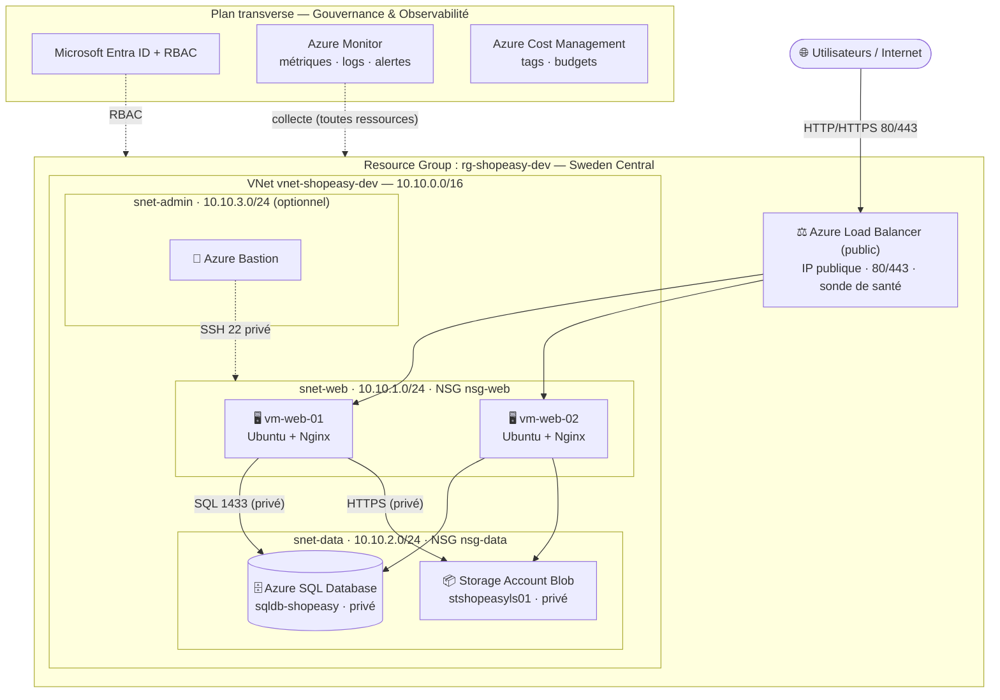

# Atelier 3 — Architecture cible Azure (ShopEasy)

> **Objectif :** construire une architecture Azure cible claire et justifiable pour l'application ShopEasy. \
> **Livrable attendu :** un schéma d'architecture cible + une légende couvrant composants, flux, zones
> réseau, exposition Internet, composants internes, sécurité et supervision.

---

## 1. Schéma d'architecture cible

> 💡 *Le diagramme Mermaid est **rendu nativement** dans l'aperçu VS Code (extension « Markdown Preview
> Mermaid Support ») et sur GitHub — il reste donc **inline**, sans image à joindre.*

---

## 2. Légende — les 7 éléments demandés

### ① Composants Azure
| Composant | Rôle |
|---|---|
| **Resource Group** `rg-shopeasy-dev` | Conteneur logique de toutes les ressources (cycle de vie, droits, coûts). |
| **Virtual Network** `vnet-shopeasy-dev` | Réseau privé isolé `10.10.0.0/16`. |
| **Subnets** `snet-web` / `snet-data` / `snet-admin` | Séparation des couches applicative / données / administration. |
| **2 × Virtual Machines** `vm-web-01`, `vm-web-02` | Couche applicative (Nginx + app), redondante. |
| **Azure Load Balancer** | Répartiteur de charge frontal avec sonde de santé. |
| **Azure SQL Database** `sqldb-shopeasy` | Base relationnelle managée (PaaS). |
| **Storage Account** `stshopeasyXXXX` | Stockage objet (Blob) des documents clients. |
| **Network Security Groups** `nsg-web`, `nsg-data` | Filtrage réseau par subnet. |
| **Microsoft Entra ID + RBAC** | Identités et droits d'administration. |
| **Azure Monitor** | Supervision (métriques, logs, alertes). |
| **Azure Cost Management** | Suivi et gouvernance des coûts. |

### ② Flux principaux
1. **Internet → Load Balancer** : trafic web HTTP/HTTPS (80/443).
2. **Load Balancer → VM web 01 / 02** : répartition de charge + sonde de santé (port 80).
3. **VM web → Azure SQL Database** : requêtes SQL (port **1433**, accès **privé**, depuis le subnet web uniquement).
4. **VM web → Storage Account** : lecture/écriture des documents (HTTPS, accès **privé**).
5. **Admin → VM** : SSH (port 22) **restreint** (IP admin ou via **Azure Bastion**).
6. **Entra ID / RBAC → Resource Group** : contrôle des accès (plan de gestion).
7. **Toutes ressources → Azure Monitor** : remontée des métriques et journaux.

### ③ Zones réseau
| Zone | Contenu | Exposition |
|---|---|---|
| **Frontal public** | Load Balancer (IP publique) | **Exposé Internet** (80/443) |
| **snet-web** `10.10.1.0/24` | VM web 01 & 02 | Interne (reçoit le trafic via le LB) |
| **snet-data** `10.10.2.0/24` | Azure SQL Database, Storage Account (accès privé) | **Interne uniquement** |
| **snet-admin** `10.10.3.0/24` | Azure Bastion (optionnel) | Administration contrôlée |

### ④ Composants exposés à Internet
- **Uniquement le Load Balancer** (ports 80/443) — point d'entrée unique et contrôlé.
- *(En TP, les VM peuvent avoir une IP publique temporaire pour SSH restreint ; en cible production, on
  les en prive au profit d'Azure Bastion.)*

### ⑤ Composants internes (non exposés)
- VM web (joignables seulement via le Load Balancer).
- **Azure SQL Database** et **Storage Account** : accès **privé**, jamais directement depuis Internet.

### ⑥ Éléments de sécurité
- **nsg-web** : autorise **80/443 depuis Internet**, **22 depuis l'IP admin uniquement**.
- **nsg-data** : autorise **1433 depuis `snet-web` uniquement** → la base n'est pas exposée.
- **Microsoft Entra ID + RBAC** : comptes nominatifs, **moindre privilège** (fin du compte partagé).
- **SQL + Storage en accès privé** (Private Endpoint en cible), **chiffrement** des données, **TLS**.
- **Segmentation réseau** en subnets pour limiter les mouvements latéraux.

### ⑦ Éléments de supervision
- **Azure Monitor** : métriques **VM** (CPU/mémoire/disque), **disponibilité du Load Balancer**,
  métriques **SQL** et **Storage**, **logs d'activité** du Resource Group.
- **Alertes** : CPU élevé, échec des sondes de santé, espace SQL proche de la limite, coût projeté > budget.

---

## 3. Plan d'adressage IP

| Élément | Plage CIDR | Rôle |
|---|---|---|
| **VNet** | `10.10.0.0/16` | Réseau global ShopEasy |
| **snet-web** | `10.10.1.0/24` | Machines virtuelles web |
| **snet-data** | `10.10.2.0/24` | Services de données / endpoints privés |
| **snet-admin** | `10.10.3.0/24` | Accès d'administration / bastion (optionnel) |

---

## 4. Variante « durcissement production »

L'architecture ci-dessus est volontairement **lisible pour le TP**. Pour une mise en production réelle,
on ferait évoluer :

- **Application Gateway + WAF** (couche 7) à la place du Load Balancer L4, avec **terminaison TLS** et HTTPS obligatoire.
- **Private Endpoint** pour Azure SQL et Storage (suppression de tout accès public).
- **Suppression des IP publiques des VM** + administration via **Azure Bastion**.
- **Déploiement multi-zones** (Availability Zones) des VM et du LB pour la résilience.
- **MFA** systématique et **revue périodique des rôles RBAC**.
- **Sauvegardes formalisées** + tests de restauration ; **Infrastructure as Code** (Terraform/Bicep) en TP2.

---

## 5. Format de remise du schéma

Le schéma est en **Mermaid**, rendu nativement dans l'aperçu VS Code et sur GitHub : il reste **inline
dans ce fichier**, aucune image à exporter. Si le rendu final exige une image autonome, coller le bloc
Mermaid sur **mermaid.live** → *Export* PNG/SVG/PDF.
