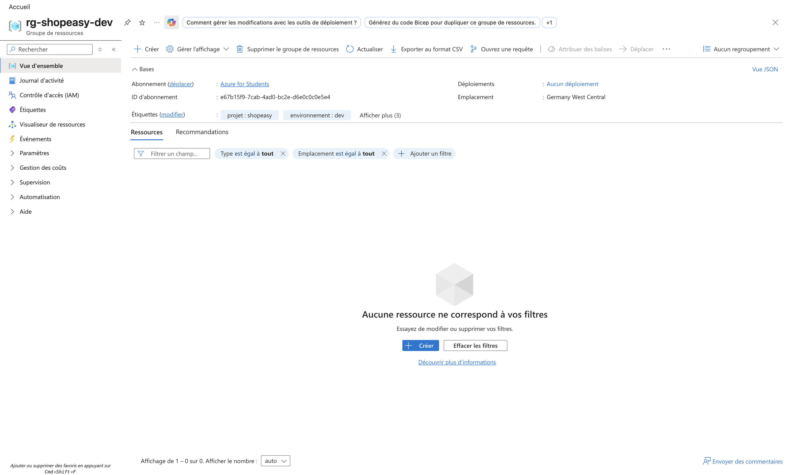
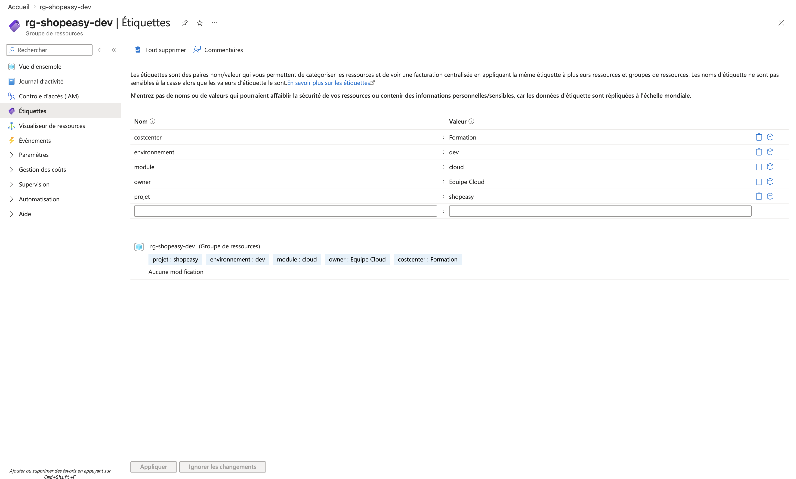

# Atelier 4 — Préparation de l'environnement Azure (ShopEasy)

> **Objectif :** créer les conteneurs logiques et les conventions de nommage du projet. \
> **Livrable attendu :** capture du Resource Group + tableau de convention de nommage complété avec le suffixe.

---

## 1. Convention de nommage adoptée

Convention retenue : `<type>-<application>-<environnement>` (+ suffixe unique pour les ressources à
nom global). **Suffixe unique du projet : `ls01`** (initiales *Louis Scarfone* + numéro).

| Ressource | Nom retenu | Remarque |
|---|---|---|
| Resource Group | `rg-shopeasy-dev` | — |
| Virtual Network | `vnet-shopeasy-dev` | — |
| Subnet web | `snet-web` | VM applicatives |
| Subnet data | `snet-data` | Services de données / endpoints privés |
| Subnet admin | `snet-admin` | Accès d'administration (optionnel) |
| NSG web | `nsg-web` | Filtrage du subnet web |
| NSG data | `nsg-data` | Filtrage du subnet data |
| Virtual Machine 1 | `vm-web-01` | — |
| Virtual Machine 2 | `vm-web-02` | — |
| **Storage Account** | `stshopeasyls01` | **Nom global unique**, minuscules, sans tiret (3-24 car.) |
| **Azure SQL Server** | `sql-shopeasy-ls01` | **Nom global unique** |
| Azure SQL Database | `sqldb-shopeasy` | — |

> Les noms **Storage Account** et **SQL Server** doivent être **uniques au niveau mondial** : c'est la
> raison du suffixe `ls01`. Le Storage Account n'accepte ni tiret ni majuscule.

---

## 2. Création du Resource Group (Azure CLI)

```bash
az group create \
  --name rg-shopeasy-dev \
  --location swedencentral \
  --tags projet=shopeasy environnement=dev module=cloud owner="Equipe Cloud" costcenter=Formation
```

> ⚠️ **Contrainte régionale Azure for Students.** L'abonnement applique une policy
> *« Allowed resource deployment regions »* qui restreint les déploiements à 5 régions :
> `germanywestcentral`, `spaincentral`, `swedencentral`, `italynorth`, `uaenorth`.
> **`francecentral` est bloquée.** Après analyse (voir Atelier 7), la seule région autorisée où les VM
> sont réellement déployables est **`swedencentral`** → c'est la **région retenue pour tout le TP**,
> RG compris (cohérence RG ↔ ressources).

### Tags de gouvernance appliqués
| Tag | Valeur | Usage |
|---|---|---|
| `projet` | `shopeasy` | Rattachement applicatif |
| `environnement` | `dev` | Distinction dev / prod |
| `module` | `cloud` | Contexte pédagogique |
| `owner` | `Equipe Cloud` | Responsable / contact |
| `costcenter` | `Formation` | Imputation des coûts (FinOps) |

---

## 3. Preuve de création (`az group show`)

```json
{
  "id": "/subscriptions/e67b15f9-.../resourceGroups/rg-shopeasy-dev",
  "location": "swedencentral",
  "name": "rg-shopeasy-dev",
  "properties": { "provisioningState": "Succeeded" },
  "tags": {
    "costcenter": "Formation",
    "environnement": "dev",
    "module": "cloud",
    "owner": "Equipe Cloud",
    "projet": "shopeasy"
  },
  "type": "Microsoft.Resources/resourceGroups"
}
```

### Captures portail

**Vue d'ensemble du Resource Group**


**Tags de gouvernance appliqués**


---

## 4. Questions de validation

**1. Pourquoi regrouper les ressources dans un Resource Group dédié ?**
Un Resource Group matérialise un **cycle de vie commun** : toutes les ressources de ShopEasy se créent,
se gèrent, se sécurisent (RBAC au niveau du groupe), se suivent en coût et **se suppriment ensemble**.
Cela évite de mélanger des ressources de projets/environnements différents et simplifie l'exploitation,
les droits et le nettoyage de fin de TP (`az group delete`).

**2. Pourquoi ajouter des tags ?**
Les tags apportent une **métadonnée de gouvernance** exploitable pour :
- **attribuer les coûts** (par application, environnement, centre de coût) dans Cost Management ;
- **rechercher et filtrer** les ressources ;
- **automatiser** des actions (extinction des ressources `environnement=dev`, politiques Azure Policy) ;
- **identifier le propriétaire** et la criticité.

**3. Que risque-t-on si toutes les ressources sont créées sans convention de nommage ?**
Un nommage improvisé rend l'environnement **illisible et difficile à exploiter** : impossible de savoir
d'un coup d'œil à quoi sert une ressource, à quel environnement elle appartient ou qui en est
responsable. Conséquences : erreurs de manipulation (suppression de la mauvaise ressource), audit et
analyse de coûts compliqués, automatisation fragile, et collisions sur les **noms globaux uniques**
(Storage, SQL) faute de suffixe.

---

## ✅ État de l'environnement après l'Atelier 4
- Resource Group `rg-shopeasy-dev` créé en `swedencentral`, `provisioningState: Succeeded`.
- 5 tags de gouvernance appliqués.
- Convention de nommage figée (suffixe `ls01`).
- **Prêt pour l'Atelier 5 — création du réseau (VNet + subnets).**
