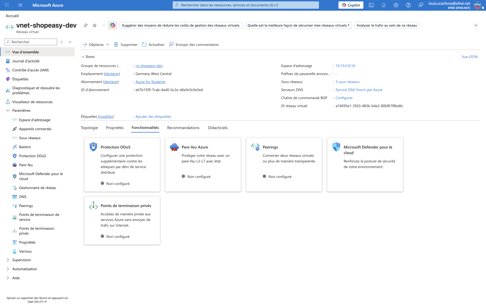
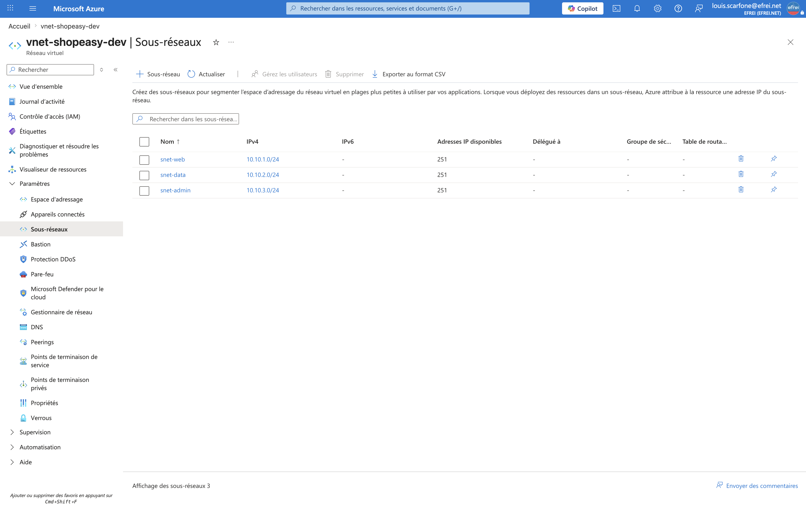

# Atelier 5 — Création du réseau Azure (ShopEasy)

> **Objectif :** créer un réseau virtuel segmenté pour séparer les composants web et données. \
> **Livrable attendu :** capture du Virtual Network et des subnets + commentaire sur la segmentation réseau.
>
> **Région :** `swedencentral` (Stockholm) — `francecentral` est bloquée par la policy
> *Allowed resource deployment regions* d'Azure for Students, et c'est la seule région autorisée où les
> VM sont déployables (cf. Ateliers 4 et 7).

---

## 1. Plan d'adressage

| Élément | Plage CIDR | Adresses utiles | Rôle |
|---|---|---|---|
| **VNet** `vnet-shopeasy-dev` | `10.10.0.0/16` | 65 536 | Réseau global de ShopEasy |
| **snet-web** | `10.10.1.0/24` | 251* | Machines virtuelles web |
| **snet-data** | `10.10.2.0/24` | 251* | Services de données / endpoints privés |
| **snet-admin** | `10.10.3.0/24` | 251* | Accès d'administration / bastion (optionnel) |

> \* Azure réserve **5 adresses par subnet** (la 1ʳᵉ, les 3 suivantes et la dernière) → 256 − 5 = 251 utilisables.

---

## 2. Création via Azure CLI

```bash
# 1) VNet + premier subnet (web)
az network vnet create \
  --resource-group rg-shopeasy-dev \
  --name vnet-shopeasy-dev \
  --location swedencentral \
  --address-prefix 10.10.0.0/16 \
  --subnet-name snet-web \
  --subnet-prefix 10.10.1.0/24

# 2) Subnet data
az network vnet subnet create \
  --resource-group rg-shopeasy-dev \
  --vnet-name vnet-shopeasy-dev \
  --name snet-data \
  --address-prefixes 10.10.2.0/24

# 3) Subnet admin
az network vnet subnet create \
  --resource-group rg-shopeasy-dev \
  --vnet-name vnet-shopeasy-dev \
  --name snet-admin \
  --address-prefixes 10.10.3.0/24
```

---

## 3. Vérification (sortie CLI)

```
=== VNet ===
Nom                Region         Espace        Etat
-----------------  -------------  ------------  ---------
vnet-shopeasy-dev  swedencentral  10.10.0.0/16  Succeeded

=== Subnets ===
Subnet      CIDR          Etat
----------  ------------  ---------
snet-admin  10.10.3.0/24  Succeeded
snet-web    10.10.1.0/24  Succeeded
snet-data   10.10.2.0/24  Succeeded
```

### Captures portail

**Vue d'ensemble du Virtual Network**


**Liste des subnets**


---

## 4. Pourquoi une seule grande plage réseau ne suffit pas ? (segmentation)

Mettre toutes les ressources dans **un seul grand subnet** « à plat » fonctionne techniquement, mais
c'est une **mauvaise pratique** en architecture professionnelle, pour plusieurs raisons :

- **Sécurité (cloisonnement)** : sans segmentation, tout le monde est sur le même réseau. Une VM web
  compromise peut atteindre **directement la base de données**. En séparant `snet-web` et `snet-data`,
  on applique des **NSG différents** par couche et on **limite les mouvements latéraux**.
- **Moindre privilège réseau** : chaque subnet n'autorise que les flux nécessaires (ex. la base
  n'accepte le port 1433 **que depuis le subnet web**), ce qui est impossible avec une seule plage.
- **Lisibilité & exploitation** : un découpage par **fonction** (web / données / admin) rend le réseau
  compréhensible, auditable et documentable.
- **Gouvernance & évolutivité** : on peut associer des **route tables**, **Private Endpoints** ou un
  **bastion** à un subnet précis sans impacter les autres ; on réserve aussi des plages propres pour la
  croissance future.
- **Conformité** : isoler les données sensibles dans une zone dédiée facilite le respect des exigences
  réglementaires (RGPD).

> En résumé : **segmenter, c'est appliquer la défense en profondeur au niveau réseau.** La grande plage
> `/16` sert d'espace global cohérent, et les `/24` matérialisent les **zones de confiance** distinctes.

---

## ✅ État de l'environnement après l'Atelier 5
- VNet `vnet-shopeasy-dev` (`10.10.0.0/16`) créé en `swedencentral`.
- 3 subnets `Succeeded` : `snet-web` (10.10.1.0/24), `snet-data` (10.10.2.0/24), `snet-admin` (10.10.3.0/24).
- **Prêt pour l'Atelier 6 — filtrage réseau (NSG).**
