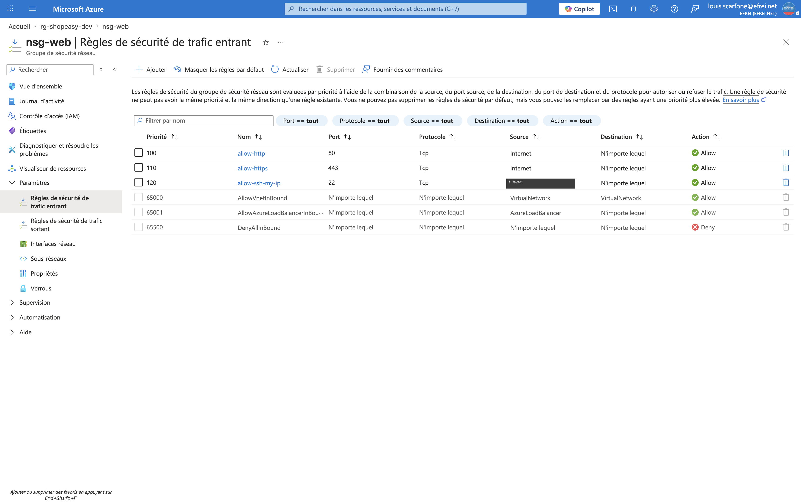
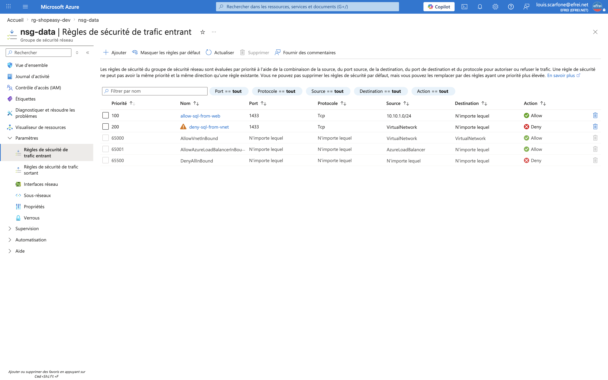

# Atelier 6 — Filtrage réseau avec Network Security Groups (ShopEasy)

> **Objectif :** protéger les flux réseau en limitant les ouvertures inutiles. \
> **Livrable attendu :** capture des NSG et des règles + justification des ouvertures autorisées.

---

## 1. Règles de filtrage retenues

| NSG | Règle | Priorité | Sens | Accès | Port | Source | Justification |
|---|---|---|---|---|---|---|---|
| **nsg-web** | `allow-http` | 100 | Inbound | Allow | 80 | Internet | Accès HTTP à l'application de test |
| **nsg-web** | `allow-https` | 110 | Inbound | Allow | 443 | Internet | Accès HTTPS (cible production) |
| **nsg-web** | `allow-ssh-my-ip` | 120 | Inbound | Allow | 22 | `<VOTRE_IP>/32` | Administration Linux **limitée à l'IP admin** |
| **nsg-data** | `allow-sql-from-web` | 100 | Inbound | Allow | 1433 | `10.10.1.0/24` | Accès SQL **uniquement depuis le subnet web** |
| **nsg-data** | `deny-sql-from-vnet` | 200 | Inbound | Deny | 1433 | `VirtualNetwork` | Bloque 1433 depuis **le reste du VNet** (ex. `snet-admin`) |

> 🔒 L'IP publique réelle de l'administrateur est utilisée dans la règle déployée, mais **masquée ici**
> (`<VOTRE_IP>/32`) pour ne pas la divulguer dans un dépôt Git.

### Pourquoi la règle `deny-sql-from-vnet` ?
Un NSG applique des **règles par défaut** invisibles, dont `AllowVnetInBound` (priorité 65000) qui
**autorise tout le trafic interne au VNet**. Sans action, `snet-admin` pourrait donc joindre la base sur
le port 1433. La règle `allow-sql-from-web` (prio 100) autorise le subnet web, et `deny-sql-from-vnet`
(prio 200) **refuse explicitement** le 1433 pour le reste du VNet → on obtient un vrai *« uniquement
depuis le web »* (principe du moindre privilège réseau).

---

## 2. Création via Azure CLI

```bash
# ---- NSG WEB ----
az network nsg create -g rg-shopeasy-dev -n nsg-web --location swedencentral

az network nsg rule create -g rg-shopeasy-dev --nsg-name nsg-web \
  --name allow-http --priority 100 --access Allow --direction Inbound --protocol Tcp \
  --source-address-prefixes Internet --destination-port-ranges 80

az network nsg rule create -g rg-shopeasy-dev --nsg-name nsg-web \
  --name allow-https --priority 110 --access Allow --direction Inbound --protocol Tcp \
  --source-address-prefixes Internet --destination-port-ranges 443

az network nsg rule create -g rg-shopeasy-dev --nsg-name nsg-web \
  --name allow-ssh-my-ip --priority 120 --access Allow --direction Inbound --protocol Tcp \
  --source-address-prefixes <VOTRE_IP>/32 --destination-port-ranges 22

# ---- NSG DATA ----
az network nsg create -g rg-shopeasy-dev -n nsg-data --location swedencentral

az network nsg rule create -g rg-shopeasy-dev --nsg-name nsg-data \
  --name allow-sql-from-web --priority 100 --access Allow --direction Inbound --protocol Tcp \
  --source-address-prefixes 10.10.1.0/24 --destination-port-ranges 1433

az network nsg rule create -g rg-shopeasy-dev --nsg-name nsg-data \
  --name deny-sql-from-vnet --priority 200 --access Deny --direction Inbound --protocol Tcp \
  --source-address-prefixes VirtualNetwork --destination-port-ranges 1433

# ---- ASSOCIATION AUX SUBNETS ----
az network vnet subnet update -g rg-shopeasy-dev --vnet-name vnet-shopeasy-dev \
  --name snet-web --network-security-group nsg-web

az network vnet subnet update -g rg-shopeasy-dev --vnet-name vnet-shopeasy-dev \
  --name snet-data --network-security-group nsg-data
```

---

## 3. Vérification (sortie CLI)

```
=== Règles nsg-web ===
Priorite    Nom              Sens     Acces    Proto    Source           Port
----------  ---------------  -------  -------  -------  ---------------  ------
100         allow-http       Inbound  Allow    Tcp      Internet         80
110         allow-https      Inbound  Allow    Tcp      Internet         443
120         allow-ssh-my-ip  Inbound  Allow    Tcp      <VOTRE_IP>/32    22

=== Règles nsg-data ===
Priorite    Nom                 Sens     Acces    Proto    Source          Port
----------  ------------------  -------  -------  -------  --------------  ------
100         allow-sql-from-web  Inbound  Allow    Tcp      10.10.1.0/24    1433
200         deny-sql-from-vnet  Inbound  Deny     Tcp      VirtualNetwork  1433

=== Associations subnet → NSG ===
snet-web     10.10.1.0/24  -> nsg-web
snet-data    10.10.2.0/24  -> nsg-data
snet-admin   10.10.3.0/24  -> aucun (optionnel)
```

### Captures portail

**Règles entrantes de `nsg-web`**


**Règles entrantes de `nsg-data`**


---

## 4. Questions de sécurité

**1. Pourquoi limiter SSH à une adresse IP précise ?**
Ouvrir le port 22 à `0.0.0.0/0` (tout Internet) l'expose en permanence aux **scans automatisés** et aux
**attaques par force brute**. En restreignant la source à l'**IP de l'administrateur**, seule cette
adresse peut même *tenter* une connexion : la surface d'attaque passe de « tout Internet » à « une IP ».
En production, on supprime carrément l'exposition publique du SSH au profit d'**Azure Bastion** + MFA.

**2. Pourquoi ne faut-il pas exposer le port SQL (1433) sur Internet ?**
La base contient les **données sensibles** (clients, commandes, factures). L'exposer directement en
ferait une **cible privilégiée** : force brute sur les comptes SQL, exploitation de vulnérabilités du
moteur, exfiltration ou altération des données. Le 1433 ne doit être joignable que depuis la **couche
applicative** (subnet web), idéalement via **Private Endpoint** — c'est la défense en profondeur.

**3. Différence entre une règle entrante et une règle sortante ?**
- **Entrante (Inbound)** : filtre le trafic qui **arrive** vers la ressource/subnet (ex. requêtes des
  utilisateurs vers le web, ou du web vers la base).
- **Sortante (Outbound)** : filtre le trafic qui **part** de la ressource (ex. une VM qui appelle un
  service externe, télécharge des paquets…).
Un NSG évalue les **deux sens séparément**, par ordre de priorité. Par défaut Azure **autorise tout
l'Outbound** et **restreint l'Inbound** (seuls le trafic intra-VNet et le Load Balancer sont permis).
Restreindre aussi l'Outbound permet de limiter l'**exfiltration** et les communications malveillantes.

**4. Comment cette configuration devrait-elle évoluer en production ?**
- **HTTPS obligatoire** (443) + redirection 80→443, gestion des **certificats** ; **Application Gateway + WAF** en frontal.
- **Suppression du SSH public** → **Azure Bastion**, VM sans IP publique, accès **just-in-time** (Defender for Cloud).
- **Private Endpoint** pour Azure SQL → plus aucune ouverture 1433, même interne.
- **NSG Flow Logs** + Azure Monitor pour tracer et auditer les flux.
- **Règles Outbound restrictives** (sortie limitée aux destinations légitimes).
- **Revue périodique** des règles et **MFA** systématique pour l'administration.

---

## ✅ État de l'environnement après l'Atelier 6
- `nsg-web` (3 règles) associé à `snet-web` ; `nsg-data` (2 règles) associé à `snet-data`.
- Base de données non joignable hors du subnet web ; SSH limité à l'IP admin.
- **Prêt pour l'Atelier 7 — déploiement des 2 VM web.**
