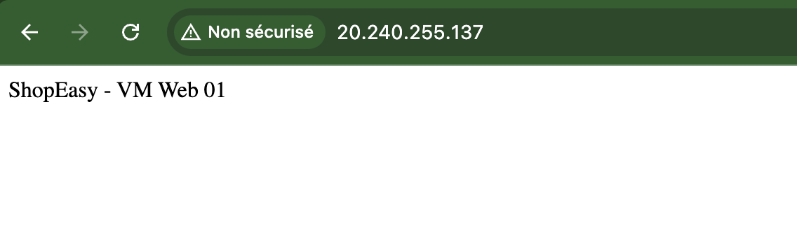
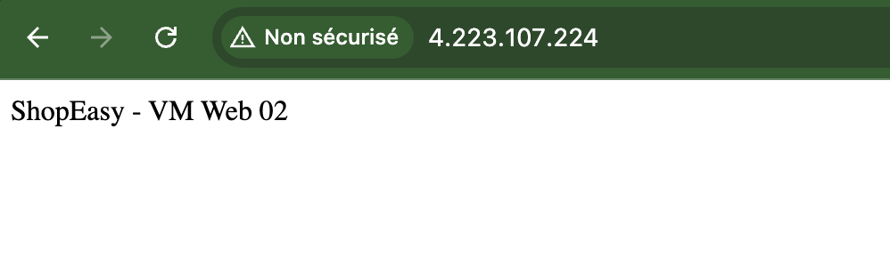
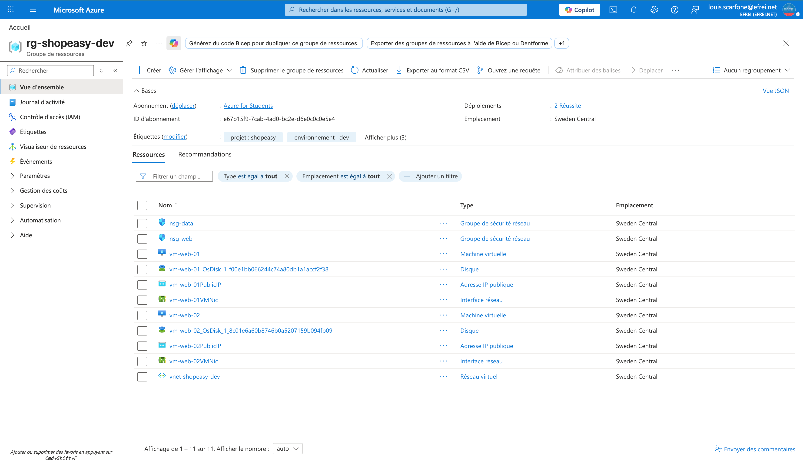

# Atelier 7 — Déploiement de machines virtuelles web (ShopEasy)

> **Objectif :** déployer deux serveurs web simples dans Azure pour représenter la couche applicative. \
> **Livrable attendu :** captures des deux VM, de la page web de test et des commandes de vérification.

---

## ⚠️ Adaptation imposée par Azure for Students (région + taille)

Le TP demande `Standard_B1s` en `francecentral`. **Aucun des deux n'est utilisable** sur cet abonnement :

| Contrainte rencontrée | Constat | Décision |
|---|---|---|
| `francecentral` | Bloquée par policy *Allowed resource deployment regions* | Région autorisée |
| `germanywestcentral` (1er essai) | Tailles x86 *NotAvailableForSubscription*, tailles ARM `Dpsv6` à **quota 0** | Région écartée |
| `Standard_B1s` | *NotAvailable* dans **les 5 régions autorisées** | Taille écartée |
| Providers `Microsoft.Compute/Storage/Sql` | Étaient **NotRegistered** | **Enregistrés** (débloque le quota) |

**Solution retenue (appuyée par la doc Microsoft) :**
- **Région : `swedencentral`** — `Standard_B2ats_v2` y est **pleinement disponible** (aucune restriction).
- **Taille : `Standard_B2ats_v2`** (2 vCPU, 1 Go, x86) — **taille officiellement recommandée par Microsoft
  pour Azure for Students**. Famille `Basv2`, quota 10 vCPU (2 VM × 2 = 4, OK).

> 📎 Source : Microsoft Community Hub — *« SKU, quota and policy restrictions on Azure for Students and
> Free Subscriptions »* (sizes recommandées : `B2ats_v2`, `B2ts_v2`, `B2als_v2`).

---

## 1. Création des VM (Azure CLI)

```bash
# vm-web-01
az vm create \
  --resource-group rg-shopeasy-dev \
  --name vm-web-01 \
  --image Ubuntu2204 \
  --size Standard_B2ats_v2 \
  --location swedencentral \
  --vnet-name vnet-shopeasy-dev \
  --subnet snet-web \
  --nsg nsg-web \
  --admin-username azureuser \
  --generate-ssh-keys \
  --public-ip-sku Standard \
  --storage-sku Standard_LRS

# vm-web-02 : idem avec --name vm-web-02
```

Résultat :

| VM | IP publique | IP privée | Taille | Région |
|---|---|---|---|---|
| `vm-web-01` | `20.240.255.137` | `10.10.1.4` | Standard_B2ats_v2 | swedencentral |
| `vm-web-02` | `4.223.107.224` | `10.10.1.5` | Standard_B2ats_v2 | swedencentral |

---

## 2. Installation de Nginx (SSH)

Commandes lancées sur chaque VM (connexion SSH avec la clé générée `~/.ssh/id_rsa`) :

```bash
ssh azureuser@<IP_PUBLIQUE>
sudo apt update
sudo apt install -y nginx
echo "ShopEasy - VM Web 0X" | sudo tee /var/www/html/index.html
sudo systemctl enable nginx
sudo systemctl restart nginx
systemctl status nginx --no-pager
```

### Sortie réelle — vm-web-01 (`20.240.255.137`)

```text
########## sudo apt install -y nginx ##########
The following NEW packages will be installed:
  fontconfig-config fonts-dejavu-core libdeflate0 libfontconfig1 libgd3
  libjbig0 libjpeg-turbo8 libjpeg8 libnginx-mod-http-geoip2
  libnginx-mod-http-image-filter libnginx-mod-http-xslt-filter
  libnginx-mod-mail libnginx-mod-stream libnginx-mod-stream-geoip2 libtiff5
  libwebp7 libxpm4 nginx nginx-common nginx-core
0 upgraded, 20 newly installed, 0 to remove and 7 not upgraded.
...
Setting up nginx-common (1.18.0-6ubuntu14.16) ...
Created symlink /etc/systemd/system/multi-user.target.wants/nginx.service → /lib/systemd/system/nginx.service.
Setting up nginx-core (1.18.0-6ubuntu14.16) ...
 * Upgrading binary nginx
   ...done.
Setting up nginx (1.18.0-6ubuntu14.16) ...

########## page index.html ##########
ShopEasy - VM Web 01

########## enable + restart ##########
Synchronizing state of nginx.service with SysV service script with /lib/systemd/systemd-sysv-install.
Executing: /lib/systemd/systemd-sysv-install enable nginx

########## systemctl status nginx ##########
● nginx.service - A high performance web server and a reverse proxy server
     Loaded: loaded (/lib/systemd/system/nginx.service; enabled; vendor preset: enabled)
     Active: active (running) since Wed 2026-06-24 10:55:29 UTC; 6ms ago
       Docs: man:nginx(8)
    Process: 4295 ExecStartPre=/usr/sbin/nginx -t -q -g daemon on; ... (code=exited, status=0/SUCCESS)
    Process: 4296 ExecStart=/usr/sbin/nginx -g daemon on; ...        (code=exited, status=0/SUCCESS)
   Main PID: 4297 (nginx)
      Tasks: 3 (limit: 1064)
     Memory: 3.3M
        CPU: 23ms
     CGroup: /system.slice/nginx.service
             ├─4297 "nginx: master process /usr/sbin/nginx -g daemon on; master_process on;"
             ├─4298 "nginx: worker process"
             └─4299 "nginx: worker process"

Jun 24 10:55:29 vm-web-01 systemd[1]: Starting A high performance web server...
Jun 24 10:55:29 vm-web-01 systemd[1]: Started A high performance web server and a reverse proxy server.
```

### Sortie réelle — vm-web-02 (`4.223.107.224`)

```text
########## sudo apt install -y nginx ##########
0 upgraded, 20 newly installed, 0 to remove and 7 not upgraded.
...
Setting up nginx (1.18.0-6ubuntu14.16) ...

########## page index.html ##########
ShopEasy - VM Web 02

########## systemctl status nginx ##########
● nginx.service - A high performance web server and a reverse proxy server
     Loaded: loaded (/lib/systemd/system/nginx.service; enabled; vendor preset: enabled)
     Active: active (running) since Wed 2026-06-24 10:56:43 UTC; 7ms ago
       Docs: man:nginx(8)
   Main PID: 2601 (nginx)
      Tasks: 3 (limit: 1064)
     Memory: 4.0M
        CPU: 23ms
     CGroup: /system.slice/nginx.service
             ├─2601 "nginx: master process /usr/sbin/nginx -g daemon on; master_process on;"
             ├─2602 "nginx: worker process"
             └─2603 "nginx: worker process"

Jun 24 10:56:43 vm-web-02 systemd[1]: Started A high performance web server and a reverse proxy server.
```

> Les deux services Nginx sont **`active (running)`** et **`enabled`** (démarrage auto).

---

## 3. Vérifications (commandes CLI)

### Les deux VM dans le Resource Group
```text
$ az vm list -g rg-shopeasy-dev -d -o table
Nom        Taille             IP_publique     IP_privee    Etat
---------  -----------------  --------------  -----------  ----------
vm-web-01  Standard_B2ats_v2  20.240.255.137  10.10.1.4    VM running
vm-web-02  Standard_B2ats_v2  4.223.107.224   10.10.1.5    VM running
```

### Test HTTP de chaque page (depuis le poste admin)
```text
$ curl http://20.240.255.137
ShopEasy - VM Web 01
$ curl http://4.223.107.224
ShopEasy - VM Web 02
```

### Réponses aux questions de vérification
1. **Les deux VM apparaissent-elles dans le Resource Group ?** Oui — `vm-web-01` et `vm-web-02` listées (`az vm list`), état `VM running`.
2. **Le service Nginx est-il actif ?** Oui — `systemctl status` = `active (running)` + `enabled` sur les deux.
3. **La page web de test est-elle accessible ?** Oui — `curl` sur les 2 IP publiques renvoie la page (NSG `allow-http` 80).
4. **Les deux pages identifient-elles la VM appelée ?** Oui — « VM Web 01 » et « VM Web 02 » distinctes, ce qui permettra de **vérifier la répartition de charge** à l'Atelier 8.

---

## 4. Captures visuelles à joindre

**Page web servie par vm-web-01** (navigateur sur `http://20.240.255.137`)


**Page web servie par vm-web-02** (navigateur sur `http://4.223.107.224`)


**Les deux VM dans le Resource Group** (portail)


---

## ✅ État après l'Atelier 7
- 2 VM `Standard_B2ats_v2` (Ubuntu 22.04) dans `snet-web`, Nginx actif, pages distinctes.
- **Prêt pour l'Atelier 8 — répartiteur de charge devant les 2 VM.**
