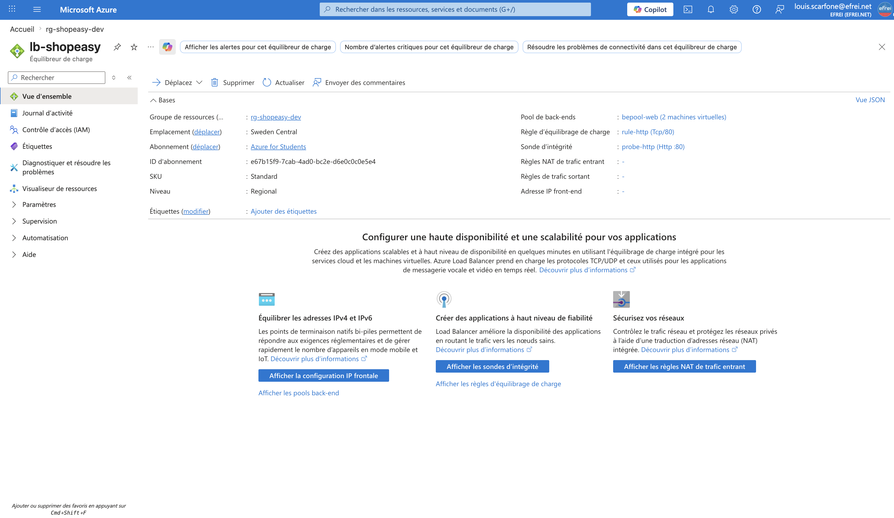
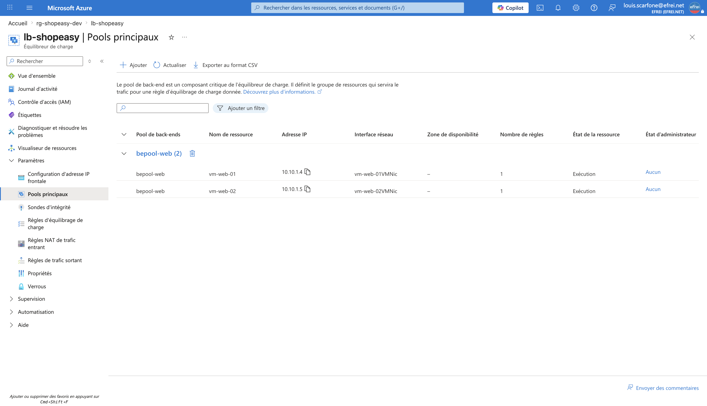
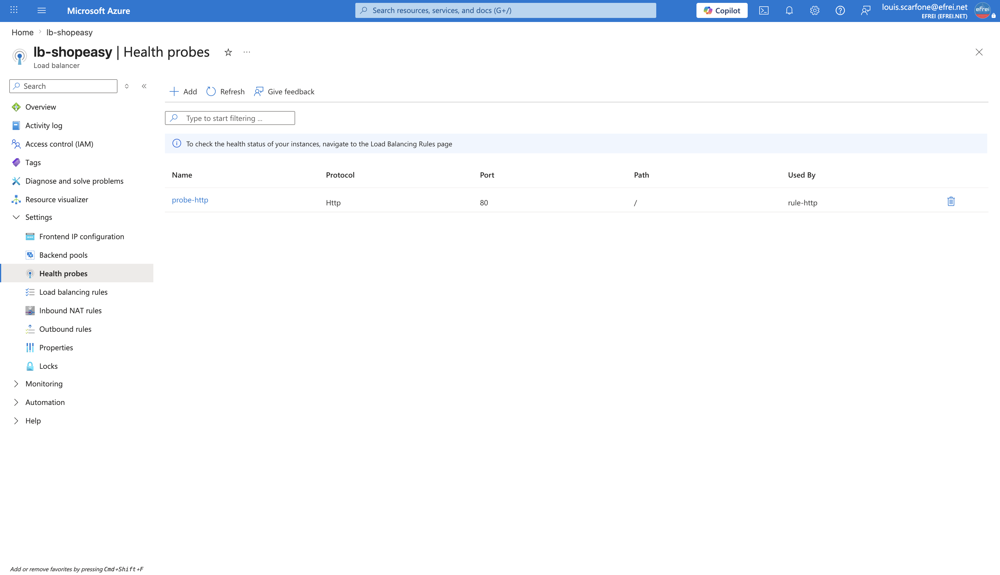
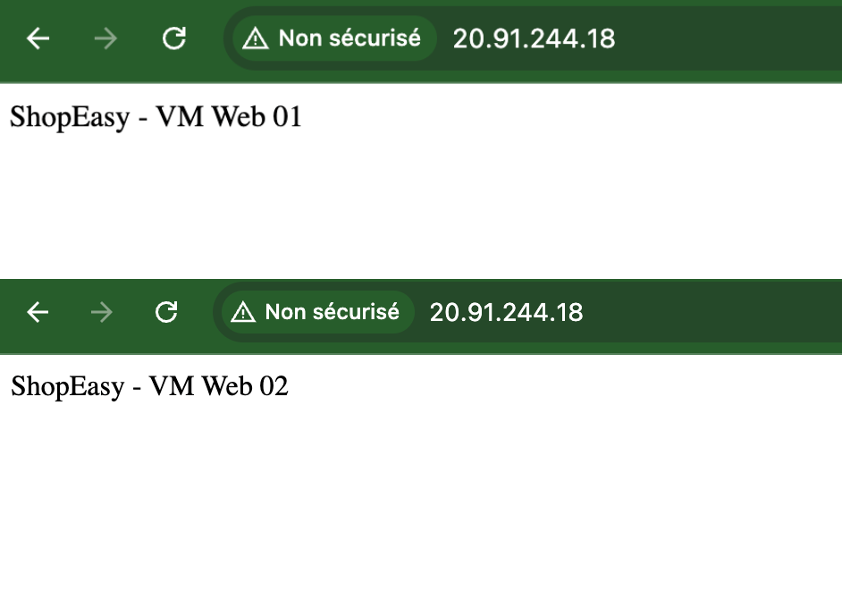

# Atelier 8 — Répartition de charge (ShopEasy)

> **Objectif :** comprendre le rôle d'un répartiteur de charge et l'intégrer dans l'architecture cible. \
> **Livrable attendu :** capture du répartiteur, du backend pool, de la sonde de santé et du test navigateur.
>
> **Région :** `swedencentral` · **Load Balancer :** `lb-shopeasy` (SKU Standard, public).

---

## 1. Choix technique

| Critère | Azure Load Balancer (retenu) | Application Gateway |
|---|---|---|
| Niveau | **Couche 4 (TCP/UDP)** | Couche 7 (HTTP/HTTPS) |
| Usage | Répartition réseau simple et efficace | Routage applicatif, terminaison TLS, **WAF** |
| Complexité | Plus simple | Plus riche, plus complexe |
| Cas TP | ✅ **Suffisant** pour une première architecture web | Cible production (sécurité applicative) |

On retient **Azure Load Balancer (Standard, public)**, conforme à l'esprit du TP. *Application Gateway +
WAF est la cible production* (cf. variante de durcissement à l'Atelier 3).

---

## 2. Création via Azure CLI

```bash
# 1) IP publique frontale (Standard, statique)
az network public-ip create -g rg-shopeasy-dev -n pip-lb-shopeasy \
  --sku Standard --location swedencentral --allocation-method Static

# 2) Load Balancer + frontend + backend pool
az network lb create -g rg-shopeasy-dev -n lb-shopeasy \
  --sku Standard --location swedencentral \
  --public-ip-address pip-lb-shopeasy \
  --frontend-ip-name feip-shopeasy \
  --backend-pool-name bepool-web

# 3) Sonde de santé HTTP sur le port 80 (chemin /)
az network lb probe create -g rg-shopeasy-dev --lb-name lb-shopeasy \
  --name probe-http --protocol Http --port 80 --path / --interval 5

# 4) Règle de répartition HTTP (80 -> 80) liée à la sonde
az network lb rule create -g rg-shopeasy-dev --lb-name lb-shopeasy \
  --name rule-http --protocol Tcp --frontend-port 80 --backend-port 80 \
  --frontend-ip-name feip-shopeasy --backend-pool-name bepool-web \
  --probe-name probe-http

# 5) Rattacher les 2 VM au backend pool (via leurs ipconfig)
az network nic ip-config address-pool add -g rg-shopeasy-dev \
  --nic-name vm-web-01VMNic --ip-config-name ipconfigvm-web-01 \
  --lb-name lb-shopeasy --address-pool bepool-web
az network nic ip-config address-pool add -g rg-shopeasy-dev \
  --nic-name vm-web-02VMNic --ip-config-name ipconfigvm-web-02 \
  --lb-name lb-shopeasy --address-pool bepool-web
```

---

## 3. Vérification (sorties CLI réelles)

```text
=== IP publique du Load Balancer : 20.91.244.18 ===

=== Backend pool (membres) ===
  - vm-web-01VMNic
  - vm-web-02VMNic

=== Sonde + règle ===
Sonde       Proto    Port    Chemin
----------  -------  ------  --------
probe-http  Http     80      /

Regle      Proto    FrontPort    BackPort
---------  -------  -----------  ----------
rule-http  Tcp      80           80
```

### Test de répartition (preuve de bascule)
14 requêtes successives sur l'IP publique du LB → **réparties 50/50** entre les deux VM :

```text
$ for i in $(seq 1 14); do curl -s http://20.91.244.18; done | sort | uniq -c
   7 ShopEasy - VM Web 01
   7 ShopEasy - VM Web 02
```

> Le Load Balancer distribue bien le trafic sur les **deux** serveurs web : c'est la **suppression du
> point de défaillance unique** applicatif identifié à l'Atelier 1.

---

## 4. Captures visuelles à joindre

**Vue d'ensemble du Load Balancer** (Overview : IP publique `20.91.244.18`, SKU Standard)


**Backend pool** (`bepool-web` avec vm-web-01 et vm-web-02)


**Sonde de santé** (`probe-http`, HTTP 80, chemin /)


**Test navigateur** (http://20.91.244.18 — rafraîchir pour voir alterner VM 01 / VM 02)


---

## 5. Analyse (questions du TP)

**1. Que se passe-t-il si une VM devient indisponible ?**
La **sonde de santé** cesse de recevoir une réponse HTTP 200 sur `/` pour cette VM et la **retire
automatiquement du backend pool**. Le Load Balancer route alors 100 % du trafic vers la VM saine
restante : le service **reste disponible** (capacité réduite, mais pas d'interruption). Dès que la VM
répond à nouveau à la sonde, elle est **réintégrée** automatiquement.

**2. Pourquoi une sonde de santé est-elle nécessaire ?**
Sans sonde, le LB continuerait d'envoyer du trafic vers une instance morte → **erreurs pour une partie
des utilisateurs**. La sonde vérifie en continu que chaque backend répond réellement, et **ne route que
vers les instances saines**. C'est elle qui rend la redondance *effective* (sinon on a deux VM mais pas
de tolérance aux pannes).

**3. Quelles limites subsistent malgré le répartiteur de charge ?**
- **Pas de protection inter-zone/région** : les 2 VM sont dans la même région, **sans Availability Zone**
  (déploiement zonal restreint sur Azure for Students) → une panne de datacenter peut toucher les deux.
- **Pas d'autoscaling** : le nombre de VM est fixe, l'ajout est manuel.
- **Couche 4 seulement** : pas de terminaison **TLS** ni de **WAF** (→ Application Gateway en production).
- **Couche données non redondée** ici (une seule base).
- L'application doit rester **sans état** (pas de session locale) pour que la répartition soit transparente.

**4. Pourquoi déployer les VM dans plusieurs zones améliore-t-il la disponibilité ?**
Les **Availability Zones** sont des datacenters **physiquement séparés** (alimentation, refroidissement,
réseau indépendants) au sein d'une même région. En plaçant `vm-web-01` et `vm-web-02` dans **deux zones
distinctes**, une panne touchant un datacenter n'affecte **qu'une seule** VM → l'autre continue de
servir. Sans zones (cas actuel), les deux VM peuvent résider dans le même datacenter et tomber
ensemble. *(Point repris à l'Atelier 13 — analyse de disponibilité.)*

---

## ✅ État après l'Atelier 8
- Load Balancer public `lb-shopeasy` (`20.91.244.18`) devant les 2 VM, sonde HTTP/80, répartition 50/50 vérifiée.
- Point de défaillance unique applicatif **levé**.
- **Prêt pour l'Atelier 9 — stockage documentaire (Storage Account).**
