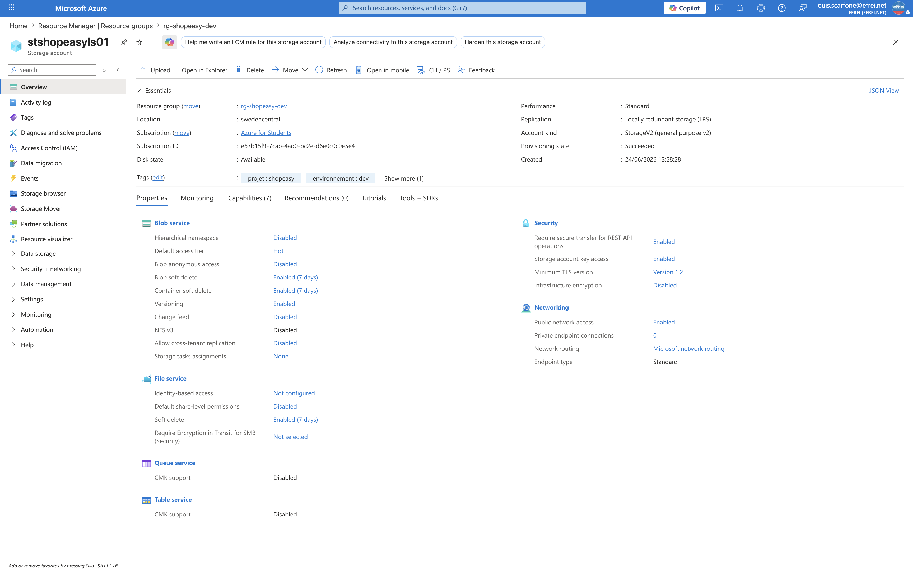
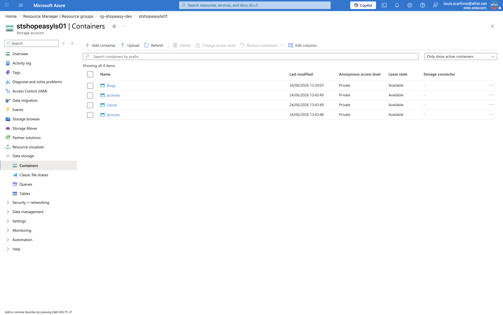
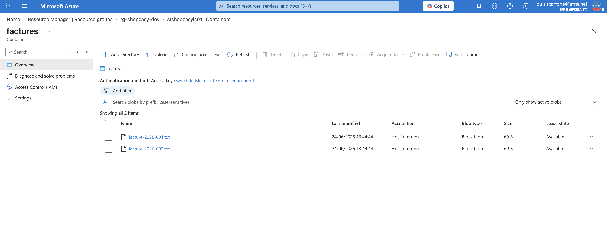

# Atelier 9 — Stockage documentaire avec Azure Storage (ShopEasy)

> **Objectif :** remplacer le stockage local des documents par un service de stockage objet. \
> **Livrable attendu :** capture du Storage Account, des conteneurs, du téléversement de fichiers + réponses aux questions.
>
> **Région :** `swedencentral` · **Storage Account :** `stshopeasyls01` (suffixe `ls01`).

---

## 1. Création du Storage Account (Azure CLI)

```bash
az storage account create \
  --resource-group rg-shopeasy-dev \
  --name stshopeasyls01 \
  --location swedencentral \
  --sku Standard_LRS \
  --kind StorageV2 \
  --https-only true \
  --min-tls-version TLS1_2 \
  --allow-blob-public-access false \
  --tags projet=shopeasy environnement=dev module=cloud
```

Résultat (sortie CLI) :
```json
{
  "AccesPublicBlob": false,
  "Etat": "Succeeded",
  "Https": true,
  "Nom": "stshopeasyls01",
  "Region": "swedencentral",
  "Sku": "Standard_LRS",
  "TLS": "TLS1_2"
}
```

> Le nom d'un Storage Account est **unique au niveau mondial** (`check-name` = `nameAvailable: true`),
> en minuscules, sans tiret → d'où `stshopeasyls01`.

---

## 2. Sécurité et résilience des données

```bash
az storage account blob-service-properties update \
  --resource-group rg-shopeasy-dev --account-name stshopeasyls01 \
  --enable-versioning true \
  --enable-delete-retention true --delete-retention-days 7 \
  --enable-container-delete-retention true --container-delete-retention-days 7
```

| Propriété | Valeur | Apport |
|---|---|---|
| **Chiffrement au repos** | activé (`Microsoft.Storage`) | Données chiffrées par défaut (clés gérées Microsoft) |
| **HTTPS obligatoire** | `true` | Données chiffrées en transit |
| **TLS minimum** | `TLS1_2` | Pas de protocole obsolète |
| **Accès public blob** | `false` (bloqué au niveau compte) | Impossible de rendre un conteneur public par erreur |
| **Versioning des blobs** | `true` | Conserve chaque version (anti-écrasement / anti-suppression) |
| **Soft-delete blob** | `true`, 7 jours | Récupération d'un blob supprimé |
| **Soft-delete conteneur** | `true`, 7 jours | Récupération d'un conteneur supprimé |

> Le chiffrement étant **activé par défaut** sur StorageV2, le point « activer le chiffrement » du TP
> est satisfait nativement — on l'a vérifié plutôt que re-créé.

---

## 3. Conteneurs et téléversement

```bash
# Conteneurs privés
for C in factures clients archives; do
  az storage container create --account-name stshopeasyls01 --name "$C" --public-access off
done

# Authentification data-plane via variables d'environnement (clé non exposée en ligne de commande)
export AZURE_STORAGE_ACCOUNT=stshopeasyls01
export AZURE_STORAGE_KEY=<clé du compte>

# Téléversement des fichiers de test
az storage blob upload -c factures -f facture-2026-001.txt -n facture-2026-001.txt
az storage blob upload -c factures -f facture-2026-002.txt -n facture-2026-002.txt
az storage blob upload -c clients  -f client-dupont.txt    -n client-dupont.txt
az storage blob upload -c clients  -f client-martin.txt    -n client-martin.txt
az storage blob upload -c archives -f archive-commandes-2025.txt -n archive-commandes-2025.txt
```

Contenu vérifié (sortie CLI) :
```text
--- factures ---
Blob                  Taille_o
--------------------  ----------
facture-2026-001.txt  69
facture-2026-002.txt  69
--- clients ---
Blob               Taille_o
-----------------  ----------
client-dupont.txt  72
client-martin.txt  70
--- archives ---
Blob                        Taille_o
--------------------------  ----------
archive-commandes-2025.txt  62
```

---

## 4. Politique de cycle de vie (FinOps) — bonus appliqué

Pour les **archives**, une politique de cycle de vie déplace automatiquement les blobs vers des paliers
moins chers puis les supprime :

```json
{
  "rules": [{
    "enabled": true, "name": "archives-tiering", "type": "Lifecycle",
    "definition": {
      "filters": { "blobTypes": ["blockBlob"], "prefixMatch": ["archives/"] },
      "actions": { "baseBlob": {
        "tierToCool":    { "daysAfterModificationGreaterThan": 30 },
        "tierToArchive": { "daysAfterModificationGreaterThan": 90 },
        "delete":        { "daysAfterModificationGreaterThan": 365 }
      }}
    }
  }]
}
```

> Appliquée via `az storage account management-policy create` → règle `archives-tiering` **active**
> sur le préfixe `archives/`. **Hot → Cool (30j) → Archive (90j) → suppression (365j)**.

---

## 5. Captures visuelles à joindre

**Storage Account** (Overview / Configuration : HTTPS, TLS 1.2, accès public désactivé)


**Conteneurs** (`factures`, `clients`, `archives`)


**Téléversement de fichiers** (ex. conteneur `factures` avec ses 2 blobs)


---

## 6. Questions du TP

**Comment ce service remplace-t-il le stockage local du serveur historique ?**
À l'origine, les documents ShopEasy étaient dans un **répertoire local** de la VM unique : couplés au
serveur, perdus si le disque tombe, non partagés et non sauvegardés. Le **Blob Storage** externalise ces
fichiers dans un service **durable, redondé, chiffré et indépendant des VM** : les serveurs web (et
demain l'application) y accèdent via API/SDK, sans stocker les documents sur leur disque. On supprime
ainsi le couplage et le risque de perte lié au serveur.

**1. Pourquoi un stockage objet est-il plus adapté que le disque local d'une VM ?**
- **Durabilité & redondance** gérées par Azure (réplication), vs un disque lié à une seule VM.
- **Découplage** : les fichiers survivent à la destruction/au redéploiement des VM.
- **Scalabilité** quasi illimitée et **paiement à l'usage**, sans dimensionner un disque.
- **Accès partagé** par plusieurs instances (les 2 VM web) et services.
- **Fonctions intégrées** : versioning, soft-delete, cycle de vie, tags, journaux.

**2. Pourquoi éviter les conteneurs publics par défaut ?**
Un conteneur public expose les documents à **tout Internet** sans authentification → **fuite de données**
clients (RGPD). L'accès doit être **privé** et contrôlé (clés, SAS à durée limitée, ou identités RBAC).
Ici, l'accès public est **bloqué au niveau du compte** (`allow-blob-public-access=false`), ce qui empêche
même une erreur de configuration d'un conteneur.

**3. Quel intérêt a le versioning ?**
Il conserve **chaque version** d'un blob à chaque modification/suppression. On peut donc **restaurer** un
document écrasé par erreur ou corrompu, et tracer l'historique. Couplé au **soft-delete**, il protège
contre les suppressions accidentelles ou malveillantes (ransomware).

**4. Quelle politique de cycle de vie pour les archives ?**
Celle appliquée ci-dessus : les blobs `archives/` passent en **Cool à 30 jours** (accès rare, stockage
moins cher), en **Archive à 90 jours** (très froid, coût minimal), puis sont **supprimés à 365 jours**.
Cela **réduit les coûts** sans intervention manuelle, tout en respectant une durée de rétention.

---

## ✅ État après l'Atelier 9
- Storage Account `stshopeasyls01` : HTTPS-only, TLS 1.2, accès public bloqué, chiffré, versioning + soft-delete.
- 3 conteneurs privés (`factures`, `clients`, `archives`) avec 5 fichiers de test.
- Lifecycle policy `archives-tiering` active.
- **Prêt pour l'Atelier 10 — base de données managée (Azure SQL Database).**
