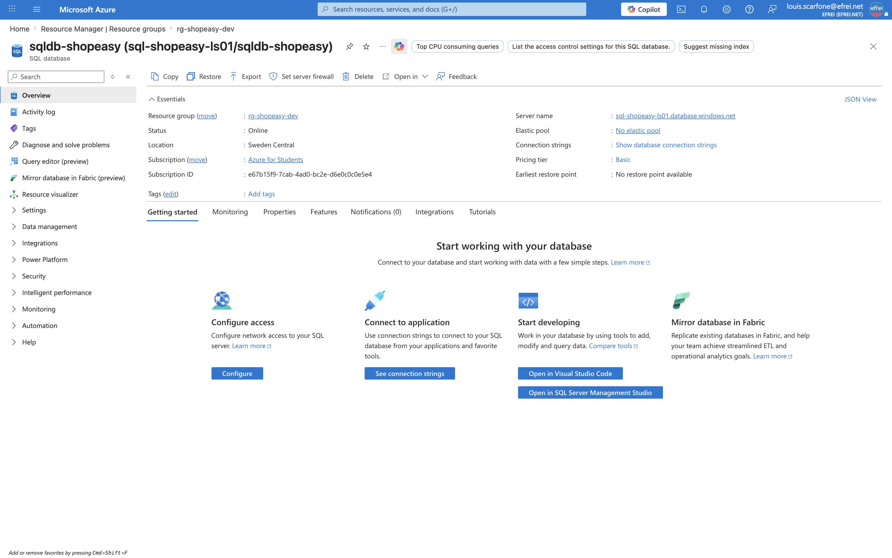

# Atelier 10 — Base de données managée avec Azure SQL Database (ShopEasy)

> **Objectif :** comparer une base installée sur serveur avec une base managée Azure SQL Database. \
> **Livrable attendu :** capture de la base créée + tableau comparatif complété.
>
> **Région :** `swedencentral` · **Serveur :** `sql-shopeasy-ls01` · **Base :** `sqldb-shopeasy`.

---

## 1. Architecture attendue

La base de données **ne doit pas être exposée librement sur Internet**. Dans une architecture de
production, on privilégie : **règles réseau limitées**, **Private Endpoint**, **identités managées**
(Microsoft Entra ID) et politiques de sécurité adaptées. Pour ce TP, le serveur est créé avec un
**pare-feu fermé** (aucune règle = aucun accès entrant).

---

## 2. Création (Azure CLI)

```bash
# Serveur logique SQL (mot de passe admin fort généré)
az sql server create \
  --resource-group rg-shopeasy-dev \
  --name sql-shopeasy-ls01 \
  --location swedencentral \
  --admin-user shopeasyadmin \
  --admin-password '<MOT_DE_PASSE_FORT>'

# Base managée, niveau Basic (test)
az sql db create \
  --resource-group rg-shopeasy-dev \
  --server sql-shopeasy-ls01 \
  --name sqldb-shopeasy \
  --service-objective Basic \
  --backup-storage-redundancy Local
```

> 🔐 **Identifiants** (à conserver hors dépôt Git) : admin `shopeasyadmin`, mot de passe **fort généré**
> (non commité ici). Le serveur : `sql-shopeasy-ls01.database.windows.net`.

Sorties CLI :
```json
// Serveur
{ "Admin": "shopeasyadmin", "Etat": "Ready", "Region": "swedencentral",
  "FQDN": "sql-shopeasy-ls01.database.windows.net", "Serveur": "sql-shopeasy-ls01" }

// Base
{ "Base": "sqldb-shopeasy", "Tier": "Basic", "DTU": 5,
  "MaxSize_Go": "2147483648", "Etat": "Online",
  "Collation": "SQL_Latin1_General_CP1_CI_AS" }
```

---

## 3. Sécurité — base non exposée

```text
=== Règles de pare-feu du serveur SQL ===
  Nombre de règles : 0
  (0 règle = aucune IP autorisée = base NON exposée à Internet)

=== Accès réseau public + TLS ===
{ "AccesPublic": "Enabled", "TLS_min": "1.2" }
```

- **Aucune règle de pare-feu** → le point de terminaison public existe mais **rejette toutes les IP**.
- **TLS 1.2** minimum imposé.
- Pour se connecter en test, on ajouterait **temporairement** une règle limitée à l'IP de l'admin
  (`az sql server firewall-rule create ... --start-ip-address <IP> --end-ip-address <IP>`), **documentée
  et supprimée après validation** (point de vigilance du TP).
- **Cible production** : `publicNetworkAccess=Disabled` + **Private Endpoint** dans `snet-data` →
  la base n'est joignable que depuis le réseau privé (le subnet web), jamais depuis Internet.

---

## 4. Capture visuelle à joindre

**Base de données créée** (Overview de `sqldb-shopeasy` : serveur, tier Basic, statut Online)


---

## 5. Tableau comparatif — SQL sur VM vs Azure SQL Database

| Critère | Base sur VM (IaaS) | Azure SQL Database (PaaS) |
|---|---|---|
| **Administration OS** | À la charge du client (OS + moteur SQL à installer/maintenir) | **Aucune** — Azure gère OS et moteur |
| **Sauvegardes** | À concevoir et opérer (jobs, stockage, rétention) | **Automatiques** (point-in-time restore intégré) |
| **Mises à jour** | À planifier et appliquer (OS + correctifs SQL) | **Automatiques** et transparentes |
| **Haute disponibilité** | À construire (cluster, réplication, témoin) | **Intégrée** selon le niveau de service (SLA jusqu'à 99,99 %) |
| **Sécurité** | Durcissement OS + SQL entièrement à la charge du client | **TDE par défaut**, pare-feu, Entra ID, audit, Defender for SQL |
| **Coût** | VM + licence SQL + disque + temps d'exploitation | Paiement du **service** (DTU/vCore), ni VM ni licence à gérer |
| **Flexibilité** | Contrôle total (version, config, accès OS) | Contrôle limité au **périmètre base**, mais **scaling rapide** |

**Synthèse :** pour ShopEasy, **Azure SQL Database** supprime l'essentiel de l'administration (OS,
sauvegardes, HA, patchs) identifiée comme un risque à l'Atelier 1, au prix d'un contrôle moindre sur la
plateforme — un compromis pertinent pour une PME sans équipe DBA dédiée.

---

## ✅ État après l'Atelier 10
- Serveur `sql-shopeasy-ls01` + base `sqldb-shopeasy` (Basic) **Online**, **pare-feu fermé** (non exposée).
- Tableau comparatif VM vs PaaS complété.
- **Prêt pour l'Atelier 11 — supervision (Azure Monitor).**
