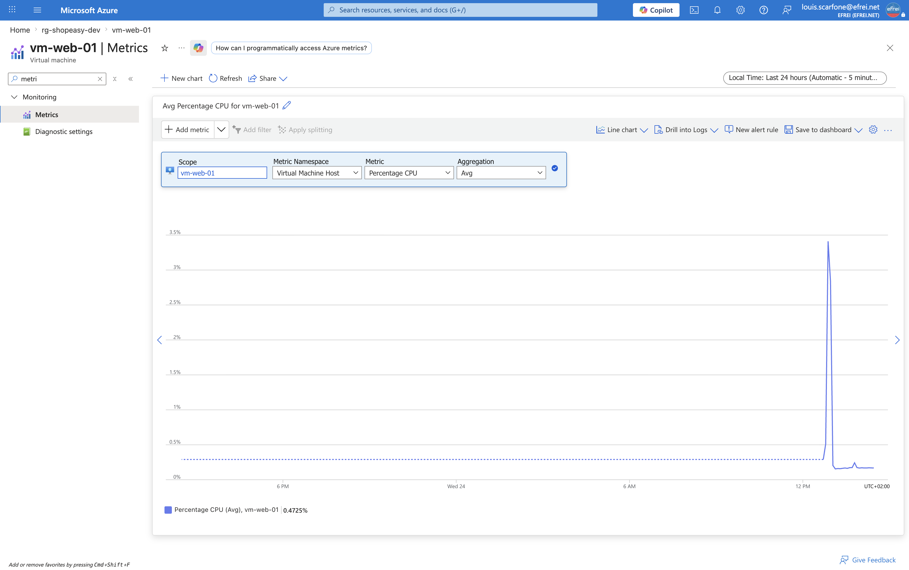
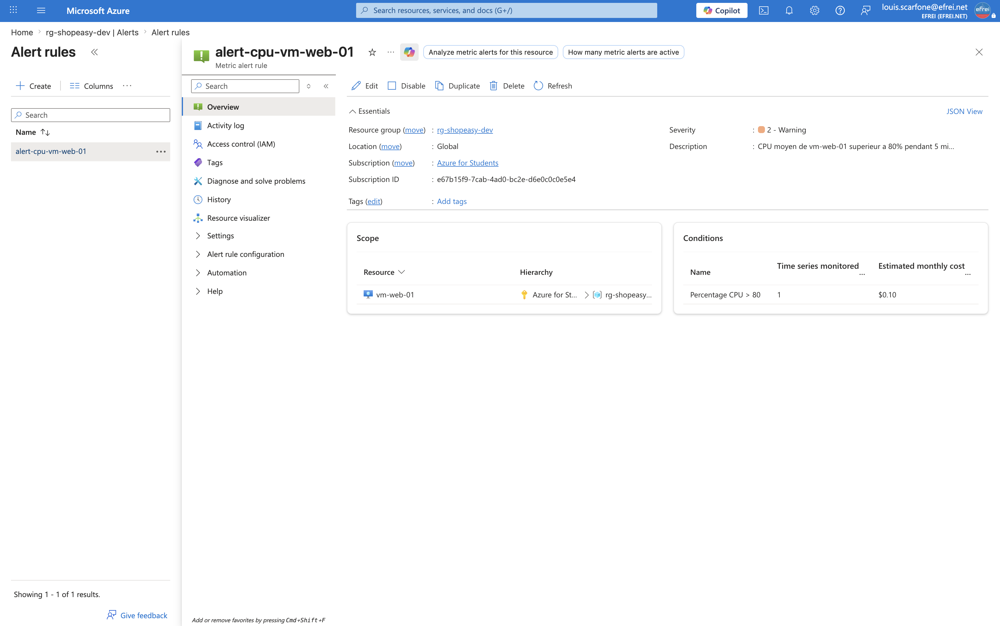

# Atelier 11 — Supervision avec Azure Monitor (ShopEasy)

> **Objectif :** mettre en place une première lecture opérationnelle de l'infrastructure. \
> **Livrable attendu :** capture des métriques, de l'alerte + tableau d'indicateurs.

---

## 1. Métriques d'une VM (CPU)

```bash
VMID=$(az vm show -g rg-shopeasy-dev -n vm-web-01 --query id -o tsv)
az monitor metrics list --resource "$VMID" \
  --metric "Percentage CPU" --interval PT5M --aggregation Average Maximum
```

Sortie réelle (vm-web-01, % CPU) :
```text
Heure                 CPU_moy   CPU_max
--------------------  --------  --------
2026-06-24T11:47:00Z  0.244     0.92
2026-06-24T11:52:00Z  0.168     0.22
2026-06-24T11:57:00Z  0.172     0.23
2026-06-24T12:02:00Z  0.168     0.22
2026-06-24T12:07:00Z  0.168     0.23
2026-06-24T12:12:00Z  0.169     0.22
```

> CPU très faible (VM au repos servant une page statique). La métrique `Percentage CPU` est une
> **métrique de plateforme** collectée sans agent.

---

## 2. Création d'une alerte CPU

```bash
az monitor metrics alert create \
  --name alert-cpu-vm-web-01 \
  --resource-group rg-shopeasy-dev \
  --scopes "$VMID" \
  --condition "avg Percentage CPU > 80" \
  --window-size 5m \
  --evaluation-frequency 1m \
  --severity 2 \
  --description "CPU moyen de vm-web-01 superieur a 80% pendant 5 minutes"
```

Sortie réelle :
```json
{ "Alerte": "alert-cpu-vm-web-01", "Active": true, "Severite": 2, "Fenetre": "PT5M",
  "Description": "CPU moyen de vm-web-01 superieur a 80% pendant 5 minutes" }
```

> L'alerte évalue le CPU **toutes les minutes** sur une **fenêtre de 5 min** ; elle se déclenche si la
> moyenne dépasse **80 %**. *(Le provider `microsoft.insights` s'est auto-enregistré à cette occasion.)*

---

## 3. Logs d'activité du Resource Group

```bash
az monitor activity-log list -g rg-shopeasy-dev --offset 6h \
  --query "[?category.value=='Administrative']"
```

Synthèse des opérations réalisées pendant le TP (50 événements administratifs) :
```text
Opération (action)                                          Statut     Nb
----------------------------------------------------------  ---------  ---
Microsoft.Storage/storageAccounts/listKeys/action           Succeeded   5
Microsoft.Sql/servers/databases/write                       Succeeded   3
Microsoft.Network/loadBalancers/write                       Succeeded   3
Microsoft.Sql/servers/write                                 Succeeded   1
Microsoft.Network/networkSecurityGroups/write               Succeeded   2
Microsoft.Network/networkInterfaces/write                   Succeeded   2
Microsoft.Storage/storageAccounts/managementPolicies/write  Succeeded   1
Microsoft.Storage/storageAccounts/blobServices/write        Succeeded   1
```

**Opérations identifiées :** création du Storage Account et de sa lifecycle policy, création du serveur
et de la base SQL, création/configuration du Load Balancer, des NSG, des interfaces réseau, lecture des
clés de stockage. → Le journal d'activité **retrace l'historique** de tout ce qui a été fait, par qui et
avec quel résultat (traçabilité / audit).

---

## 4. Captures visuelles à joindre

**Métriques CPU de la VM** (graphique « Percentage CPU »)


**Règle d'alerte CPU** (`alert-cpu-vm-web-01`)


---

## 5. Tableau d'indicateurs

| Indicateur | Seuil proposé | Pourquoi le surveiller ? |
|---|---|---|
| **CPU VM** | > 80 % pendant 5 min | Détecter une **saturation** ou un sous-dimensionnement → dégradation des temps de réponse. |
| **Disponibilité HTTP** | < 100 % / échec sonde LB | Détecter une **VM/backend HS** → indisponibilité du service web. |
| **Espace disque** | > 85 % utilisé | Éviter le **disque plein** (OS/app qui plante, logs qui ne s'écrivent plus). |
| **Échecs de connexion** | > seuil / minute | Détecter des **erreurs applicatives** ou des **tentatives d'intrusion** (brute force SQL/SSH). |
| **Coût journalier** | > budget / 30 | Alerter sur un **dépassement budgétaire** (FinOps), éviter les dérives. |

### Trois indicateurs supplémentaires utiles en production
1. **Latence applicative (P95)** : temps de réponse au 95ᵉ percentile → reflète l'**expérience utilisateur** réelle.
2. **Santé des backends du Load Balancer (Dip availability)** : pourcentage de backends sains → détecter une **bascule** ou une perte de capacité.
3. **DTU / connexions / deadlocks Azure SQL** : santé de la **couche données** → anticiper la saturation de la base.

*(Bonus : taux d'erreurs HTTP 5xx pour la qualité de service.)*

---

## ✅ État après l'Atelier 11
- Métriques CPU consultées, alerte `alert-cpu-vm-web-01` active, logs d'activité analysés.
- Tableau d'indicateurs + 3 indicateurs production proposés.
- **Prêt pour l'Atelier 12 — estimation et optimisation des coûts (FinOps).**
