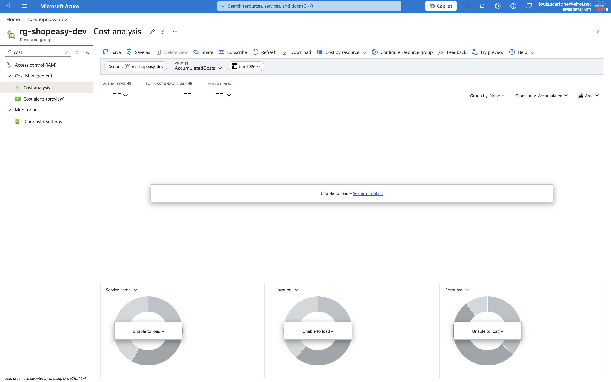

# Atelier 12 — Estimation et optimisation des coûts (FinOps) — ShopEasy

> **Objectif :** produire une première estimation budgétaire et identifier des optimisations FinOps simples. \
> **Livrable attendu :** une estimation de coût + trois recommandations FinOps.

---

## 1. Méthode et source des prix

Le **coût réel** (Cost Management / `az consumption usage list`) n'est **pas encore disponible** : les
données de facturation n'apparaissent qu'après **24-48 h** sur un abonnement récent. Les prix ci-dessous
sont donc **vérifiés en direct** via l'**API officielle Azure Retail Prices** (`prices.azure.com`, **juin
2026**), en **pay-as-you-go USD**, hypothèse de fonctionnement **24/7** (730 h/mois).

| Ressource déployée (vérifiée en CLI) | Prix unitaire officiel (Azure Retail Prices) |
|---|---|
| 2 × VM `Standard_B2ats_v2` (Linux, Sweden Central) | **0,00972 $/h** |
| 2 × disque OS Standard HDD **S4 (32 Go) LRS** | **1,536 $/mois** |
| 1 × Load Balancer **Standard** (5 règles incluses) | **0,025 $/h** (+ 0,005 $/Go traité) |
| 3 × IP publique **Standard static** | **0,005 $/h** |
| 1 × Azure SQL Database **Basic** (5 DTU) | **0,161 $/jour** (≈ 4,90 $/mois) |
| 1 × règle d'alerte Azure Monitor | **≈ 0,10 $/mois** |
| Storage Account StorageV2 LRS (faible volume) | négligeable (< 0,10 $/mois) |

---

## 2. Tableau de coûts (prix réels, 24/7)

| Ressource | Calcul | Coût $/mois | Optimisation possible |
|---|---|---|---|
| **VM web 1** | 0,00972 $/h × 730 | **7,10** | Désallouer hors usage (`az vm deallocate`) |
| **VM web 2** | 0,00972 $/h × 730 | **7,10** | Idem ; autoscale en production |
| **Disques** | 2 × 1,536 $/mois | **3,07** | Taille adaptée ; suppression au nettoyage |
| **Load Balancer** | 0,025 $/h × 730 | **18,25** | App Gateway **seulement si** L7/WAF requis ; arrêt hors usage |
| **IP publiques (3)** | 3 × 0,005 $/h × 730 | **10,95** | Retirer les IP des VM (Bastion) → 1 seule (LB) |
| **Azure SQL Database** | Basic, 0,161 $/j × 30,4 | **4,90** | Serverless auto-pause / niveau adapté |
| **Storage Account** | faible volume | **< 0,10** | Lifecycle (déjà appliquée), LRS (pas GRS) |
| **Monitoring** | 1 règle d'alerte | **0,10** | Métriques de plateforme **gratuites** |
| **Total** | | **≈ 51,5 $/mois** | (≈ 0 si tout est désalloué/supprimé hors TP) |

> ⚠️ Les **3 postes les plus coûteux** sont le **Load Balancer (18,25 $)**, les **IP publiques (10,95 $)**
> et le **compute des 2 VM (14,20 $)** — le LB et les IP facturent **même à trafic nul**. À l'inverse,
> **désallouer les VM** annule leur coût compute (≈ 14 $/mois économisés).
>
> 📎 *Prix vérifiés via l'API **Azure Retail Prices** (`prices.azure.com`, juin 2026), pay-as-you-go, USD.*

---

## 3. Trois recommandations FinOps

1. **Arrêter le compute hors période d'usage.** Les VM de test n'ont pas besoin de tourner 24/7 :
   `az vm deallocate` stoppe la facturation **compute** (seul le disque reste facturé). En fin de TP,
   **supprimer tout le Resource Group** (`az group delete`) supprime d'un coup les postes qui coûtent à
   vide (LB, IP publiques, base).
2. **Réduire les ressources facturées en permanence.** Supprimer les **IP publiques des VM** (3 → 1 :
   seule celle du LB est nécessaire ; administration via **Azure Bastion**). Garder **LRS** (pas de
   géo-redondance inutile en dev) et la **lifecycle policy** sur les archives.
3. **Dimensionner et piloter.** Choisir des **niveaux adaptés** (SQL Basic ou Serverless auto-pause,
   VM burstable), et **gouverner** avec **tags + budgets/alertes** Cost Management pour être prévenu
   avant tout dépassement.

---

## 4. Questions FinOps du TP

**1. Quelles ressources coûtent même lorsqu'elles ne sont pas utilisées ?**
Les **IP publiques statiques**, le **Load Balancer**, les **disques managés**, la **base SQL provisionnée**
et le **Storage Account** facturent en continu (à la réservation/capacité). Le **compute des VM**, lui, ne
coûte **que si la VM est allumée** — une VM **désallouée** ne facture plus de compute (mais son disque OS
reste facturé).

**2. Que peut-on arrêter en dehors des périodes de formation ?**
**Désallouer les VM** (gain principal). On peut aussi **supprimer le Load Balancer et les IP publiques**
(recréables rapidement par script). La base SQL Basic et le Storage sont peu coûteux : on peut les
laisser, ou tout supprimer via le Resource Group si l'environnement n'est plus nécessaire.

**3. Pourquoi les tags sont-ils utiles pour analyser les coûts ?**
Les tags (`projet`, `environnement`, `owner`, `costcenter`) permettent d'**attribuer** la dépense à une
application, un environnement ou une équipe, de **filtrer** les coûts dans Cost Management et de définir
des **budgets ciblés** — sans tags, les coûts sont difficiles à imputer et à piloter.

**4. Quelle différence entre réduire les coûts et optimiser les coûts ?**
- **Réduire** = baisser la dépense, parfois **au détriment du service** (supprimer, sous-dimensionner).
- **Optimiser** = obtenir le **meilleur rapport valeur/coût** : bon dimensionnement, suppression du
  **gaspillage** (ressources oubliées, surdimensionnées), choix du bon niveau de service — **sans dégrader
  la valeur métier**. La cible FinOps est l'**optimisation**, pas la réduction aveugle.

---

## 5. Capture (optionnelle)

Le coût réel n'étant pas encore remonté, une capture **Cost Management → Cost analysis** montrera peu de
données pour l'instant. Optionnel :

> Navigation (EN) : **Cost Management + Billing → Cost analysis** (ou `rg-shopeasy-dev` → **Cost analysis**).

---

## ✅ État après l'Atelier 12
- Estimation ≈ **52 €/mois** (24/7), postes principaux identifiés (LB, compute, IP publiques).
- 3 recommandations FinOps + réponses aux 4 questions.
- **Prêt pour l'Atelier 13 — analyse de disponibilité.**
