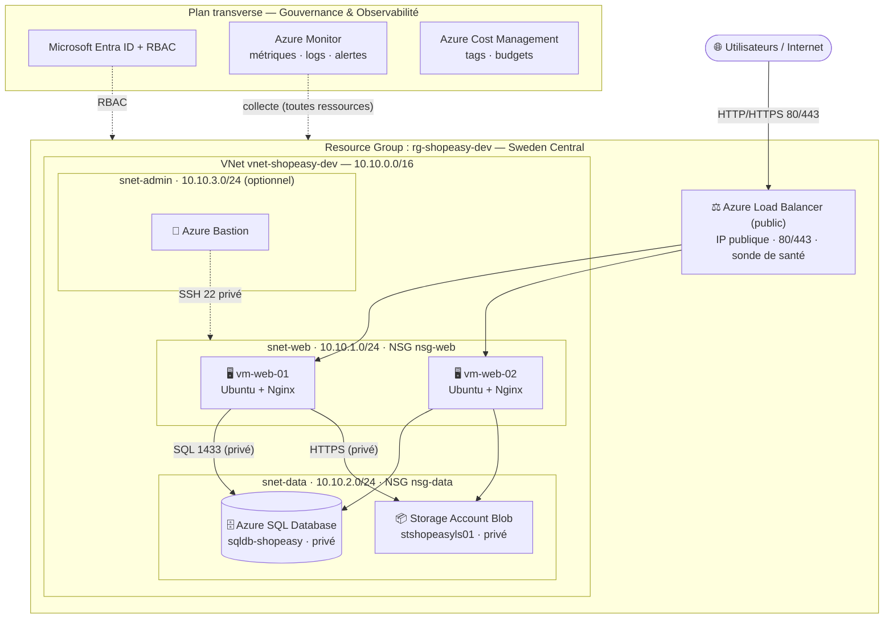

# Note de recommandations — Migration de ShopEasy vers Microsoft Azure

> **Destinataire :** Direction des Systèmes d'Information (DSI) \
> **Objet :** proposition d'architecture cloud cible pour l'application de gestion de commandes ShopEasy \
> **Auteurs (binôme) :** Louis SCARFONE & Maxence BOURRAGUE · **Périmètre :** TP1 — Bloc 4 (Cloud Computing)

---

## 1. Contexte et enjeux

ShopEasy exploite une application interne de gestion de commandes (consultation clients, saisie de
commandes, facturation, dépôt de documents) hébergée sur **un serveur physique unique** : Apache/Nginx +
application PHP/Node.js + base MySQL **colocalisés**, documents en répertoire local, sauvegardes
manuelles, **aucune supervision**, **compte administrateur partagé**.

Cette situation présente des **risques majeurs** : point de défaillance unique (indisponibilité totale en
cas de panne), sécurité faible (données et accès non cloisonnés, traçabilité nulle), exploitation
artisanale et coûts non maîtrisés. La direction souhaite une **première proposition Azure** améliorant la
**disponibilité**, **séparant les couches**, **réduisant les risques d'administration** et offrant une
**visibilité financière**, tout en préparant une évolution vers l'automatisation.

---

## 2. Architecture cible proposée

*(Schéma identique à l'[Atelier 3 — Architecture cible](Atelier-03-Architecture-cible.md), avec sa légende détaillée.)*

L'architecture **sépare les couches** (réseau, applicatif, données, stockage), supprime le **point de
défaillance unique applicatif** (2 VM + répartiteur de charge) et **n'expose à Internet que le Load
Balancer**. La base et les documents sont en **accès privé**.

---

## 3. Services Azure retenus et leur rôle

| Service | Rôle | Modèle |
|---|---|---|
| **Resource Group** `rg-shopeasy-dev` | Cycle de vie commun, droits, coûts | Gouvernance |
| **Virtual Network + subnets** | Réseau privé isolé, segmentation web/data/admin | IaaS |
| **Network Security Groups** | Filtrage des flux (80/443 web, 22 admin, 1433 interne) | IaaS |
| **2 × Virtual Machines** (`B2ats_v2`) | Couche applicative redondante (Nginx) | IaaS |
| **Azure Load Balancer** | Répartition de charge + sonde de santé | IaaS |
| **Azure SQL Database** (Basic) | Base relationnelle **managée**, non exposée | PaaS |
| **Storage Account** (Blob) | Documents clients durables, privés, versionnés | PaaS |
| **Microsoft Entra ID + RBAC** | Identités et droits (moindre privilège) | Gouvernance |
| **Azure Monitor** | Métriques, logs, alertes | Gouvernance |
| **Cost Management + tags** | Suivi et pilotage des coûts | Gouvernance |

---

## 4. Gains attendus

- **Disponibilité** : redondance applicative + répartiteur de charge → plus de panne bloquante sur une VM.
- **Sécurité** : couches cloisonnées, base et stockage **non exposés**, SSH restreint, chiffrement/TLS.
- **Exploitation** : services managés (base, stockage), supervision centralisée et alertes.
- **Données** : durabilité, **versioning**, soft-delete, sauvegardes intégrées de la base.
- **Coûts** : passage en **OPEX**, visibilité par tags, leviers d'optimisation (arrêt/dimensionnement).

---

## 5. Sécurité — mesures et risques résiduels

**Mesures en place :** NSG restrictifs (SSH limité à l'IP admin, SQL `1433` interne au subnet web),
**base sans accès public** (0 règle de pare-feu), **stockage public bloqué**, **TLS 1.2** + chiffrement au
repos, supervision et alerte.

**Risques résiduels (à traiter) :** compte d'administration à **rendre nominatif** (+ MFA, RBAC moindre
privilège) ; **IP publiques sur les VM** à supprimer (→ Azure Bastion) ; passage en **Private Endpoint**
pour SQL et Storage ; **HTTPS/WAF** via Application Gateway.

---

## 6. Disponibilité — niveau obtenu et améliorations

**Obtenu :** tolérance à la panne d'**une** VM (la sonde la retire, l'autre sert le trafic), base et
stockage managés et redondés localement.

**Limites & améliorations :** déploiement **mono-zone** (VM sans Availability Zone, contrainte de
l'abonnement Azure for Students) → cible **multi-zone** ; base **Basic** sans HA avancée → niveau
supérieur + **failover group** ; stockage **LRS** → **ZRS/GRS** ; **tests de restauration** et objectifs
**RPO/RTO** à formaliser.

---

## 7. Coûts (FinOps)

Estimation **vérifiée via l'API Azure Retail Prices** (juin 2026, pay-as-you-go, **24/7**) :

| Poste | Coût ($/mois) |
|---|---|
| 2 × VM `B2ats_v2` | 14,20 |
| Load Balancer Standard | 18,25 |
| 3 × IP publique Standard | 10,95 |
| Base SQL Basic | 4,90 |
| 2 × disque HDD S4 | 3,07 |
| Storage + Monitoring | ~0,12 |
| **Total** | **≈ 51,5 $/mois** |

**Recommandations FinOps :** désallouer les VM hors usage ; supprimer les ressources qui facturent à vide
(LB, IP publiques) en dehors des périodes d'activité ; **réduire les IP publiques** (3 → 1) ; dimensionner
les niveaux (SQL Serverless auto-pause) ; **piloter via tags + budgets/alertes**. *Postes les plus
coûteux : Load Balancer, IP publiques et compute — ils facturent même à trafic nul.*

---

## 8. Plan d'action priorisé

| Échéance | Actions |
|---|---|
| **Court terme** | Comptes **nominatifs + MFA**, **RBAC moindre privilège** ; budgets/alertes de coût ; HTTPS ; désallocation/nettoyage des ressources de test. |
| **Moyen terme** | **Azure Bastion** + suppression des IP publiques ; **Private Endpoint** SQL/Storage ; **Application Gateway + WAF** ; **multi-zone** ; SQL HA + failover ; **sauvegardes testées** (DR) ; supervision avancée (Defender, flow logs). |
| **Long terme** | **Infrastructure as Code** (Terraform/Bicep) + pipeline **CI/CD** ; éventuelle bascule vers **App Service** (PaaS) pour réduire l'administration des VM. |

---

## 9. Limites de la proposition

Architecture **volontairement progressive et pédagogique** : mono-zone, niveaux de service minimaux
(Basic/LRS), VM avec IP publiques pour faciliter le TP, accès aux services de données par pare-feu plutôt
que Private Endpoint. Elle **démontre les briques fondamentales** mais **n'est pas une cible de production
critique** : les évolutions du plan d'action (multi-zone, HA, durcissement réseau, IaC, tests de reprise)
sont nécessaires avant une mise en production.

> **Contraintes d'environnement notables (Azure for Students) :** régions restreintes par policy
> (déploiement en **Sweden Central**), tailles de VM limitées (**`Standard_B2ats_v2`** au lieu de `B1s`),
> déploiement zonal indisponible, providers à enregistrer manuellement — éléments à anticiper pour une
> souscription d'entreprise.

---

## Conclusion

La migration proposée transforme un serveur unique fragile en une architecture **segmentée, redondée,
supervisée et au coût maîtrisé**, en s'appuyant sur des services Azure adaptés à chaque besoin. Elle
répond aux objectifs de la DSI tout en traçant une **feuille de route claire** vers une cible de
production sécurisée et hautement disponible.
