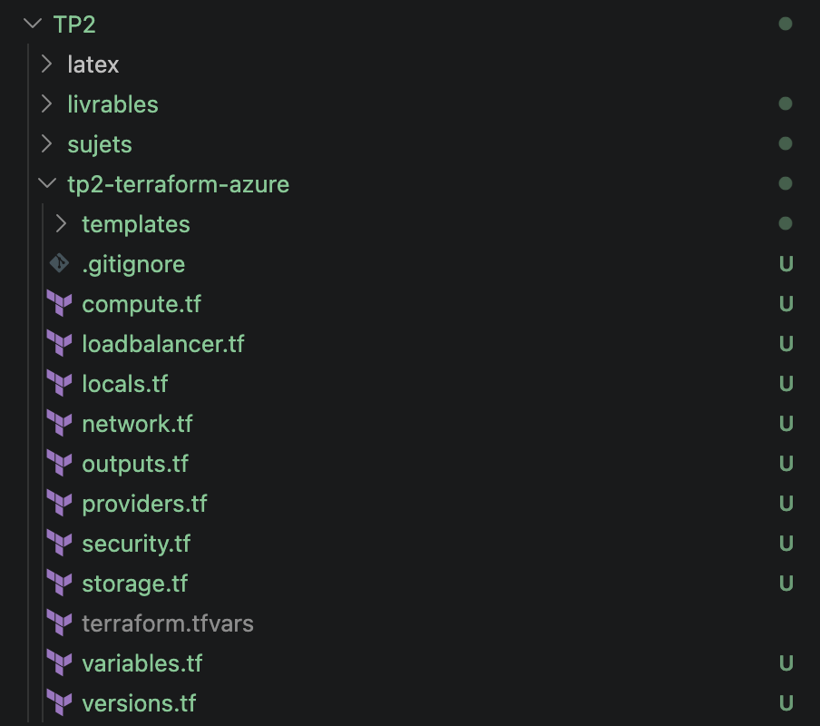

# Atelier 1 — Initialisation du projet Terraform (ShopEasy)

> **Objectif :** poser les fondations d'un projet Terraform propre, lisible et sécurisé pour ShopEasy. \
> **Livrable attendu :** l'arborescence du projet + le fichier `.gitignore`, avec la justification de la non-publication du `terraform.tfstate`.

Le TP1 a conçu et déployé manuellement (Azure CLI) l'architecture cible de ShopEasy. Le TP2 reprend cette
architecture mais la décrit en **Infrastructure as Code** avec **Terraform** : l'infrastructure devient un
ensemble de fichiers `.tf` versionnés, relus, appliqués puis détruits de façon reproductible. Cet atelier
met en place le squelette du projet ; aucune ressource Azure n'est encore créée.

---

## 1. Vérification de l'environnement

L'environnement local est vérifié avant toute initialisation :

```bash
terraform version
git --version
az version --query '"azure-cli"' -o tsv
az account show --query '{name:name, state:state, user:user.name}' -o json
```

Sortie :

```text
Terraform v1.15.7
on darwin_arm64

git version 2.50.1 (Apple Git-155)

2.87.0

{
  "name": "Azure for Students",
  "state": "Enabled",
  "user": "louis.scarfone@efrei.net"
}
```

| Prérequis | Attendu | Constaté | État |
|---|---|---|---|
| Terraform CLI | ≥ 1.6 | **v1.15.7** | ✅ |
| Azure CLI | présent et connecté | **2.87.0**, session active | ✅ |
| Git | présent | **2.50.1** | ✅ |
| Abonnement Azure | formation, actif | **Azure for Students**, *Enabled* | ✅ |
| Clé SSH publique | `~/.ssh/id_rsa.pub` | présente (générée au TP1) | ✅ |

Terraform a été installé via le tap officiel HashiCorp (`brew install hashicorp/tap/terraform`), requis
depuis le passage de Terraform sous licence BSL.

---

## 2. Arborescence du projet

L'arborescence de travail est créée comme suit :

```bash
mkdir -p tp2-terraform-azure/templates
cd tp2-terraform-azure
touch versions.tf providers.tf variables.tf locals.tf \
      network.tf security.tf compute.tf loadbalancer.tf \
      storage.tf outputs.tf terraform.tfvars templates/cloud-init.yml
```

Structure obtenue :

```text
tp2-terraform-azure/
├── .gitignore              exclusions Git (state, secrets, cache)
├── versions.tf             versions Terraform + providers requis
├── providers.tf            configuration du provider azurerm
├── variables.tf            variables d'entrée (paramétrage du projet)
├── locals.tf               valeurs calculées (préfixe de nommage, tags communs)
├── network.tf              Resource Group, VNet, subnet
├── security.tf             Network Security Group + règles + association
├── compute.tf              IP publiques, interfaces réseau, 2 VM Linux (cloud-init)
├── loadbalancer.tf         IP publique LB, Load Balancer, backend pool, sonde, règle
├── storage.tf              suffixe aléatoire, Storage Account, container Blob
├── outputs.tf              sorties exposées après déploiement
├── terraform.tfvars        valeurs concrètes (exclu de Git — contient l'IP admin)
└── templates/
    └── cloud-init.yml      script d'installation Nginx au premier démarrage des VM
```

Le projet est découpé par **responsabilité** (réseau / sécurité / calcul / stockage / sorties) plutôt
qu'en un seul fichier `main.tf`. Ce découpage améliore la lisibilité et la maintenabilité : chaque fichier
regroupe un type de ressources cohérent et peut être relu indépendamment. Les fichiers `.tf` sont créés
vides à ce stade et seront complétés atelier par atelier.

### Rôle de chaque fichier

| Fichier | Rôle |
|---|---|
| `versions.tf` | Version minimale de Terraform + providers requis (`azurerm`, `random`) avec contraintes de version. |
| `providers.tf` | Configuration du provider `azurerm` (bloc `features {}`). |
| `variables.tf` | Paramètres configurables : projet, environnement, région, admin, clé SSH, CIDR SSH. |
| `locals.tf` | Valeurs internes réutilisables : préfixe de nommage, tags communs. |
| `network.tf` | Resource Group + Virtual Network + subnet applicatif. |
| `security.tf` | NSG, règles entrantes (HTTP, SSH restreint) et association au subnet. |
| `compute.tf` | IP publiques, interfaces réseau et 2 VM Linux provisionnées par cloud-init. |
| `loadbalancer.tf` | IP publique + Load Balancer L4 (frontend, backend pool, sonde, règle). |
| `storage.tf` | Suffixe aléatoire + Storage Account privé + container Blob versionné. |
| `outputs.tf` | Sorties utiles (nom du RG, IP du LB, IP des VM, nom du Storage). |
| `terraform.tfvars` | Valeurs concrètes de l'environnement `dev` (exclu du dépôt). |
| `templates/cloud-init.yml` | Configuration cloud-init (installation et démarrage Nginx, page de test par serveur). |

---

## 3. Fichier `.gitignore`

```gitignore
# --- Répertoire de travail Terraform (providers téléchargés, cache, plugins) ---
.terraform/

# --- Fichiers de STATE : peuvent contenir des données sensibles en clair ---
#     (clés d'accès Storage, mots de passe, chaînes de connexion, IDs…)
*.tfstate
*.tfstate.*

# --- Variables converties en JSON (peuvent embarquer des valeurs sensibles) ---
*.tfvars.json

# --- Valeurs concrètes d'environnement ---
#     terraform.tfvars contient le CIDR SSH = IP publique réelle de l'admin.
#     Seul l'exemple anonymisé terraform.tfvars.example est versionné.
terraform.tfvars

# --- Fichier de verrouillage des providers (choix du TP : non versionné) ---
.terraform.lock.hcl

# --- Logs de crash Terraform ---
crash.log
crash.*.log
```

| Motif ignoré | Raison |
|---|---|
| `.terraform/` | Cache local volumineux (binaires des providers), recréé par `terraform init`. |
| `*.tfstate` / `*.tfstate.*` | Le state peut contenir des secrets en clair et l'inventaire complet de l'infrastructure (cf. §4). |
| `*.tfvars.json` | Variables au format JSON pouvant contenir des valeurs sensibles. |
| `terraform.tfvars` | Contient l'IP publique réelle de l'administrateur (CIDR SSH) — seul l'exemple anonymisé est versionné (cf. §5). |
| `.terraform.lock.hcl` | Fichier de verrouillage des providers — non versionné selon le choix du TP (cf. §5). |
| `crash.*.log` | Journaux de crash temporaires, sans valeur de suivi. |

---

## 4. Point de contrôle — pourquoi ne jamais publier `terraform.tfstate`

Le fichier `terraform.tfstate` est une représentation JSON de toutes les ressources gérées par Terraform
et de leurs attributs. Le publier dans un dépôt non sécurisé est dangereux pour quatre raisons :

1. **Présence possible de secrets en clair.** Terraform stocke dans le state les attributs renvoyés par
   Azure, y compris des valeurs sensibles : clés d'accès d'un Storage Account, mots de passe admin,
   chaînes de connexion, tokens SAS, clés privées. Même si aucun secret n'est écrit dans les `.tf`, il
   peut se retrouver dans le state.
2. **Exposition de l'inventaire complet de l'infrastructure.** Noms, identifiants, adresses IP, plages de
   subnets et règles réseau constituent une cartographie de reconnaissance exploitable par un attaquant.
3. **Rôle de source de vérité.** Le state fait le lien entre le code et les ressources réelles. S'il est
   exposé, corrompu ou modifié, Terraform peut détruire ou recréer des ressources par erreur, ou perdre la
   trace de ce qu'il gère.
4. **Incompatibilité avec le travail d'équipe en local.** Plusieurs personnes qui versionnent leur state
   provoquent des conflits de fusion et l'absence de verrouillage mène à la corruption du fichier.

La solution professionnelle consiste à externaliser le state dans un **backend distant** (Storage Account
Azure dédié) avec chiffrement, RBAC et verrouillage — objet de l'Atelier 12. En attendant, le `.gitignore`
garantit que le state ne quitte jamais le poste local.

---

## 5. Protection des valeurs sensibles

**Exclusion de `terraform.tfvars`.** Le `.gitignore` fourni par le TP n'exclut pas `terraform.tfvars`. Or
ce fichier contiendra `allowed_ssh_cidr` = l'IP publique réelle de l'administrateur. Conformément à la
règle du cours (« ne jamais mettre de valeur sensible dans un fichier versionné ») et à la pratique du TP1
(masquage de l'IP), `terraform.tfvars` est exclu du dépôt ; un `terraform.tfvars.example` anonymisé est
versionné à sa place (Atelier 3).

**Fichier `.terraform.lock.hcl`.** Le TP demande de l'ignorer. En projet d'équipe réel, HashiCorp
recommande plutôt de le versionner pour figer les versions de providers et garantir des déploiements
identiques entre développeurs et CI/CD. Le choix du TP est suivi ici, la bonne pratique étant notée.

---

## 6. Capture

**Arborescence du projet Terraform dans l'éditeur**


---

## ✅ État du projet après l'Atelier 1

- Arborescence `tp2-terraform-azure/` créée : **10 fichiers `.tf`** (vides), `terraform.tfvars`, `templates/cloud-init.yml` et `.gitignore`.
- Environnement validé : Terraform v1.15.7, Azure CLI 2.87.0 (connecté à *Azure for Students*), Git 2.50.1.
- `.gitignore` en place : state, secrets et `terraform.tfvars` (IP admin) exclus du dépôt.
- Point de contrôle traité : justification de la non-publication du `terraform.tfstate`.

> La région par défaut `francecentral` et la taille de VM `Standard_B1s` prévues par le TP ne sont pas
> disponibles sur *Azure for Students* (policy régionale + SKU indisponible, constaté au TP1). Elles sont
> adaptées en `swedencentral` et `Standard_B2ats_v2` aux Ateliers 3 et 6.

**Prêt pour l'Atelier 2 — déclaration des providers.**
