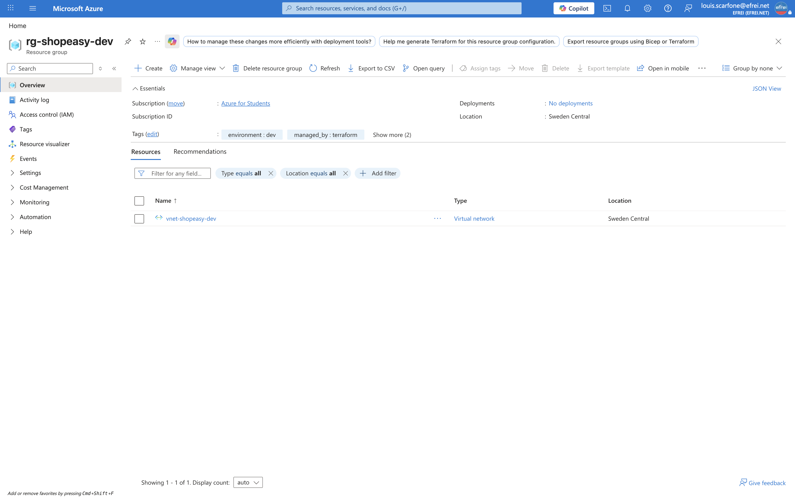
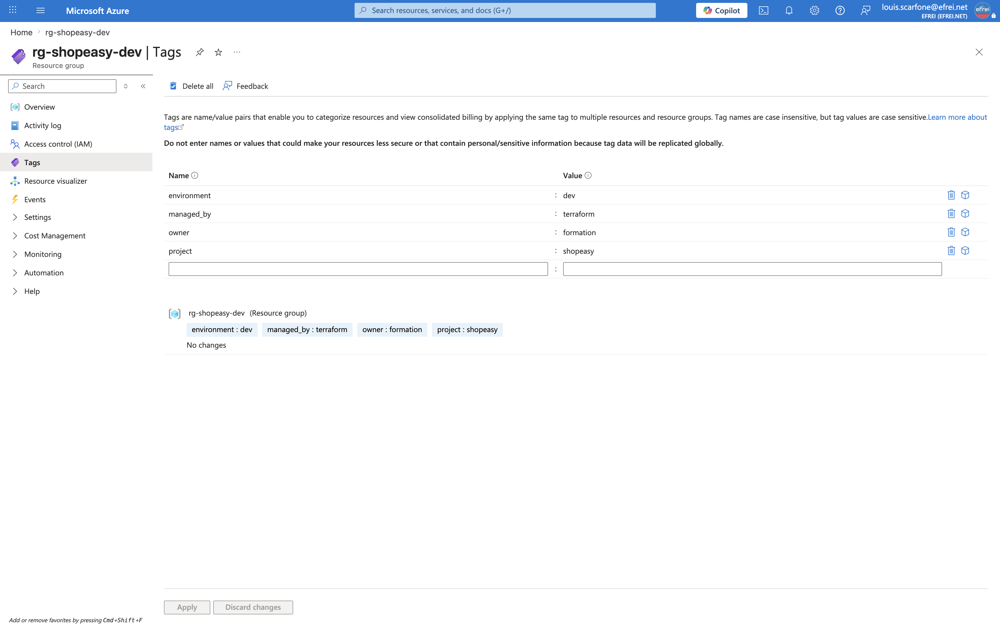
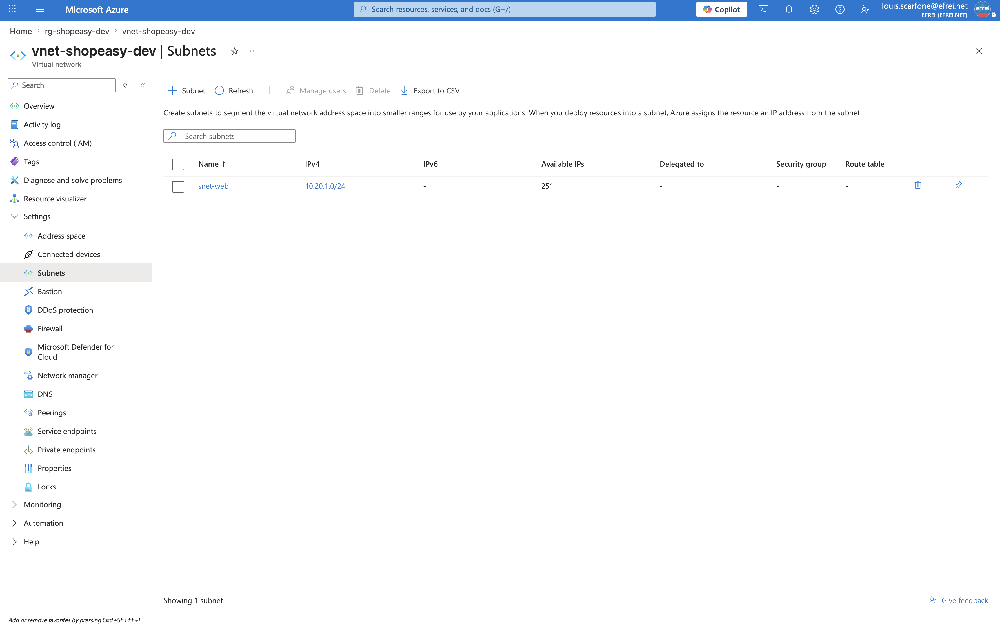

# Atelier 4 — Groupe de ressources et réseau (ShopEasy)

> **Objectif :** créer le groupe de ressources et le réseau privé de ShopEasy avec Terraform, et réaliser le premier `apply`. \
> **Livrable attendu :** `network.tf` (RG + VNet + subnet) + preuve de création (plan, apply, portail) + réponses aux questions.

---

## 1. Authentification du provider

L'authentification vers Azure est héritée de la session Azure CLI (`az login`) déjà active. Le provider
`azurerm` v4.x exige en plus l'identifiant d'abonnement : il est fourni par la variable d'environnement
`ARM_SUBSCRIPTION_ID`, renseignée depuis la session active, **sans inscrire l'identifiant dans le code** :

```bash
export ARM_SUBSCRIPTION_ID=$(az account show --query id -o tsv)
```

---

## 2. Ressources réseau — `network.tf`

```hcl
resource "azurerm_resource_group" "main" {
  name     = "rg-${local.prefix}"
  location = var.location
  tags     = local.common_tags
}

resource "azurerm_virtual_network" "main" {
  name                = "vnet-${local.prefix}"
  address_space       = ["10.20.0.0/16"]
  location            = azurerm_resource_group.main.location
  resource_group_name = azurerm_resource_group.main.name
  tags                = local.common_tags
}

resource "azurerm_subnet" "web" {
  name                 = "snet-web"
  resource_group_name  = azurerm_resource_group.main.name
  virtual_network_name = azurerm_virtual_network.main.name
  address_prefixes     = ["10.20.1.0/24"]
}
```

Le VNet et le subnet **référencent** les attributs du Resource Group (`azurerm_resource_group.main.name`,
`.location`). Terraform en déduit automatiquement le **graphe de dépendances** : le RG est créé en premier,
puis le VNet, puis le subnet. Le nommage s'appuie sur `local.prefix` (`shopeasy-dev`) et tous les éléments
portent `local.common_tags`.

| Ressource | Nom | Valeur clé |
|---|---|---|
| `azurerm_resource_group.main` | `rg-shopeasy-dev` | région `swedencentral` |
| `azurerm_virtual_network.main` | `vnet-shopeasy-dev` | espace `10.20.0.0/16` |
| `azurerm_subnet.web` | `snet-web` | préfixe `10.20.1.0/24` |

---

## 3. Prévisualisation — `terraform plan`

```bash
terraform plan
```

```text
Terraform used the selected providers to generate the following execution
plan. Resource actions are indicated with the following symbols:
  + create

Terraform will perform the following actions:

  # azurerm_resource_group.main will be created
  + resource "azurerm_resource_group" "main" {
      + id       = (known after apply)
      + location = "swedencentral"
      + name     = "rg-shopeasy-dev"
      + tags     = {
          + "environment" = "dev"
          + "managed_by"  = "terraform"
          + "owner"       = "formation"
          + "project"     = "shopeasy"
        }
    }

  # azurerm_subnet.web will be created
  + resource "azurerm_subnet" "web" {
      + address_prefixes                              = [
          + "10.20.1.0/24",
        ]
      + default_outbound_access_enabled               = true
      + id                                            = (known after apply)
      + name                                          = "snet-web"
      + private_endpoint_network_policies             = "Disabled"
      + private_link_service_network_policies_enabled = true
      + resource_group_name                           = "rg-shopeasy-dev"
      + virtual_network_name                          = "vnet-shopeasy-dev"
    }

  # azurerm_virtual_network.main will be created
  + resource "azurerm_virtual_network" "main" {
      + address_space                  = [
          + "10.20.0.0/16",
        ]
      + dns_servers                    = (known after apply)
      + guid                           = (known after apply)
      + id                             = (known after apply)
      + location                       = "swedencentral"
      + name                           = "vnet-shopeasy-dev"
      + private_endpoint_vnet_policies = "Disabled"
      + resource_group_name            = "rg-shopeasy-dev"
      + subnet                         = (known after apply)
      + tags                           = {
          + "environment" = "dev"
          + "managed_by"  = "terraform"
          + "owner"       = "formation"
          + "project"     = "shopeasy"
        }
    }

Plan: 3 to add, 0 to change, 0 to destroy.
```

Le plan annonce **3 ressources à créer**, aucune modification ni destruction — résultat attendu pour un
premier déploiement.

---

## 4. Application — `terraform apply`

```bash
terraform apply
```

Le plan ré-affiché par `apply` est identique au §3 (omis ici) ; suit le journal de création :

```text
Plan: 3 to add, 0 to change, 0 to destroy.
azurerm_resource_group.main: Creating...
azurerm_resource_group.main: Still creating... [00m10s elapsed]
azurerm_resource_group.main: Still creating... [00m20s elapsed]
azurerm_resource_group.main: Creation complete after 26s [id=/subscriptions/e67b15f9-.../resourceGroups/rg-shopeasy-dev]
azurerm_virtual_network.main: Creating...
azurerm_virtual_network.main: Creation complete after 6s [id=.../virtualNetworks/vnet-shopeasy-dev]
azurerm_subnet.web: Creating...
azurerm_subnet.web: Creation complete after 5s [id=.../subnets/snet-web]

Apply complete! Resources: 3 added, 0 changed, 0 destroyed.
```

> L'identifiant d'abonnement est masqué (`e67b15f9-...`) dans les ID de ressources.

---

## 5. Vérification (Azure CLI + état Terraform)

```bash
az group show -n rg-shopeasy-dev --query '{name:name, location:location, provisioningState:properties.provisioningState, tags:tags}' -o json
```

```json
{
  "location": "swedencentral",
  "name": "rg-shopeasy-dev",
  "provisioningState": "Succeeded",
  "tags": {
    "environment": "dev",
    "managed_by": "terraform",
    "owner": "formation",
    "project": "shopeasy"
  }
}
```

```bash
az network vnet show -g rg-shopeasy-dev -n vnet-shopeasy-dev --query '{name:name, location:location, addressSpace:addressSpace.addressPrefixes, provisioningState:provisioningState}' -o json
az network vnet subnet show -g rg-shopeasy-dev --vnet-name vnet-shopeasy-dev -n snet-web --query '{name:name, addressPrefix:addressPrefix, state:provisioningState}' -o json
```

```json
{
  "addressSpace": [ "10.20.0.0/16" ],
  "location": "swedencentral",
  "name": "vnet-shopeasy-dev",
  "provisioningState": "Succeeded"
}
{
  "addressPrefix": "10.20.1.0/24",
  "name": "snet-web",
  "state": "Succeeded"
}
```

```bash
terraform state list
```

```text
azurerm_resource_group.main
azurerm_subnet.web
azurerm_virtual_network.main
```

Les trois ressources sont en `provisioningState: Succeeded`, avec la bonne région, le bon plan d'adressage
et les quatre tags de gouvernance. L'état Terraform recense exactement les trois ressources gérées.

---

## 6. Captures portail

**Vue d'ensemble du Resource Group (région `swedencentral`)**


> Navigation (EN) : **Portal → Resource groups → rg-shopeasy-dev → Overview**.

**Tags de gouvernance du Resource Group**


> Navigation (EN) : **rg-shopeasy-dev → Settings → Tags**.

**Subnet `snet-web` du Virtual Network**


> Navigation (EN) : **rg-shopeasy-dev → vnet-shopeasy-dev → Settings → Subnets**.

---

## 7. Questions

**1. Pourquoi le VNet utilise-t-il une plage privée ?**
La plage `10.20.0.0/16` appartient aux **adresses privées RFC 1918**, non routables sur Internet. Un VNet
est un **réseau privé** : utiliser une plage privée évite tout conflit avec des adresses publiques, garde
les communications internes **isolées et non exposées**, et permet une **segmentation maîtrisée** par
subnets. L'exposition vers l'extérieur se fait **explicitement** via des IP publiques et un Load Balancer
(Ateliers 6 et 7), jamais par le VNet lui-même.

**2. Que faudrait-il ajouter pour isoler une base de données dans un subnet dédié ?**
Il faudrait créer un **second subnet** (par exemple `snet-data`, `10.20.2.0/24`) réservé à la couche
données, associé à son **propre NSG** n'autorisant l'accès à la base (port `1433`/`5432`) **que depuis le
subnet web** et refusant le reste. Idéalement, la base est jointe via un **Private Endpoint** (aucune
exposition publique), éventuellement avec une **délégation de subnet** selon le service managé. C'est
l'application de la **segmentation réseau** et du **moindre privilège** (défense en profondeur). Cette
isolation correspond à l'extension « subnet privé » proposée en mise en autonomie du TP.

**3. Pourquoi séparer les fichiers Terraform au lieu de tout placer dans `main.tf` ?**
Terraform charge **tous** les fichiers `.tf` d'un répertoire quel que soit leur nom : le découpage est donc
purement **organisationnel**, sans coût fonctionnel. Regrouper les ressources par **responsabilité**
(`network.tf`, `security.tf`, `compute.tf`, `storage.tf`, `outputs.tf`) rend le projet **lisible**,
**navigable** et **maintenable** : on trouve et on relit rapidement un domaine, on réduit les conflits de
fusion en équipe, et on respecte le principe du cours selon lequel la qualité d'un projet Terraform se
mesure aussi à sa lisibilité.

---

## ✅ État de l'environnement après l'Atelier 4

- `network.tf` créé : Resource Group + Virtual Network + subnet.
- `terraform apply` : **3 ressources ajoutées** (`rg-shopeasy-dev`, `vnet-shopeasy-dev`, `snet-web`), toutes en `Succeeded`.
- Région `swedencentral`, plan d'adressage `10.20.0.0/16` (subnet web `10.20.1.0/24`), 4 tags de gouvernance.
- État Terraform synchronisé (3 ressources gérées).

**Prêt pour l'Atelier 5 — sécurisation du réseau avec un Network Security Group.**
