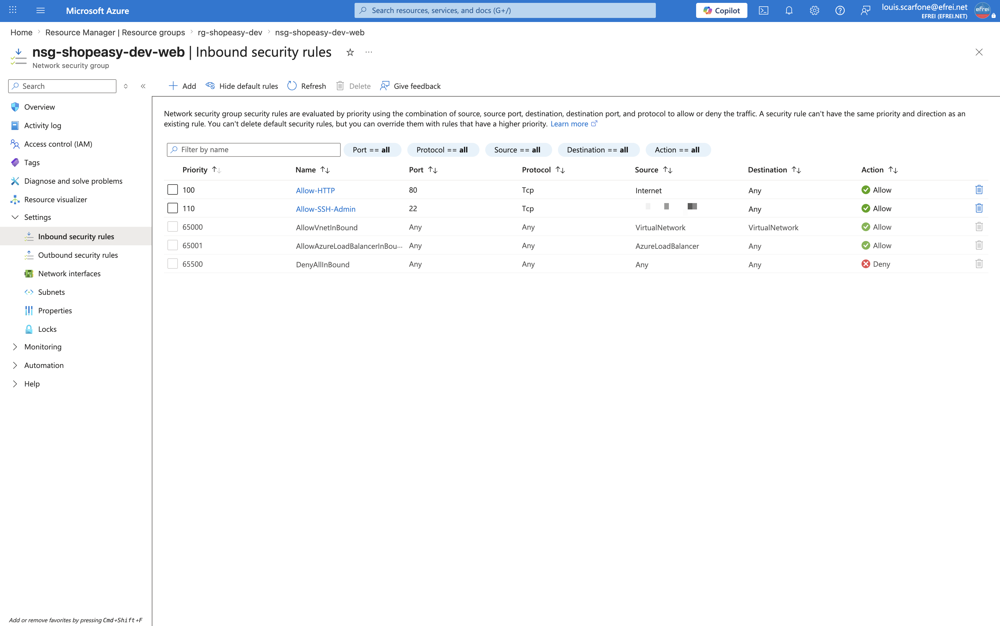
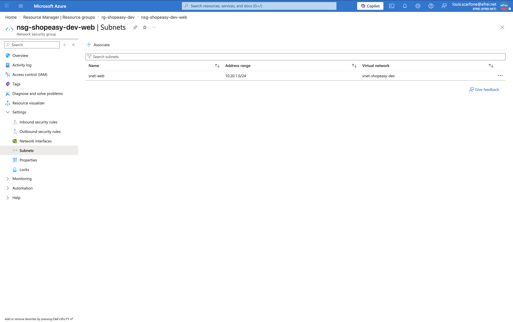

# Atelier 5 — Sécurisation du réseau avec un NSG (ShopEasy)

> **Objectif :** filtrer les flux réseau du subnet web en n'autorisant que les ouvertures nécessaires. \
> **Livrable attendu :** `security.tf` (NSG + règles + association) + analyse de sécurité des flux.

---

## 1. NSG, règles et association — `security.tf`

```hcl
resource "azurerm_network_security_group" "web" {
  name                = "nsg-${local.prefix}-web"
  location            = azurerm_resource_group.main.location
  resource_group_name = azurerm_resource_group.main.name
  tags                = local.common_tags

  security_rule {
    name                       = "Allow-HTTP"
    priority                   = 100
    direction                  = "Inbound"
    access                     = "Allow"
    protocol                   = "Tcp"
    source_port_range          = "*"
    destination_port_range     = "80"
    source_address_prefix      = "Internet"
    destination_address_prefix = "*"
  }

  security_rule {
    name                       = "Allow-SSH-Admin"
    priority                   = 110
    direction                  = "Inbound"
    access                     = "Allow"
    protocol                   = "Tcp"
    source_port_range          = "*"
    destination_port_range     = "22"
    source_address_prefix      = var.allowed_ssh_cidr
    destination_address_prefix = "*"
  }
}

resource "azurerm_subnet_network_security_group_association" "web" {
  subnet_id                 = azurerm_subnet.web.id
  network_security_group_id = azurerm_network_security_group.web.id
}
```

| Règle | Priorité | Sens | Accès | Port | Source | Rôle |
|---|---|---|---|---|---|---|
| `Allow-HTTP` | 100 | Inbound | Allow | 80 | `Internet` | Accès HTTP à l'application web de test. |
| `Allow-SSH-Admin` | 110 | Inbound | Allow | 22 | `var.allowed_ssh_cidr` (IP admin `/32`) | Administration Linux **limitée à l'IP de l'admin**. |

La source SSH n'est jamais codée en dur : elle provient de la variable `allowed_ssh_cidr` (définie dans
`terraform.tfvars`, exclu du dépôt). L'association rattache le NSG au subnet `snet-web` : toutes les VM
qui y seront déployées hériteront du filtrage.

---

## 2. Prévisualisation — `terraform plan`

Le plan annonce **2 ressources à créer** (NSG + association). Extrait (attributs à valeur vide `[]` omis
pour la lisibilité, IP admin masquée) :

```text
  # azurerm_network_security_group.web will be created
  + resource "azurerm_network_security_group" "web" {
      + id                  = (known after apply)
      + location            = "swedencentral"
      + name                = "nsg-shopeasy-dev-web"
      + resource_group_name = "rg-shopeasy-dev"
      + security_rule       = [
          + {
              + access                     = "Allow"
              + destination_address_prefix = "*"
              + destination_port_range     = "22"
              + direction                  = "Inbound"
              + name                       = "Allow-SSH-Admin"
              + priority                   = 110
              + protocol                   = "Tcp"
              + source_address_prefix      = "<IP_ADMIN>/32"
              + source_port_range          = "*"
            },
          + {
              + access                     = "Allow"
              + destination_address_prefix = "*"
              + destination_port_range     = "80"
              + direction                  = "Inbound"
              + name                       = "Allow-HTTP"
              + priority                   = 100
              + protocol                   = "Tcp"
              + source_address_prefix      = "Internet"
              + source_port_range          = "*"
            },
        ]
      + tags                = {
          + "environment" = "dev"
          + "managed_by"  = "terraform"
          + "owner"       = "formation"
          + "project"     = "shopeasy"
        }
    }

  # azurerm_subnet_network_security_group_association.web will be created
  + resource "azurerm_subnet_network_security_group_association" "web" {
      + id                        = (known after apply)
      + network_security_group_id = (known after apply)
      + subnet_id                 = ".../virtualNetworks/vnet-shopeasy-dev/subnets/snet-web"
    }

Plan: 2 to add, 0 to change, 0 to destroy.
```

---

## 3. Application — `terraform apply`

```text
Plan: 2 to add, 0 to change, 0 to destroy.
azurerm_network_security_group.web: Creating...
azurerm_network_security_group.web: Creation complete after 2s [id=.../networkSecurityGroups/nsg-shopeasy-dev-web]
azurerm_subnet_network_security_group_association.web: Creating...
azurerm_subnet_network_security_group_association.web: Creation complete after 6s [id=.../subnets/snet-web]

Apply complete! Resources: 2 added, 0 changed, 0 destroyed.
```

---

## 4. Vérification (Azure CLI)

```bash
az network nsg rule list -g rg-shopeasy-dev --nsg-name nsg-shopeasy-dev-web \
  --query 'sort_by([].{Name:name,Priority:priority,Direction:direction,Access:access,Proto:protocol,Port:destinationPortRange,Source:sourceAddressPrefix}, &Priority)' -o table
```

```text
Name             Priority    Direction    Access    Proto    Port    Source
---------------  ----------  -----------  --------  -------  ------  -----------------
Allow-HTTP       100         Inbound      Allow     Tcp      80      Internet
Allow-SSH-Admin  110         Inbound      Allow     Tcp      22      <IP_ADMIN>/32
```

```bash
az network vnet subnet show -g rg-shopeasy-dev --vnet-name vnet-shopeasy-dev -n snet-web \
  --query '{subnet:name, nsg_associe:networkSecurityGroup.id}' -o json
```

```json
{
  "nsg_associe": ".../networkSecurityGroups/nsg-shopeasy-dev-web",
  "subnet": "snet-web"
}
```

Les deux règles sont actives et le subnet `snet-web` est bien associé au NSG `nsg-shopeasy-dev-web`. La
source de la règle SSH est restreinte à l'IP de l'administrateur (masquée ci-dessus).

---

## 5. Captures portail

**Règles entrantes du NSG (`Allow-HTTP` et `Allow-SSH-Admin`)**


> Navigation (EN) : **rg-shopeasy-dev → nsg-shopeasy-dev-web → Settings → Inbound security rules**.
> *(La source de la règle `Allow-SSH-Admin` — l'IP de l'admin — est floutée sur la capture.)*

**Association du NSG au subnet `snet-web`**


> Navigation (EN) : **nsg-shopeasy-dev-web → Settings → Subnets**.

---

## 6. Analyse de sécurité des flux

| Flux | Autorisé ? | Justification | Risque résiduel |
|---|---|---|---|
| **Internet → HTTP (80)** | **Oui** | Règle `Allow-HTTP` ; nécessaire pour exposer l'application web de test. | Trafic **en clair** (pas de chiffrement). En production : forcer **HTTPS (443)** + redirection, certificats, **Application Gateway + WAF**. |
| **SSH (22) depuis l'IP admin** | **Oui** | Règle `Allow-SSH-Admin` limitée à l'IP de l'administrateur en `/32` ; administration Linux. | Dépend d'une IP fixe ; usurpation possible. En production : **Azure Bastion** / VPN, accès *just-in-time*, MFA. |
| **SSH (22) depuis tout Internet** | **Non** | Aucune règle ne l'autorise ; la règle SSH est restreinte à l'IP admin, et la règle par défaut **`DenyAllInBound`** (priorité 65500) bloque le reste. | Quasi nul au niveau réseau tant que le CIDR admin reste étroit (`/32`). |
| **Tout trafic sortant** | **Oui** | Azure autorise l'**Outbound par défaut** (`AllowVnetOutBound`, `AllowInternetOutBound`). Aucune règle sortante restrictive n'est définie. | **Exfiltration** ou rappel C2 possible depuis une VM compromise. En production : restreindre l'Outbound aux destinations légitimes. |

> Un NSG applique des **règles par défaut** invisibles : `AllowVnetInBound`, `AllowAzureLoadBalancerInBound`
> et `DenyAllInBound` en entrée ; `AllowVnetOutBound`, `AllowInternetOutBound` et `DenyAllOutBound` en
> sortie. Les règles personnalisées (priorité < 65000) sont évaluées **avant** ces défauts.

---

## 7. Question de recul — l'accès SSH en production

Exposer le port SSH (22) directement sur Internet, même restreint à une IP, reste une pratique à **éviter
en production**. Une IP publique peut changer, être usurpée, ou l'administration peut devoir se faire
depuis plusieurs sites. Les approches recommandées :

- **Azure Bastion** : connexion SSH/RDP via le portail, **sans IP publique** sur les VM ni port 22 exposé ;
- **VPN site-to-site ou point-to-site** : l'administration passe par le réseau privé ;
- **Jump server / bastion host** contrôlé et audité, seul point d'entrée ;
- **Accès *just-in-time*** (Microsoft Defender for Cloud) : ouverture du port à la demande, pour une durée
  et une IP limitées, puis fermeture automatique.

L'objectif commun est de **supprimer l'exposition permanente** du SSH au profit d'un accès privé, temporaire
et tracé.

---

## ✅ État de l'environnement après l'Atelier 5

- `security.tf` créé : NSG `nsg-shopeasy-dev-web` (2 règles entrantes) + association au subnet `snet-web`.
- `terraform apply` : **2 ressources ajoutées**.
- HTTP (80) ouvert depuis Internet ; SSH (22) **restreint à l'IP de l'administrateur** ; reste de l'entrant bloqué par défaut.
- Analyse de sécurité des flux complétée + question de recul sur l'administration en production.

**Prêt pour l'Atelier 6 — déploiement des deux machines virtuelles Linux (cloud-init, taille `Standard_B2ats_v2`).**
