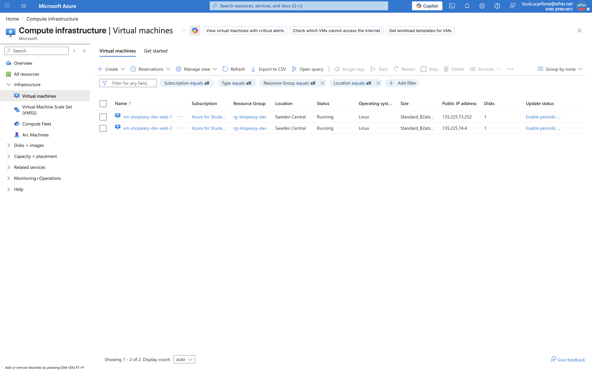
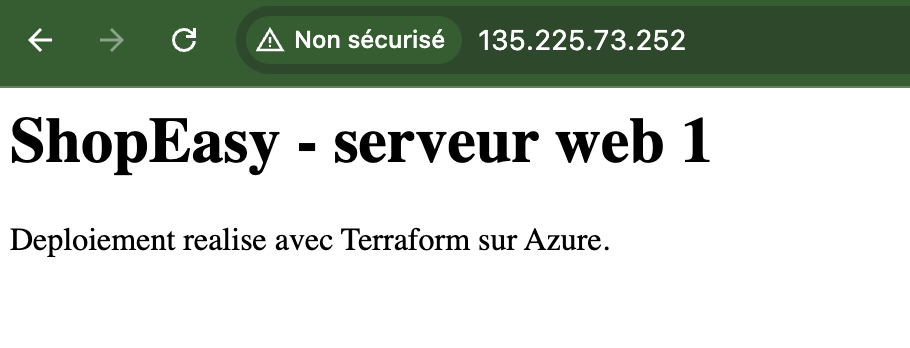
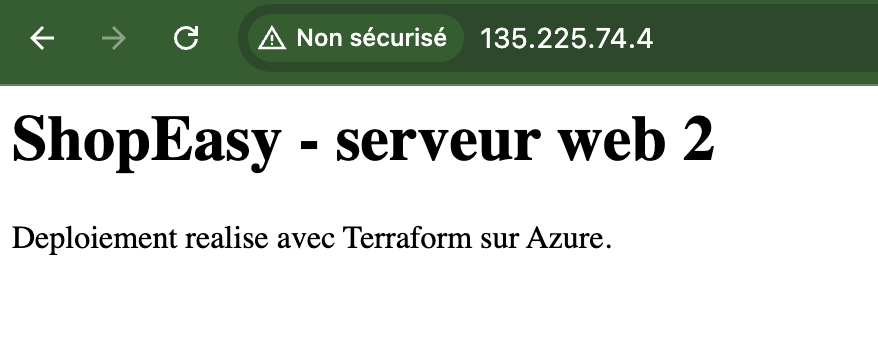

# Atelier 6 — Déploiement des deux machines virtuelles Linux (ShopEasy)

> **Objectif :** déployer deux serveurs web Linux identiques, provisionnés automatiquement par cloud-init. \
> **Livrable attendu :** `templates/cloud-init.yml` + `compute.tf` (IP publiques, interfaces réseau, VM) + preuve d'accès web.

---

## ⚠️ Adaptation imposée par Azure for Students (taille de VM)

Le TP fixe `size = "Standard_B1s"`. Cette taille est **indisponible** sur l'abonnement *Azure for Students*
(contrainte déjà rencontrée et résolue au TP1). La taille retenue est **`Standard_B2ats_v2`** (2 vCPU, série
burstable `Basv2`), **officiellement recommandée par Microsoft** comme alternative à `B1s` sur les
abonnements *Azure for Students* / Free. Le quota `Basv2` (10 vCPU) couvre les 2 × 2 = 4 vCPU nécessaires.

---

## 1. Script cloud-init — `templates/cloud-init.yml`

```yaml
#cloud-config
package_update: true
packages:
  - nginx
write_files:
  - path: /var/www/html/index.html
    content: |
      <html>
        <body>
          <h1>ShopEasy - serveur web ${server_index}</h1>
          <p>Deploiement realise avec Terraform sur Azure.</p>
        </body>
      </html>
runcmd:
  - systemctl enable nginx
  - systemctl restart nginx
```

Ce script est exécuté **au premier démarrage** de chaque VM : il met à jour les paquets, installe **Nginx**,
écrit une page `index.html` puis active et démarre le service. Le marqueur `${server_index}` est une
variable de *template* injectée par Terraform (cf. §2) pour **personnaliser la page par serveur** (1 ou 2).

---

## 2. IP publiques, interfaces et VM — `compute.tf`

```hcl
resource "azurerm_public_ip" "web" {
  count               = 2
  name                = "pip-${local.prefix}-web-${count.index + 1}"
  location            = azurerm_resource_group.main.location
  resource_group_name = azurerm_resource_group.main.name
  allocation_method   = "Static"
  sku                 = "Standard"
  tags                = local.common_tags
}

resource "azurerm_network_interface" "web" {
  count               = 2
  name                = "nic-${local.prefix}-web-${count.index + 1}"
  location            = azurerm_resource_group.main.location
  resource_group_name = azurerm_resource_group.main.name
  tags                = local.common_tags

  ip_configuration {
    name                          = "internal"
    subnet_id                     = azurerm_subnet.web.id
    private_ip_address_allocation = "Dynamic"
    public_ip_address_id          = azurerm_public_ip.web[count.index].id
  }
}

resource "azurerm_linux_virtual_machine" "web" {
  count               = 2
  name                = "vm-${local.prefix}-web-${count.index + 1}"
  location            = azurerm_resource_group.main.location
  resource_group_name = azurerm_resource_group.main.name
  size                = "Standard_B2ats_v2" # B1s indisponible sur Azure for Students (cf. TP1)
  admin_username      = var.admin_username

  network_interface_ids = [
    azurerm_network_interface.web[count.index].id
  ]

  admin_ssh_key {
    username   = var.admin_username
    public_key = file(pathexpand(var.ssh_public_key_path))
  }

  os_disk {
    caching              = "ReadWrite"
    storage_account_type = "Standard_LRS"
  }

  source_image_reference {
    publisher = "Canonical"
    offer     = "0001-com-ubuntu-server-jammy"
    sku       = "22_04-lts"
    version   = "latest"
  }

  custom_data = base64encode(templatefile("${path.module}/templates/cloud-init.yml", {
    server_index = count.index + 1
  }))

  tags = local.common_tags
}
```

Points clés :

- **`count = 2`** déploie **deux exemplaires** de chaque ressource, indexés par `count.index` (0 et 1).
  Chaque VM est reliée à **sa** NIC et **son** IP via `azurerm_network_interface.web[count.index]`.
- **`templatefile(...)`** lit le `cloud-init.yml` et y injecte `server_index = count.index + 1`, puis
  **`base64encode`** encode le résultat pour `custom_data`.
- **`pathexpand(var.ssh_public_key_path)`** : la fonction Terraform `file()` ne développe pas `~` ;
  `pathexpand()` convertit `~/.ssh/id_rsa.pub` en chemin absolu avant lecture de la clé publique.

---

## 3. Prévisualisation — `terraform plan`

```text
  # azurerm_linux_virtual_machine.web[0] will be created
  # azurerm_linux_virtual_machine.web[1] will be created
  # azurerm_network_interface.web[0] will be created
  # azurerm_network_interface.web[1] will be created
  # azurerm_public_ip.web[0] will be created
  # azurerm_public_ip.web[1] will be created

Plan: 6 to add, 0 to change, 0 to destroy.
```

---

## 4. Application — `terraform apply`

```text
azurerm_public_ip.web[0]: Creating...
azurerm_public_ip.web[1]: Creating...
azurerm_public_ip.web[0]: Creation complete after 3s [id=.../publicIPAddresses/pip-shopeasy-dev-web-1]
azurerm_public_ip.web[1]: Creation complete after 4s [id=.../publicIPAddresses/pip-shopeasy-dev-web-2]
azurerm_network_interface.web[1]: Creating...
azurerm_network_interface.web[0]: Creating...
azurerm_network_interface.web[1]: Creation complete after 3s [id=.../networkInterfaces/nic-shopeasy-dev-web-2]
azurerm_network_interface.web[0]: Creation complete after 5s [id=.../networkInterfaces/nic-shopeasy-dev-web-1]
azurerm_linux_virtual_machine.web[1]: Creating...
azurerm_linux_virtual_machine.web[0]: Creating...
azurerm_linux_virtual_machine.web[1]: Still creating... [00m40s elapsed]
azurerm_linux_virtual_machine.web[0]: Still creating... [00m40s elapsed]
azurerm_linux_virtual_machine.web[1]: Creation complete after 49s [id=.../virtualMachines/vm-shopeasy-dev-web-2]
azurerm_linux_virtual_machine.web[0]: Creation complete after 50s [id=.../virtualMachines/vm-shopeasy-dev-web-1]

Apply complete! Resources: 6 added, 0 changed, 0 destroyed.
```

---

## 5. Vérification (Azure CLI + accès web)

```bash
az vm list -d -g rg-shopeasy-dev --query 'sort_by([].{Name:name, Size:hardwareProfile.vmSize, PublicIP:publicIps, PrivateIP:privateIps, Power:powerState}, &Name)' -o table
```

```text
Name                   Size               PublicIP        PrivateIP    Power
---------------------  -----------------  --------------  -----------  ----------
vm-shopeasy-dev-web-1  Standard_B2ats_v2  135.225.73.252  10.20.1.5    VM running
vm-shopeasy-dev-web-2  Standard_B2ats_v2  135.225.74.4    10.20.1.4    VM running
```

Test HTTP de chaque page (depuis le poste admin) :

```bash
curl http://135.225.73.252
curl http://135.225.74.4
```

```html
<html>
  <body>
    <h1>ShopEasy - serveur web 1</h1>
    <p>Deploiement realise avec Terraform sur Azure.</p>
  </body>
</html>

<html>
  <body>
    <h1>ShopEasy - serveur web 2</h1>
    <p>Deploiement realise avec Terraform sur Azure.</p>
  </body>
</html>
```

```bash
terraform state list
```

```text
azurerm_linux_virtual_machine.web[0]
azurerm_linux_virtual_machine.web[1]
azurerm_network_interface.web[0]
azurerm_network_interface.web[1]
azurerm_network_security_group.web
azurerm_public_ip.web[0]
azurerm_public_ip.web[1]
azurerm_resource_group.main
azurerm_subnet.web
azurerm_subnet_network_security_group_association.web
azurerm_virtual_network.main
```

Les deux VM sont `VM running`, en `Standard_B2ats_v2`, et **chaque page identifie son serveur** (1 et 2) —
ce qui permettra de vérifier la répartition de charge à l'Atelier 7. L'état Terraform recense les 11
ressources gérées.

---

## 6. Captures portail et navigateur

**Les deux VM dans le portail (`VM running`, `Standard_B2ats_v2`)**


> Navigation (EN) : **Portal → Virtual machines** (filtrer sur `rg-shopeasy-dev`).

**Page web servie par `vm-web-1`** (navigateur sur `http://135.225.73.252`)


**Page web servie par `vm-web-2`** (navigateur sur `http://135.225.74.4`)


---

## 7. Questions

**1. À quoi sert `count` dans cette configuration ?**
`count = 2` demande à Terraform de créer **deux exemplaires** de la ressource, indexés par `count.index`
(0 et 1). Cela permet de déployer plusieurs serveurs **sans dupliquer le code** (principe DRY). L'index sert
à la fois à **nommer** les ressources (`web-1`, `web-2` via `count.index + 1`) et à **relier** chaque VM à
la bonne interface et à la bonne IP (`azurerm_network_interface.web[count.index]`).

**2. Quel est le rôle de `custom_data` ?**
`custom_data` transmet à la VM un script **cloud-init** (encodé en base64) exécuté **au premier démarrage**.
Ici, il installe Nginx et publie la page de test, sans aucune intervention manuelle ni connexion SSH. Couplé
à `templatefile`, il **personnalise** la page de chaque serveur via `server_index`. C'est le provisionnement
automatique et reproductible de la couche applicative.

**3. Pourquoi une VM `Standard_B2ats_v2` (à défaut de `B1s`) est-elle acceptable pour un environnement de formation ?**
Une VM **burstable de petite taille** (série B) suffit à un environnement de **test/formation** : charge
faible, pas de SLA de production, **coût minimal** (≈ 0,01 $/h). Sur *Azure for Students*, `B1s` est
indisponible : `B2ats_v2` est la taille **recommandée par Microsoft** en remplacement. En production, on
dimensionnerait selon la charge réelle, avec **autoscale** et **redondance multi-zone**.

**4. Pourquoi ne faut-il pas conserver des IP publiques directes sur les VM en production ?**
Une IP publique par VM **expose chaque machine à Internet** (surface d'attaque, scans, brute-force), **coûte
en continu** et complique la gouvernance. En production, les VM restent en **IP privée** : l'entrée du
trafic se fait par un **Load Balancer / Application Gateway** (point d'entrée public unique) et
l'administration par **Azure Bastion**. On réduit ainsi la surface d'attaque et le nombre d'IP facturées.
Ici, les IP publiques sont conservées pour **tester chaque VM individuellement** ; leur suppression est
proposée en mise en autonomie (« Option B — Azure Bastion »).

---

## ✅ État de l'environnement après l'Atelier 6

- `templates/cloud-init.yml` + `compute.tf` créés : **2 IP publiques**, **2 interfaces réseau**, **2 VM Linux** `Standard_B2ats_v2`.
- `terraform apply` : **6 ressources ajoutées** ; les 2 VM sont `VM running`.
- Nginx installé automatiquement par cloud-init ; pages distinctes (`serveur web 1` / `serveur web 2`) accessibles en HTTP.
- État Terraform synchronisé (11 ressources gérées).

**Prêt pour l'Atelier 7 — mise en place du Load Balancer devant les deux VM.**
