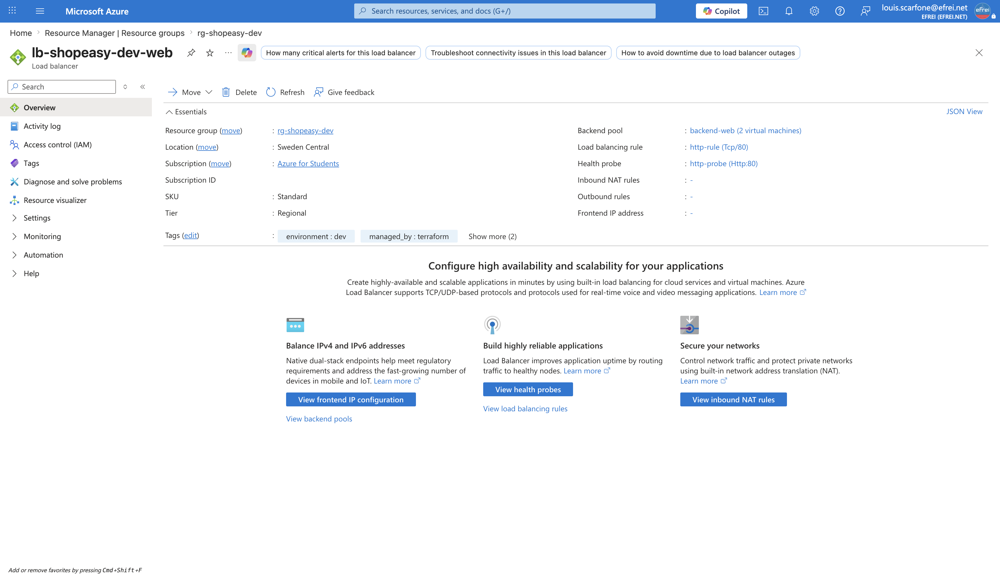

# Atelier 7 — Mise en place du Load Balancer (ShopEasy)

> **Objectif :** répartir le trafic web entrant sur les deux VM via un Load Balancer public. \
> **Livrable attendu :** `loadbalancer.tf` + preuve de répartition (alternance des réponses entre les 2 serveurs).

---

## 1. IP publique, LB, pool, sonde et règle — `loadbalancer.tf`

```hcl
resource "azurerm_public_ip" "lb" {
  name                = "pip-${local.prefix}-lb"
  location            = azurerm_resource_group.main.location
  resource_group_name = azurerm_resource_group.main.name
  allocation_method   = "Static"
  sku                 = "Standard"
  tags                = local.common_tags
}

resource "azurerm_lb" "web" {
  name                = "lb-${local.prefix}-web"
  location            = azurerm_resource_group.main.location
  resource_group_name = azurerm_resource_group.main.name
  sku                 = "Standard"
  tags                = local.common_tags

  frontend_ip_configuration {
    name                 = "public-frontend"
    public_ip_address_id = azurerm_public_ip.lb.id
  }
}

resource "azurerm_lb_backend_address_pool" "web" {
  name            = "backend-web"
  loadbalancer_id = azurerm_lb.web.id
}

resource "azurerm_network_interface_backend_address_pool_association" "web" {
  count                   = 2
  network_interface_id    = azurerm_network_interface.web[count.index].id
  ip_configuration_name   = "internal"
  backend_address_pool_id = azurerm_lb_backend_address_pool.web.id
}

resource "azurerm_lb_probe" "http" {
  name            = "http-probe"
  loadbalancer_id = azurerm_lb.web.id
  protocol        = "Http"
  request_path    = "/"
  port            = 80
}

resource "azurerm_lb_rule" "http" {
  name                           = "http-rule"
  loadbalancer_id                = azurerm_lb.web.id
  protocol                       = "Tcp"
  frontend_port                  = 80
  backend_port                   = 80
  frontend_ip_configuration_name = "public-frontend"
  backend_address_pool_ids       = [azurerm_lb_backend_address_pool.web.id]
  probe_id                       = azurerm_lb_probe.http.id
}
```

| Ressource | Nom | Rôle |
|---|---|---|
| `azurerm_public_ip.lb` | `pip-shopeasy-dev-lb` | IP publique statique du frontend du LB. |
| `azurerm_lb.web` | `lb-shopeasy-dev-web` | Load Balancer **Standard** (L4), frontend `public-frontend`. |
| `azurerm_lb_backend_address_pool.web` | `backend-web` | Pool des VM cibles. |
| `azurerm_network_interface_backend_address_pool_association.web` (×2) | — | Rattache chaque NIC (`web-1`, `web-2`) au pool. |
| `azurerm_lb_probe.http` | `http-probe` | Sonde **HTTP** sur `/` port 80 (santé des VM). |
| `azurerm_lb_rule.http` | `http-rule` | Règle **80 → 80 (Tcp)** liant frontend + pool + sonde. |

---

## 2. Prévisualisation — `terraform plan`

```text
  # azurerm_lb.web will be created
  # azurerm_lb_backend_address_pool.web will be created
  # azurerm_lb_probe.http will be created
  # azurerm_lb_rule.http will be created
  # azurerm_network_interface_backend_address_pool_association.web[0] will be created
  # azurerm_network_interface_backend_address_pool_association.web[1] will be created
  # azurerm_public_ip.lb will be created

Plan: 7 to add, 0 to change, 0 to destroy.
```

---

## 3. Application — `terraform apply`

```text
azurerm_public_ip.lb: Creation complete after 2s [id=.../publicIPAddresses/pip-shopeasy-dev-lb]
azurerm_lb.web: Creation complete after 11s [id=.../loadBalancers/lb-shopeasy-dev-web]
azurerm_lb_probe.http: Creation complete after 11s [id=.../probes/http-probe]
azurerm_lb_backend_address_pool.web: Creation complete after 14s [id=.../backendAddressPools/backend-web]
azurerm_network_interface_backend_address_pool_association.web[0]: Creation complete after 2s [id=...nic-shopeasy-dev-web-1...backend-web]
azurerm_network_interface_backend_address_pool_association.web[1]: Creation complete after 2s [id=...nic-shopeasy-dev-web-2...backend-web]
azurerm_lb_rule.http: Creation complete after 9s [id=.../loadBalancingRules/http-rule]

Apply complete! Resources: 7 added, 0 changed, 0 destroyed.
```

---

## 4. Vérification (Azure CLI) et test de répartition

```bash
az network lb show -g rg-shopeasy-dev -n lb-shopeasy-dev-web --query '{name:name, sku:sku.name, frontend:frontendIPConfigurations[0].name}' -o json
az network lb rule list  -g rg-shopeasy-dev --lb-name lb-shopeasy-dev-web --query '[].{Name:name, Proto:protocol, FrontPort:frontendPort, BackPort:backendPort}' -o table
az network lb probe list -g rg-shopeasy-dev --lb-name lb-shopeasy-dev-web --query '[].{Name:name, Proto:protocol, Port:port, Path:requestPath}' -o table
```

```text
{ "name": "lb-shopeasy-dev-web", "sku": "Standard", "frontend": "public-frontend" }   # IP : 9.223.33.133

Name       Proto    FrontPort    BackPort
---------  -------  -----------  ----------
http-rule  Tcp      80           80

Name        Proto    Port    Path
----------  -------  ------  ------
http-probe  Http     80      /
```

Appartenance des interfaces au backend pool (vue côté NIC) :

```text
nic-shopeasy-dev-web-1  ->  backend-web
nic-shopeasy-dev-web-2  ->  backend-web
```

Test de répartition — **12 requêtes** sur l'IP du Load Balancer (`http://9.223.33.133`) :

```bash
for i in $(seq 1 12); do curl -s http://9.223.33.133 | grep -o "serveur web [12]"; done
```

```text
req  1 -> serveur web 2     req  7 -> serveur web 2
req  2 -> serveur web 1     req  8 -> serveur web 2
req  3 -> serveur web 1     req  9 -> serveur web 2
req  4 -> serveur web 1     req 10 -> serveur web 1
req  5 -> serveur web 2     req 11 -> serveur web 1
req  6 -> serveur web 1     req 12 -> serveur web 2
```

Bilan : **6 réponses `serveur web 1` / 6 réponses `serveur web 2`**. Le Load Balancer répartit bien le
trafic entre les deux VM ; la sonde HTTP confirme leur état de santé, et les deux NIC sont membres du pool.

---

## 5. Captures portail et navigateur

**Vue d'ensemble du Load Balancer (frontend, backend pool, règle)**


> Navigation (EN) : **rg-shopeasy-dev → lb-shopeasy-dev-web → Overview** (et *Backend pools* / *Load balancing rules*).

**Page web servie via le Load Balancer** (`http://9.223.33.133`)


> Navigation (EN) : navigateur → `http://9.223.33.133`. En **rafraîchissant plusieurs fois**, le serveur
> répondant alterne entre `serveur web 1` et `serveur web 2`.

---

## 6. Analyse

**1. Quel problème résout le Load Balancer ?**
Il **répartit le trafic entrant** sur plusieurs VM derrière un **point d'entrée public unique** (une seule
IP/DNS). Cela évite la **surcharge d'un seul serveur**, améliore la **disponibilité** et permet de **monter
en charge** en ajoutant des instances. Il **découple** l'adresse publique exposée des serveurs individuels.

**2. Que se passe-t-il si une VM devient indisponible ?**
La **sonde de santé** (`http-probe` sur `/`) cesse de recevoir une réponse `200` de la VM défaillante et la
**retire de la rotation**. Le trafic est alors routé **uniquement vers la (les) VM saine(s)** : le service
reste disponible (capacité réduite, mais pas d'interruption). Dès que la VM repasse la sonde, elle est
**réintégrée automatiquement**. C'est l'apport de disponibilité du couple *Load Balancer + plusieurs
instances + sonde*.

**3. Quelle différence avec Azure Application Gateway ?**
- **Azure Load Balancer** opère en **couche 4** (TCP/UDP) : il répartit selon un *hash* (5-tuple) sans
  comprendre le contenu HTTP. Simple, rapide, peu coûteux.
- **Application Gateway** opère en **couche 7** (HTTP/HTTPS) : il comprend URL, en-têtes et cookies, ce qui
  permet le **routage par chemin/hôte**, la **terminaison TLS**, l'**affinité de session** et surtout un
  **WAF** (pare-feu applicatif).
- On choisit le **LB** pour une répartition L4 générique, et l'**Application Gateway** quand on a besoin de
  fonctions L7 (routage applicatif, TLS offload, protection WAF). Pour ShopEasy en production, le frontal
  web serait un **Application Gateway + WAF** en HTTPS (cf. analyse de sécurité).

---

## ✅ État de l'environnement après l'Atelier 7

- `loadbalancer.tf` créé : IP publique + Load Balancer Standard + backend pool (2 VM) + sonde HTTP + règle 80.
- `terraform apply` : **7 ressources ajoutées**.
- Test validé : **alternance 6/6** des réponses entre `serveur web 1` et `serveur web 2` via l'IP du LB.
- État Terraform : 18 ressources gérées.

**Prêt pour l'Atelier 8 — ajout d'un Storage Account (suffixe aléatoire, container privé, versioning Blob).**
