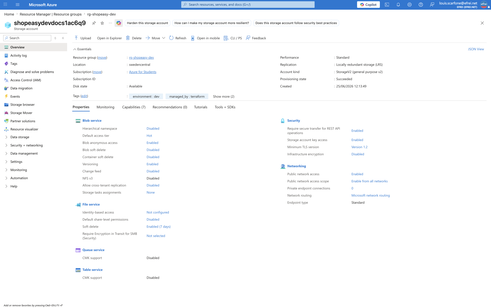
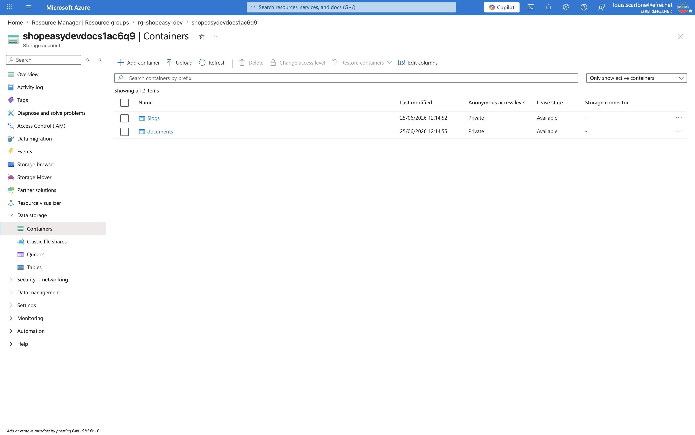
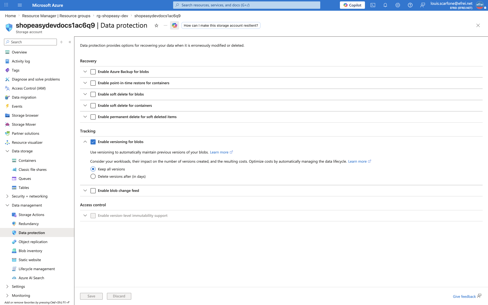

# Atelier 8 — Ajout d'un Storage Account (ShopEasy)

> **Objectif :** ajouter un stockage documentaire privé et versionné, avec un nom globalement unique. \
> **Livrable attendu :** `storage.tf` (suffixe aléatoire + Storage Account + container) + vérifications (privé, versioning, tags).

---

## 1. Suffixe aléatoire, Storage Account et container — `storage.tf`

```hcl
resource "random_string" "suffix" {
  length  = 6
  upper   = false
  special = false
}

resource "azurerm_storage_account" "docs" {
  name                     = "${replace(local.prefix, "-", "")}docs${random_string.suffix.result}"
  resource_group_name      = azurerm_resource_group.main.name
  location                 = azurerm_resource_group.main.location
  account_tier             = "Standard"
  account_replication_type = "LRS"
  min_tls_version          = "TLS1_2"
  tags                     = local.common_tags

  blob_properties {
    versioning_enabled = true
  }
}

resource "azurerm_storage_container" "documents" {
  name                  = "documents"
  storage_account_id    = azurerm_storage_account.docs.id
  container_access_type = "private"
}
```

| Élément | Choix | Raison |
|---|---|---|
| `random_string.suffix` | 6 caractères, minuscules, sans spécial | Le nom d'un Storage Account doit être **globalement unique** (3-24 car., minuscules/chiffres). |
| `name` | `${replace(local.prefix,"-","")}docs${...}` | `replace` retire le tiret (`shopeasy-dev` → `shopeasydev`) : un Storage Account **n'accepte ni tiret ni majuscule**. Résultat : `shopeasydevdocs1ac6q9`. |
| `account_replication_type = "LRS"` | Redondance locale | Suffisant en dev ; pas de géo-redondance (GRS) facturée inutilement. |
| `min_tls_version = "TLS1_2"` | TLS 1.2 minimum | Refuse les protocoles obsolètes (sécurité en transit). |
| `versioning_enabled = true` | Versioning Blob | Conserve l'historique des objets (récupération après écrasement/suppression). |
| `container_access_type = "private"` | Container privé | Aucun accès anonyme : seuls les appels **authentifiés** accèdent aux documents. |

> Le provider `random` (déclaré à l'Atelier 2) génère le suffixe **au moment de l'`apply`** : sa valeur est
> donc « known after apply » dans le plan.

---

## 2. Prévisualisation — `terraform plan`

```text
  # azurerm_storage_account.docs will be created
  # azurerm_storage_container.documents will be created
  # random_string.suffix will be created

Plan: 3 to add, 0 to change, 0 to destroy.
```

---

## 3. Application — `terraform apply`

```text
random_string.suffix: Creating...
random_string.suffix: Creation complete after 0s [id=1ac6q9]
azurerm_storage_account.docs: Creating...
azurerm_storage_account.docs: Still creating... [00m10s elapsed]
...
azurerm_storage_account.docs: Creation complete after 1m6s [id=.../storageAccounts/shopeasydevdocs1ac6q9]
azurerm_storage_container.documents: Creating...
azurerm_storage_container.documents: Creation complete after 11s [id=.../storageAccounts/shopeasydevdocs1ac6q9/blobServices/default/containers/documents]

Apply complete! Resources: 3 added, 0 changed, 0 destroyed.
```

Le suffixe généré est `1ac6q9` → Storage Account **`shopeasydevdocs1ac6q9`**.

---

## 4. Vérification (Azure CLI)

```bash
az storage account show -g rg-shopeasy-dev -n shopeasydevdocs1ac6q9 \
  --query '{name:name, sku:sku.name, kind:kind, tls:minimumTlsVersion, httpsOnly:enableHttpsTrafficOnly, allowBlobPublic:allowBlobPublicAccess}' -o json
az storage account blob-service-properties show -g rg-shopeasy-dev --account-name shopeasydevdocs1ac6q9 \
  --query '{versioning:isVersioningEnabled}' -o json
az storage container show --account-name shopeasydevdocs1ac6q9 --name documents --account-key <clé> \
  --query '{name:name, publicAccess:properties.publicAccess}' -o json
```

```json
{
  "name": "shopeasydevdocs1ac6q9",
  "sku": "Standard_LRS",
  "kind": "StorageV2",
  "tls": "TLS1_2",
  "httpsOnly": true,
  "allowBlobPublic": true
}
{ "versioning": true }
{ "name": "documents", "publicAccess": null }
```

Bilan : Storage Account `StorageV2` / `Standard_LRS`, **TLS 1.2**, **HTTPS-only**, **versioning activé**, et
container `documents` **privé** (`publicAccess: null`). *(La clé de compte utilisée pour interroger le
container n'est pas affichée.)*

---

## 5. Captures portail

**Vue d'ensemble du Storage Account (`Standard_LRS`, `StorageV2`, tags)**


> Navigation (EN) : **rg-shopeasy-dev → shopeasydevdocs1ac6q9 → Overview**.

**Container `documents` — niveau d'accès *Private***


> Navigation (EN) : **shopeasydevdocs1ac6q9 → Data storage → Containers → documents** (colonne *Public access level* = *Private*).

**Versioning Blob activé**


> Navigation (EN) : **shopeasydevdocs1ac6q9 → Data management → Data protection** (*Enable versioning for blobs*).

---

## 6. Questions FinOps et sécurité

**1. Pourquoi le container doit-il être privé ?**
Le container héberge des **documents métier sensibles** (factures, pièces clients). En accès **privé**,
seuls les appels **authentifiés et autorisés** (clé de compte, jeton SAS, ou identité Azure AD via RBAC)
peuvent lire les blobs. Un container **public** exposerait tous les objets à quiconque connaît l'URL →
**fuite de données** et non-conformité (RGPD). Le privé applique le **moindre privilège** : l'accès est
accordé explicitement, jamais par défaut.

**2. Pourquoi le versioning peut-il augmenter les coûts ?**
À chaque modification, écrasement ou suppression d'un blob, le versioning **conserve une copie de la version
précédente**. Ces versions **s'accumulent** et sont **facturées comme du stockage**. Sur des objets souvent
mis à jour, le volume — donc le coût — **croît continuellement**. Sans gestion du cycle de vie, les
anciennes versions ne sont **jamais nettoyées**.

**3. Quelle règle de cycle de vie proposer pour limiter les coûts ?**
Une **lifecycle management policy** sur le Storage Account, par exemple :
- **transférer** les versions anciennes vers un niveau **Cool** puis **Archive** après *N* jours ;
- **supprimer** les versions de plus de *X* jours (ex. purge des versions > 90 jours) ;
- déplacer les blobs **rarement consultés** vers **Cool**.

Cela **plafonne** l'accumulation des versions et le coût associé. C'est l'extension « Storage lifecycle »
proposée en mise en autonomie du TP.

---

## 7. Note de sécurité — accès public au niveau du compte

La vérification montre `allowBlobPublicAccess = true` **au niveau du compte** : le container est bien privé,
mais le compte **autoriserait** qu'un container soit passé en public. Pour la **défense en profondeur**, on
recommande de **désactiver explicitement** cette possibilité :

```hcl
# dans azurerm_storage_account.docs
allow_nested_items_to_be_public = false
```

Ainsi, aucun blob ne peut être rendu public, même par erreur — mesure cohérente avec le principe de moindre
privilège (identifiée dans l'analyse de sécurité de l'Atelier 13).

---

## ✅ État de l'environnement après l'Atelier 8

- `storage.tf` créé : `random_string` + Storage Account `shopeasydevdocs1ac6q9` (`Standard_LRS`, `StorageV2`, TLS 1.2) + container `documents` **privé** **versionné**.
- `terraform apply` : **3 ressources ajoutées**.
- Risque résiduel identifié : `allowBlobPublicAccess = true` au niveau du compte (mesure corrective proposée).
- État Terraform : 21 ressources gérées.

**Prêt pour l'Atelier 9 — outputs et validation finale du déploiement.**
