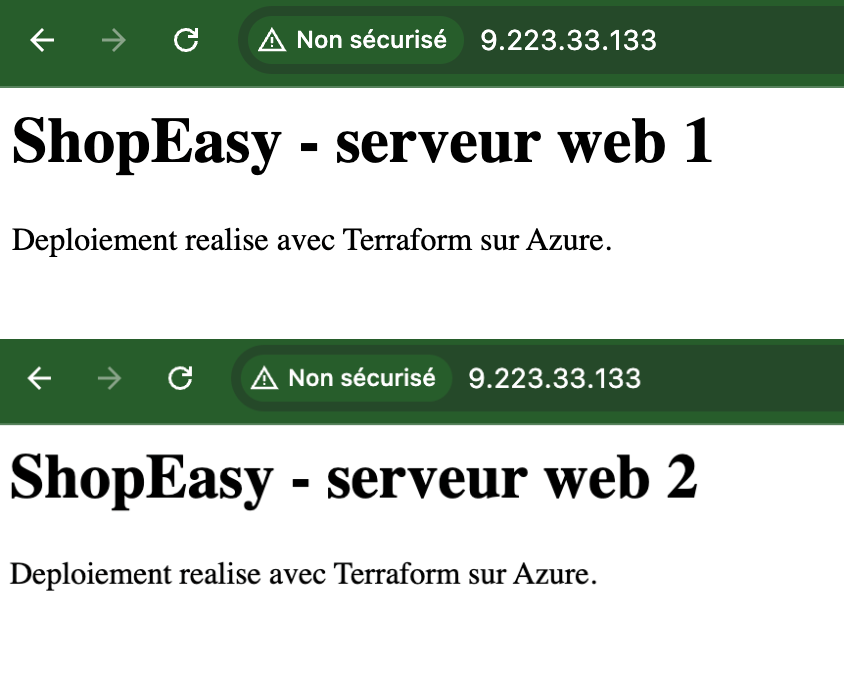

# Atelier 9 — Outputs et validation (ShopEasy)

> **Objectif :** exposer les informations utiles après déploiement et valider l'ensemble de l'infrastructure. \
> **Livrable attendu :** `outputs.tf` + sorties `terraform output` + checklist technique + page web via le Load Balancer.

---

## 1. Sorties exposées — `outputs.tf`

```hcl
output "resource_group_name" {
  description = "Nom du Resource Group créé"
  value       = azurerm_resource_group.main.name
}

output "load_balancer_public_ip" {
  description = "IP publique du Load Balancer (point d'entrée de l'application)"
  value       = azurerm_public_ip.lb.ip_address
}

output "web_vm_public_ips" {
  description = "IP publiques des deux VM web"
  value       = azurerm_public_ip.web[*].ip_address
}

output "storage_account_name" {
  description = "Nom du Storage Account documentaire"
  value       = azurerm_storage_account.docs.name
}
```

Les outputs exposent les informations dont un développeur ou un script a besoin **après** le déploiement,
sans avoir à fouiller le portail : point d'entrée applicatif (IP du LB), IP des VM, nom du Storage. L'expression
`azurerm_public_ip.web[*].ip_address` utilise le *splat* `[*]` pour renvoyer la **liste** des IP des deux VM
créées par `count`.

---

## 2. Application — `terraform apply`

Ajouter des outputs **ne modifie aucune ressource** : Terraform met seulement à jour les sorties du state.

```text
Changes to Outputs:
  + load_balancer_public_ip = "9.223.33.133"
  + resource_group_name     = "rg-shopeasy-dev"
  + storage_account_name    = "shopeasydevdocs1ac6q9"
  + web_vm_public_ips        = [ "135.225.73.252", "135.225.74.4" ]

Apply complete! Resources: 0 added, 0 changed, 0 destroyed.
```

---

## 3. Lecture des sorties — `terraform output`

```bash
terraform output
```

```text
load_balancer_public_ip = "9.223.33.133"
resource_group_name = "rg-shopeasy-dev"
storage_account_name = "shopeasydevdocs1ac6q9"
web_vm_public_ips = [
  "135.225.73.252",
  "135.225.74.4",
]
```

> `terraform show` a également été exécuté : il restitue l'intégralité du state lisible (les 21 ressources
> gérées et leurs attributs). Sortie volumineuse, non reproduite ici.

---

## 4. Checklist technique

| Contrôle | Statut | Preuve |
|---|---|---|
| Le projet Terraform s'initialise sans erreur | ✅ | Atelier 2 — `terraform init` : providers `azurerm` + `random` installés, *successfully initialized*. |
| `terraform validate` réussit | ✅ | *Success! The configuration is valid.* (à chaque atelier). |
| Le Resource Group est créé | ✅ | Atelier 4 — `rg-shopeasy-dev`, `provisioningState: Succeeded`. |
| Le VNet et le subnet existent | ✅ | Atelier 4 — `vnet-shopeasy-dev` (`10.20.0.0/16`), `snet-web` (`10.20.1.0/24`). |
| Le NSG limite SSH à l'IP admin | ✅ | Atelier 5 — règle `Allow-SSH-Admin` port 22 depuis `<IP_ADMIN>/32`. |
| Deux VM Linux sont créées | ✅ | Atelier 6 — `vm-shopeasy-dev-web-1/2`, `VM running`, `Standard_B2ats_v2`. |
| Nginx répond sur les VM | ✅ | Atelier 6 — `curl` → « serveur web 1 » / « serveur web 2 ». |
| Le Load Balancer répond en HTTP | ✅ | Atelier 7 — 12 requêtes sur `http://9.223.33.133`, alternance **6/6**. |
| Le Storage Account est privé | ✅ | Atelier 8 — container `documents` `publicAccess: null`. |
| Le versioning Blob est activé | ✅ | Atelier 8 — `isVersioningEnabled: true`. |
| Les ressources sont taguées | ✅ | `local.common_tags` (4 tags) appliqués au RG, VNet, NSG, IP, NIC, VM, LB, Storage. |

Tous les contrôles sont **au vert**.

---

## 5. Captures

Les sorties `terraform output` ci-dessus constituent la **preuve des outputs** (commande projet).

**Page web accessible via le Load Balancer** (`http://9.223.33.133`)


> Capture réalisée à l'Atelier 7 : en rafraîchissant, la réponse alterne entre `serveur web 1` et
> `serveur web 2`, confirmant la répartition de charge depuis le point d'entrée unique du Load Balancer.

---

## ✅ État de l'environnement après l'Atelier 9

- `outputs.tf` créé : **4 sorties** (nom du RG, IP du LB, IP des VM, nom du Storage).
- `terraform apply` : **0 ressource modifiée**, sorties ajoutées au state.
- Checklist technique : **11/11 contrôles OK**.
- Infrastructure complète : **21 ressources** gérées par Terraform, déployées et validées.

**Prêt pour l'Atelier 10 — modification de l'infrastructure (ajout d'un tag) et lecture du plan.**
