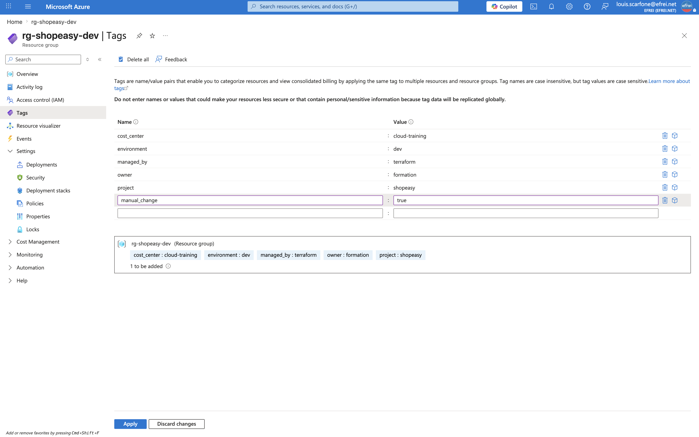

# Atelier 11 — Observation d'une dérive Terraform (ShopEasy)

> **Objectif :** provoquer une modification manuelle hors Terraform et observer comment l'outil détecte l'écart (*drift*). \
> **Livrable attendu :** mise en évidence de la dérive via `terraform plan` + analyse.

---

## 1. Création d'une dérive volontaire

Une modification est faite **manuellement dans le portail Azure**, en dehors de Terraform : ajout du tag
`manual_change = true` sur le Resource Group `rg-shopeasy-dev` (**rg-shopeasy-dev → Settings → Tags**).

Le Resource Group porte alors **6 tags** (les 5 déclarés + le tag manuel) :

```bash
az group show -n rg-shopeasy-dev --query tags -o json
```

```json
{
  "cost_center": "cloud-training",
  "environment": "dev",
  "managed_by": "terraform",
  "manual_change": "true",
  "owner": "formation",
  "project": "shopeasy"
}
```

Cette modification **n'existe pas dans le code Terraform** : c'est précisément ce qui constitue une dérive.

---

## 2. Détection — `terraform plan`

```bash
terraform plan
```

```text
Terraform used the selected providers to generate the following execution
plan. Resource actions are indicated with the following symbols:
  ~ update in-place

Terraform will perform the following actions:

  # azurerm_resource_group.main will be updated in-place
  ~ resource "azurerm_resource_group" "main" {
        id   = ".../resourceGroups/rg-shopeasy-dev"
        name = "rg-shopeasy-dev"
      ~ tags = {
            "cost_center"   = "cloud-training"
            "environment"   = "dev"
            "managed_by"    = "terraform"
          - "manual_change" = "true" -> null
            "owner"         = "formation"
            "project"       = "shopeasy"
        }
    }

Plan: 0 to add, 1 to change, 0 to destroy.
```

Terraform **compare l'état réel au code** (sa source de vérité) et détecte le tag `manual_change` ajouté hors
processus. Il propose de le **supprimer** (`- "manual_change" = "true" -> null`) pour **réaligner la réalité
sur l'état déclaré**. Le code reste la référence : Terraform cherche à annuler le changement manuel.

---

## 3. Réconciliation — `terraform apply`

```text
azurerm_resource_group.main: Modifying...
azurerm_resource_group.main: Modifications complete after 1s

Apply complete! Resources: 0 added, 1 changed, 0 destroyed.
```

Tags après réconciliation (retour aux 5 tags déclarés) :

```json
{
  "cost_center": "cloud-training",
  "environment": "dev",
  "managed_by": "terraform",
  "owner": "formation",
  "project": "shopeasy"
}
```

Plan de contrôle :

```text
Terraform has compared your real infrastructure against your configuration
and found no differences, so no changes are needed.
```

La dérive est résorbée : l'infrastructure correspond de nouveau exactement au code.

---

## 4. Capture portail

**Tag `manual_change` ajouté manuellement sur le Resource Group**


> Navigation (EN) : **rg-shopeasy-dev → Settings → Tags** (le tag `manual_change = true` ajouté hors Terraform).

---

## 5. Analyse

**1. Terraform détecte-t-il une différence ?**
**Oui.** Lors du `plan`, Terraform rafraîchit l'état réel, le compare au code et **signale l'écart** : le tag
`manual_change` présent dans Azure n'existe pas dans la configuration.

**2. Quelle action propose-t-il ?**
Une **mise à jour en place** (`~`) du Resource Group pour **supprimer** le tag `manual_change`
(`- "manual_change" = "true" -> null`), afin de **revenir à l'état déclaré**. Le plan annonce
`0 to add, 1 to change, 0 to destroy`.

**3. Pourquoi les modifications manuelles sont-elles dangereuses dans une organisation ?**
Elles créent une **dérive** entre le code (source de vérité) et l'infrastructure réelle. Conséquences :
l'infrastructure devient **imprévisible**, la **sécurité est affaiblie** (une règle ouverte à la main échappe
à la revue de code), la **confiance dans le code** se perd, et un `apply` ultérieur peut **annuler
silencieusement** un changement manuel — ou, à l'inverse, un correctif manuel urgent peut être **écrasé**.
L'environnement devient difficile à auditer et à reproduire.

**4. Quelle règle d'équipe proposer pour limiter ce risque ?**
Tout changement d'infrastructure doit **passer par le code** : modification du `.tf` → **pull request** →
revue → `plan` → `apply` contrôlé. On complète par : exécution **régulière de `terraform plan`** (en CI) pour
détecter les dérives, **droits restreints** sur le portail (lecture seule en production), **Azure Policy**
pour encadrer les écarts, et **formation** des équipes. Le portail sert alors à **observer et diagnostiquer**,
pas à modifier.

---

## ✅ État de l'environnement après l'Atelier 11

- Dérive volontaire créée (tag `manual_change` ajouté manuellement) puis **détectée** par `terraform plan`.
- Action proposée : suppression du tag pour réaligner sur le code (`0 add, 1 change, 0 destroy`).
- **Réconciliation** appliquée : retour aux 5 tags déclarés, `plan` de contrôle *no changes*.
- Démonstration du rôle du code comme **source de vérité** et de l'intérêt du `plan`.

**Prêt pour l'Atelier 12 — préparation d'un state distant (backend Azure Storage).**
