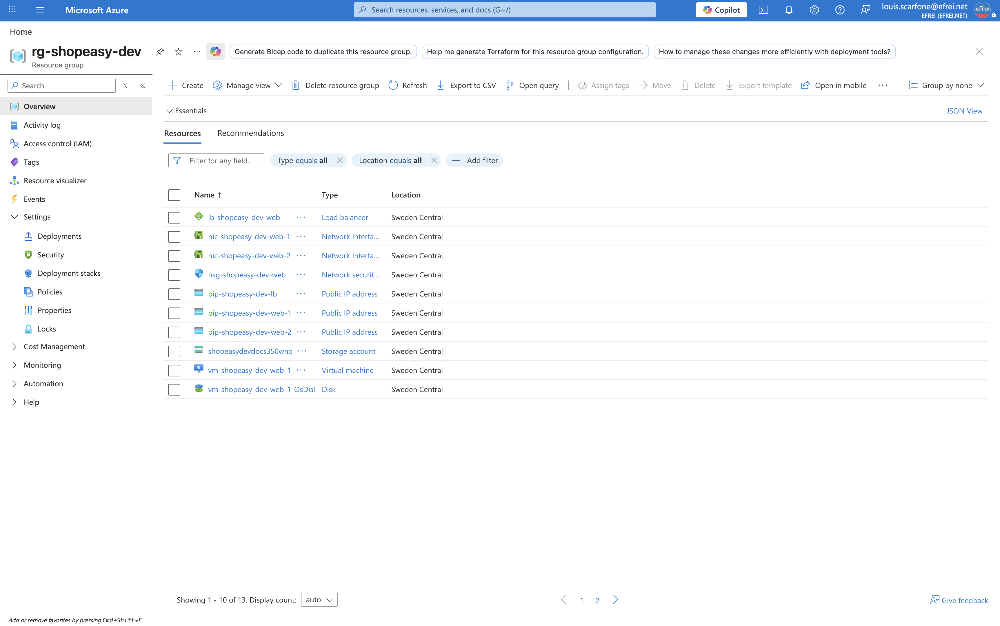

# Atelier 1 — Prise en main d'Azure CLI (ShopEasy)

> **Objectif :** vérifier l'accès à l'environnement Azure, identifier la subscription active et se positionner sur le bon groupe de ressources. \
> **Livrable attendu :** extrait de terminal montrant la subscription active, le groupe de ressources cible et les valeurs par défaut configurées.

---

## 1. Contexte — du déploiement à l'exploitation

Le TP1 a **conçu et déployé manuellement** l'architecture ShopEasy ; le TP2 l'a **décrite en Terraform**. Le TP3 ouvre la phase d'**exploitation** : administrer, inventorier, surveiller, automatiser et documenter cet environnement avec **Azure CLI, Bash et Python**.

L'environnement de travail est celui du TP2, **redéployé à l'identique** via `terraform apply` (21 ressources) : un groupe de ressources `rg-shopeasy-dev` contenant un réseau segmenté, deux VM Linux derrière un Load Balancer et un compte de stockage privé.

| Périmètre | Valeur |
|---|---|
| Abonnement | Azure for Students |
| Région | `swedencentral` (Stockholm) |
| Groupe de ressources | `rg-shopeasy-dev` |
| VM web | `vm-shopeasy-dev-web-1`, `vm-shopeasy-dev-web-2` (`Standard_B2ats_v2`) |
| Storage Account | `shopeasydevdocs350wnq` |

> La région `swedencentral` et la taille `Standard_B2ats_v2` sont conservées du TP1/TP2 : `francecentral` est bloquée par la policy *Allowed regions* d'Azure for Students, et `Standard_B1s` est indisponible sur l'abonnement étudiant.

---

## 2. Centralisation des variables — `variables.sh`

Toutes les commandes et tous les scripts du TP s'appuient sur un jeu de variables centralisé dans `variables.sh`, à sourcer avant chaque session de travail. Cette factorisation évite de répéter les noms de ressources et permet de rejouer les commandes sur un autre environnement en ne changeant qu'un fichier.

```bash
source variables.sh
```

```bash
#!/usr/bin/env bash
# variables.sh - Variables d'exploitation de l'environnement ShopEasy (TP3)

# --- Perimetre d'exploitation ------------------------------------------------
export RG="rg-shopeasy-dev"              # Groupe de ressources dedie au projet
export LOCATION="swedencentral"          # Region de deploiement
export VM1="vm-shopeasy-dev-web-1"       # Premiere VM web
export VM2="vm-shopeasy-dev-web-2"       # Seconde VM web
export STORAGE="shopeasydevdocs350wnq"   # Storage Account (suffixe aleatoire Terraform)
export CONTAINER="operations"            # Conteneur des rapports d'exploitation

# --- Authentification (resolue dynamiquement, jamais en dur) ------------------
export ARM_SUBSCRIPTION_ID="$(az account show --query id -o tsv)"
export AZURE_SUBSCRIPTION_ID="$ARM_SUBSCRIPTION_ID"   # Utilisee par le SDK Python
export AZURE_RESOURCE_GROUP="$RG"
```

Aucun identifiant n'est codé en dur : la subscription est résolue dynamiquement par `az account show`, comme au TP2.

---

## 3. Version d'Azure CLI

```bash
az version
```

```text
azure-cli : 2.87.0
core      : 2.87.0
```

La version installée est récente et compatible avec l'ensemble des commandes du TP (monitoring, storage `--auth-mode login`, requêtes JMESPath).

---

## 4. Subscription active

```bash
az account show --output table
```

```text
EnvironmentName    IsDefault    Name                State    TenantDefaultDomain    TenantId
-----------------  -----------  ------------------  -------  ---------------------  -----------------
AzureCloud         True         Azure for Students  Enabled  efrei.net              <masqué>
```

```bash
az account list --output table
```

```text
Name                CloudName    SubscriptionId        TenantId              State    IsDefault
------------------  -----------  --------------------  --------------------  -------  -----------
Azure for Students  AzureCloud   <masqué>              <masqué>              Enabled  True
```

La subscription **Azure for Students** est active (`State = Enabled`) et définie par défaut (`IsDefault = True`). Les identifiants (subscription ID, tenant ID) sont **masqués** dans les livrables ; ils ne sont jamais écrits en clair dans un fichier versionné.

---

## 5. Groupe de ressources cible

```bash
az group show --name "$RG" --query "{Nom:name, Region:location, Etat:properties.provisioningState}" -o table
```

```text
Nom              Region         Etat
---------------  -------------  ---------
rg-shopeasy-dev  swedencentral  Succeeded
```

Le groupe de ressources `rg-shopeasy-dev` existe, en région `swedencentral`, à l'état `Succeeded` : l'environnement à exploiter est bien en place.

---

## 6. Configuration des valeurs par défaut

Pour éviter de répéter `--resource-group` et `--location` sur chaque commande, on configure des valeurs par défaut au niveau de la CLI.

```bash
az configure --defaults group="$RG" location="$LOCATION"
az configure --list-defaults --output table
```

```text
Name      Source                             Value
--------  ---------------------------------  ---------------
group     /Users/.../.azure/config           rg-shopeasy-dev
location  /Users/.../.azure/config           swedencentral
```

Effet immédiat : les commandes suivantes ciblent le bon groupe de ressources **sans `-g`**.

```bash
az resource list --query "length(@)" -o tsv
```

```text
13
```

Les 13 ressources de premier niveau (réseau, VM, disques, NSG, Load Balancer, IP publiques, Storage) sont visibles directement, ce qui confirme que le contexte par défaut est correctement positionné.

---

## 7. Travail demandé — réponses

**1. Vérifier la subscription active.**
La subscription **Azure for Students** est active et par défaut (`State = Enabled`, `IsDefault = True`), confirmée par `az account show`.

**2. Vérifier que le groupe de ressources du TP existe.**
`az group show --name rg-shopeasy-dev` retourne le groupe en `swedencentral` à l'état `Succeeded`.

**3. Configurer les valeurs par défaut pour éviter de répéter les mêmes paramètres.**
`az configure --defaults group=rg-shopeasy-dev location=swedencentral` enregistre le groupe et la région dans `~/.azure/config`. Les commandes ultérieures n'ont plus besoin de préciser `-g` ni `-l`.

---

## 8. Capture portail



> Navigation (EN) : **Portal → Resource groups → rg-shopeasy-dev** (Overview). La capture montre le nom du groupe, la région *Sweden Central* et la liste des ressources déployées (réseau, VM, Load Balancer, Storage).

---

## ✅ État après l'Atelier 1

- Accès Azure validé : subscription **Azure for Students** active (`Enabled`, par défaut).
- Groupe de ressources `rg-shopeasy-dev` présent en `swedencentral` (`Succeeded`), contenant les 13 ressources de l'architecture ShopEasy.
- Valeurs par défaut configurées (`group`, `location`) : les commandes suivantes sont plus courtes et reproductibles.
- Variables d'exploitation centralisées dans `variables.sh` (aucun secret en dur).

**Prêt pour l'Atelier 2 — Inventorier les ressources Azure.**
