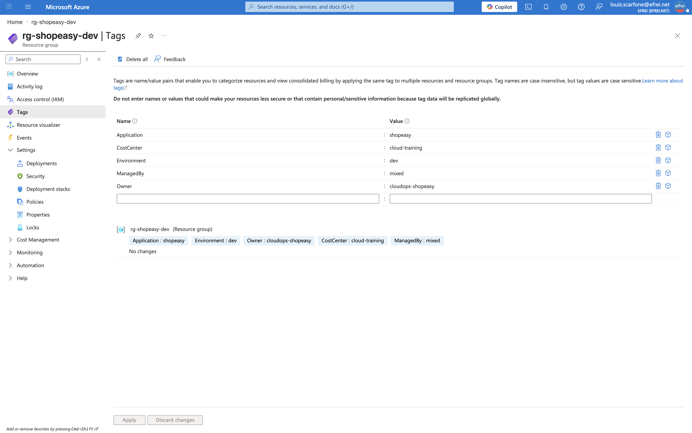
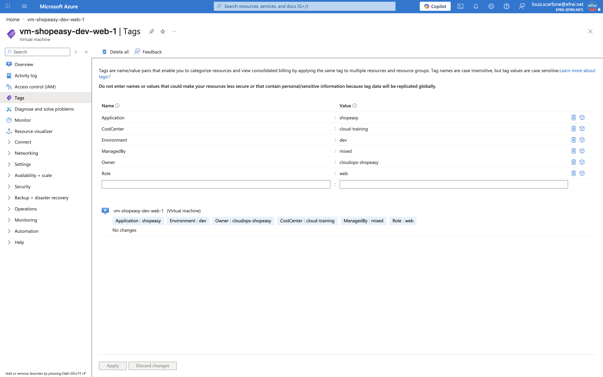

# Atelier 3 — Normaliser les tags d'exploitation (ShopEasy)

> **Objectif :** appliquer une stratégie de tags minimale pour faciliter l'exploitation, le suivi des coûts et l'identification des responsabilités. \
> **Livrable attendu :** export JSON (et capture) montrant les tags du groupe de ressources et d'au moins une VM.

---

## 1. Stratégie de tags d'exploitation

Les ressources avaient déjà des **tags techniques hérités du TP2** (posés par Terraform, en `snake_case`). On les **normalise** en une convention d'exploitation homogène (`PascalCase`), partagée par le RG et les VM.

| Tag | Valeur retenue | Rôle |
|---|---|---|
| `Application` | `shopeasy` | Relier la ressource à l'application métier. |
| `Environment` | `dev` | Distinguer dev / test / prod (seuils, politiques, coûts). |
| `Owner` | `cloudops-shopeasy` | Identifier l'équipe responsable (équipe CloudOps de ShopEasy). |
| `CostCenter` | `cloud-training` | Imputer les coûts à un centre de coût (FinOps). |
| `ManagedBy` | `mixed` | Mode de gestion : **provisionné par Terraform**, **exploité par CLI**. |
| `Role` *(VM)* | `web` | Rôle technique de la VM dans l'architecture. |

> **Choix `ManagedBy=mixed`** : l'infrastructure a été créée en IaC (Terraform, TP2) mais est administrée en CLI au TP3. La valeur `mixed` décrit honnêtement ce cycle de vie hybride, plutôt que `cli` (qui masquerait l'origine IaC) ou `terraform` (qui ignorerait l'exploitation CLI).

---

## 2. État avant normalisation

Le RG et les VM portaient les 5 tags Terraform en `snake_case` :

```bash
az group show --name "$RG" --query tags -o json
az vm show -g "$RG" -n "$VM1" --query tags -o json
```

```json
{
  "cost_center": "cloud-training",
  "environment": "dev",
  "managed_by": "terraform",
  "owner": "formation",
  "project": "shopeasy"
}
```

---

## 3. Appliquer les tags au groupe de ressources

`az group update --tags` **remplace** l'intégralité du jeu de tags du RG par la convention normalisée.

```bash
az group update --name "$RG" \
  --tags Application=shopeasy Environment=dev Owner=cloudops-shopeasy CostCenter=cloud-training ManagedBy=mixed \
  --query tags -o table
```

```text
Application    Environment    Owner              CostCenter      ManagedBy
-------------  -------------  -----------------  --------------  -----------
shopeasy       dev            cloudops-shopeasy  cloud-training  mixed
```

---

## 4. Appliquer les tags aux VM

Pour un remplacement propre des tags d'une ressource précise, on utilise `az resource tag --ids` (comportement par défaut : remplacement complet). On en profite pour ajouter le tag technique `Role=web`.

```bash
for VM in "$VM1" "$VM2"; do
  VM_ID=$(az vm show -g "$RG" -n "$VM" --query id -o tsv)
  az resource tag --ids "$VM_ID" \
    --tags Application=shopeasy Environment=dev Owner=cloudops-shopeasy CostCenter=cloud-training ManagedBy=mixed Role=web \
    --query tags -o json
done
```

```json
{
  "Application": "shopeasy",
  "CostCenter": "cloud-training",
  "Environment": "dev",
  "ManagedBy": "mixed",
  "Owner": "cloudops-shopeasy",
  "Role": "web"
}
```

(Sortie identique pour `vm-shopeasy-dev-web-1` et `vm-shopeasy-dev-web-2`.)

> **Variante du TP** : `az vm update --set tags.Application=shopeasy tags.Environment=dev tags.Role=web` ajoute/écrase **clé par clé** (mode incrémental) sans supprimer les autres tags. On lui a préféré `az resource tag` (remplacement complet) pour éliminer les anciennes clés `snake_case` et obtenir un jeu **homogène**.

---

## 5. Vérification et exports

```bash
az group show --name "$RG" --query tags -o json > exports/tags-rg.json
az vm show -g "$RG" -n "$VM1" --query tags -o json > exports/tags-vm.json
```

Les fichiers `exports/tags-rg.json` et `exports/tags-vm.json` constituent la preuve d'exploitation (rejouable, archivable).

**Couverture de la normalisation.** Le travail demandé porte sur le RG et les VM. Les autres ressources conservent pour l'instant les tags techniques Terraform :

```bash
az resource list -g "$RG" --query "[?tags.Application==null].{Nom:name,Type:type}" -o table
```

```text
Nom                     Type
----------------------  ---------------------------------------
vnet-shopeasy-dev       Microsoft.Network/virtualNetworks
shopeasydevdocs350wnq   Microsoft.Storage/storageAccounts
pip-shopeasy-dev-web-1  Microsoft.Network/publicIPAddresses
pip-shopeasy-dev-lb     Microsoft.Network/publicIPAddresses
nsg-shopeasy-dev-web    Microsoft.Network/networkSecurityGroups
pip-shopeasy-dev-web-2  Microsoft.Network/publicIPAddresses
lb-shopeasy-dev-web     Microsoft.Network/loadBalancers
nic-shopeasy-dev-web-2  Microsoft.Network/networkInterfaces
nic-shopeasy-dev-web-1  Microsoft.Network/networkInterfaces
…_OsDisk_… (x2)         Microsoft.Compute/disks
```

**11 ressources** ne portent pas encore le tag `Application` normalisé. Ce manque est **volontairement laissé visible** : il sera **détecté automatiquement** par le script `inventory.sh` (Atelier 5) et `healthcheck.sh` (Atelier 9), et son extension à toutes les ressources figure dans les recommandations FinOps (Atelier 11).

---

## 6. Drift Terraform — point de vigilance

Modifier les tags via CLI sur des ressources gérées par Terraform crée une **dérive (drift)** par rapport au state : au prochain `terraform plan`, Terraform détecterait l'écart et proposerait de restaurer ses tags `snake_case`. C'est le phénomène étudié au **TP2 (Atelier 11)**.

**Réconciliation possible :**
- **reporter** la convention d'exploitation dans le code Terraform (`locals.common_tags`) puis `apply` → le code redevient source de vérité ;
- ou **exclure** les tags du périmètre Terraform (`lifecycle { ignore_changes = [tags] }`) pour piloter les tags hors IaC.

Pour le TP3 (phase d'exploitation), cette modification CLI est assumée et documentée ; aucun `terraform apply` n'est rejoué d'ici la destruction finale.

---

## 7. Pourquoi les tags sont utiles pour le FinOps et la gouvernance

**FinOps** — les tags `CostCenter`, `Application` et `Environment` permettent de **ventiler la facture** Azure (Cost Management) par centre de coût, par application et par environnement. Sans eux, impossible de répondre à « combien coûte ShopEasy en dev ? » ni d'arrêter sélectivement les ressources `dev` le soir.

**Gouvernance** — le tag `Owner` identifie le **responsable** d'une ressource (qui contacter en cas d'incident, qui peut autoriser un arrêt). `ManagedBy` documente le **mode de gestion** (IaC vs manuel). Les tags servent aussi de base à des **Azure Policy** (refuser une ressource sans `Owner`, par exemple) et au **filtrage** lors des inventaires et des automatisations.

> Un environnement sans tags est difficile à exploiter : on ne sait ni à qui appartient une ressource, ni à quel budget l'imputer, ni laquelle peut être arrêtée sans risque.

---

## 8. Travail demandé — réponses

**1. Appliquer les tags au groupe de ressources.** Fait via `az group update --tags` (5 tags normalisés).
**2. Appliquer au moins trois tags aux VM.** Fait sur les 2 VM via `az resource tag` (6 tags : les 5 + `Role=web`).
**3. Vérifier que les tags sont visibles dans le portail et avec Azure CLI.** Vérifié en CLI (§3-5) et au portail (§9).
**4. Expliquer l'intérêt FinOps/gouvernance.** Détaillé en §7.

---

## 9. Captures portail



> Navigation (EN) : **Portal → Resource groups → rg-shopeasy-dev → Tags**. Les 5 tags d'exploitation (Application, Environment, Owner, CostCenter, ManagedBy) sont visibles.



> Navigation (EN) : **Portal → Virtual machines → vm-shopeasy-dev-web-1 → Tags**. Les 6 tags (dont `Role=web`) sont visibles.

---

## ✅ État après l'Atelier 3

- Convention de tags d'exploitation normalisée (`Application`, `Environment`, `Owner`, `CostCenter`, `ManagedBy`) appliquée au **RG** et aux **2 VM** (+ `Role=web`).
- Anciennes clés `snake_case` remplacées proprement (jeu homogène) ; preuve exportée (`exports/tags-rg.json`, `exports/tags-vm.json`).
- **11 ressources** encore en `snake_case` : manque tracé, à corriger via inventaire automatisé et recommandations FinOps.
- Drift Terraform identifié et documenté (réconciliation possible par le code ou `ignore_changes`).

**Prêt pour l'Atelier 4 — Administrer les machines virtuelles.**
