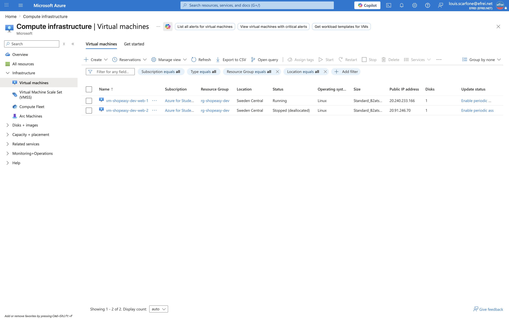

# Atelier 4 — Administrer les machines virtuelles (ShopEasy)

> **Objectif :** réaliser les opérations courantes sur les VM — lister, vérifier l'état, démarrer, arrêter, désallouer, redémarrer et exécuter une commande distante. \
> **Livrable attendu :** tableau des VM (état, IP, taille, action réalisée), avec la commande utilisée et le résultat observé.

---

## 1. Lister les VM et leur état

```bash
source variables.sh
az vm list --resource-group "$RG" --output table
```

```text
Name                   ResourceGroup    Location
---------------------  ---------------  -------------
vm-shopeasy-dev-web-1  rg-shopeasy-dev  swedencentral
vm-shopeasy-dev-web-2  rg-shopeasy-dev  swedencentral
```

État synthétique (nom, état, IP publique, taille) — `--show-details` ajoute l'état d'alimentation et l'IP :

```bash
az vm list -g "$RG" --show-details \
  --query "[].{Nom:name,Etat:powerState,IP:publicIps,Taille:hardwareProfile.vmSize}" \
  -o table
```

```text
Nom                    Etat        IP              Taille
---------------------  ----------  --------------  -----------------
vm-shopeasy-dev-web-1  VM running  20.240.233.166  Standard_B2ats_v2
vm-shopeasy-dev-web-2  VM running  20.91.246.70    Standard_B2ats_v2
```

Les deux serveurs web sont actifs, en `Standard_B2ats_v2`, chacun avec son IP publique d'administration.

---

## 2. Exécuter une commande distante (vérifier le serveur web)

`az vm run-command invoke` exécute un script directement dans la VM via l'agent Azure, **sans connexion SSH** (utile quand le port 22 est restreint à l'IP admin).

```bash
az vm run-command invoke \
  --resource-group "$RG" \
  --name "$VM1" \
  --command-id RunShellScript \
  --scripts "hostname && uptime && systemctl is-active nginx && systemctl status nginx --no-pager | head -5 && curl -s -o /dev/null -w 'HTTP local: %{http_code}\n' http://localhost" \
  --query "value[0].message" -o tsv
```

```text
Enable succeeded:
[stdout]
vm-shopeasy-dev-web-1
 08:15:51 up 21 min,  0 users,  load average: 0.00, 0.00, 0.00
active
● nginx.service - A high performance web server and a reverse proxy server
     Loaded: loaded (/lib/systemd/system/nginx.service; enabled; vendor preset: enabled)
     Active: active (running) since Fri 2026-06-26 07:55:02 UTC; 20min ago
       Docs: man:nginx(8)
    Process: 2291 ExecStartPre=/usr/sbin/nginx -t -q -g daemon on; master_process on; (code=exited, status=0/SUCCESS)
HTTP local: 200

[stderr]
```

**Lecture :** le serveur `vm-shopeasy-dev-web-1` répond, `nginx` est `active (running)` et la requête HTTP locale renvoie **200**. Le service web est opérationnel.

---

## 3. Redémarrer et désallouer

Deux actions d'exploitation, exécutées en parallèle sur deux VM distinctes :
- **redémarrer** la VM 1 (la VM reste allouée — usage : appliquer une configuration, débloquer un service) ;
- **désallouer** la VM 2, considérée comme non utilisée (geste FinOps : libère le calcul).

```bash
az vm restart    -g "$RG" -n "$VM1"   # redémarrage, VM toujours allouée
az vm deallocate -g "$RG" -n "$VM2"   # arrêt + libération du compute
```

```text
✓ restart vm-shopeasy-dev-web-1 terminé
✓ deallocate vm-shopeasy-dev-web-2 terminé
```

État après les actions :

```bash
az vm list -g "$RG" --show-details \
  --query "[].{Nom:name,Etat:powerState,IP:publicIps,Taille:hardwareProfile.vmSize}" -o table
```

```text
Nom                    Etat            IP              Taille
---------------------  --------------  --------------  -----------------
vm-shopeasy-dev-web-1  VM running      20.240.233.166  Standard_B2ats_v2
vm-shopeasy-dev-web-2  VM deallocated  20.91.246.70    Standard_B2ats_v2
```

---

## 4. `stop` ≠ `deallocate` (point FinOps essentiel)

| Commande | Effet | Facturation compute |
|---|---|---|
| `az vm stop` | Arrête l'OS, mais la VM **reste allouée** sur l'hôte | **Continue** d'être facturée |
| `az vm deallocate` | Arrête **et libère** les ressources de calcul (état *Stopped (deallocated)*) | **Stoppée** |

Pour réduire les coûts d'un environnement de développement, c'est **`deallocate`** qu'il faut utiliser, pas `stop`. C'est la base du script `vm-power.sh` (Atelier 6).

> **Ce qui reste facturé même désallouée :** le **disque OS managé** et l'**IP publique Standard statique** (réservée). C'est pourquoi `vm-shopeasy-dev-web-2` affiche encore son IP `20.91.246.70` bien qu'éteinte. La suppression des IP publiques (via Bastion) est un levier FinOps abordé à l'Atelier 11.

---

## 5. Tableau récapitulatif des VM

| VM | Taille | IP publique | État initial | Action réalisée | État final | Résultat |
|---|---|---|---|---|---|---|
| `vm-shopeasy-dev-web-1` | `Standard_B2ats_v2` | `20.240.233.166` | VM running | Commande distante + `restart` | **VM running** | Nginx `active`, HTTP `200` |
| `vm-shopeasy-dev-web-2` | `Standard_B2ats_v2` | `20.91.246.70` | VM running | `deallocate` | **VM deallocated** | Compute libéré (FinOps) |

---

## 6. Travail demandé — réponses

**1. Lister toutes les VM du groupe de ressources.** `az vm list -g $RG -o table` → 2 VM (§1).
**2. Identifier leur taille, leur IP publique et leur état.** `az vm list --show-details` → `Standard_B2ats_v2`, IP publiques, `VM running` (§1).
**3. Redémarrer une VM.** `az vm restart -g $RG -n vm-shopeasy-dev-web-1` → reste `running` (§3).
**4. Désallouer une VM non utilisée.** `az vm deallocate -g $RG -n vm-shopeasy-dev-web-2` → `VM deallocated` (§3).
**5. Exécuter une commande distante pour vérifier le serveur web.** `az vm run-command invoke` → Nginx `active`, HTTP `200` (§2).

---

## 7. Capture portail



> Navigation (EN) : **Portal → Virtual machines**. La liste montre `vm-shopeasy-dev-web-1` à l'état *Running* et `vm-shopeasy-dev-web-2` à l'état *Stopped (deallocated)* après les actions.

---

## ✅ État après l'Atelier 4

- 2 VM `Standard_B2ats_v2` inventoriées avec état, IP et taille.
- Commande distante validée (sans SSH) : `vm-shopeasy-dev-web-1` sert Nginx, HTTP `200`.
- `restart` appliqué sur la VM 1 (reste `running`), `deallocate` sur la VM 2 (`deallocated`, compute libéré).
- Distinction `stop` / `deallocate` documentée (impact FinOps) ; IP publique statique facturée même VM éteinte.

**Prêt pour l'Atelier 5 — Construire un script Bash d'inventaire.**
