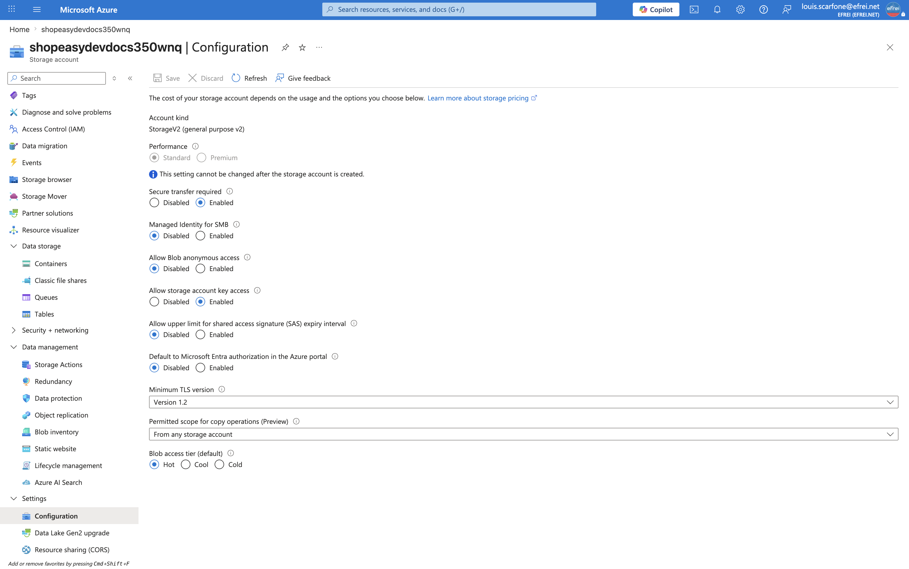
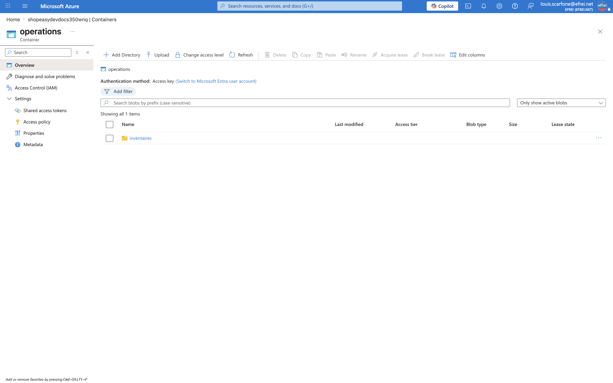

# Atelier 7 — Exploiter un Storage Account (ShopEasy)

> **Objectif :** disposer d'un espace de stockage opérationnel et sécurisé pour déposer les rapports et exports d'exploitation. \
> **Livrable attendu :** sortie CLI (et capture) montrant le conteneur, les fichiers déposés et l'accès public désactivé.

---

## 1. Réutiliser le Storage Account existant

Le compte `shopeasydevdocs350wnq` a été créé au TP2 (Terraform). On le **réutilise** plutôt que d'en créer un nouveau. Inspection initiale :

```bash
az storage account show --name "$STORAGE" --resource-group "$RG" \
  --query "{name:name, sku:sku.name, kind:kind, allowBlobPublicAccess:allowBlobPublicAccess, minimumTlsVersion:minimumTlsVersion, httpsOnly:enableHttpsTrafficOnly}" -o table
```

```text
Name                   Sku           Kind       AllowBlobPublicAccess    MinimumTlsVersion    HttpsOnly
---------------------  ------------  ---------  -----------------------  -------------------  -----------
shopeasydevdocs350wnq  Standard_LRS  StorageV2  True                     TLS1_2               True
```

**Constat de sécurité :** `MinimumTlsVersion=TLS1_2` et `HttpsOnly=True` sont corrects, mais **`AllowBlobPublicAccess=True`** : le compte autorise (potentiellement) l'accès public aux blobs. Le provider Terraform laisse ce paramètre activé par défaut ; il faut donc le **corriger en exploitation**.

---

## 2. Sécuriser : désactiver l'accès public

```bash
az storage account update --name "$STORAGE" --resource-group "$RG" \
  --allow-blob-public-access false \
  --query "{name:name, allowBlobPublicAccess:allowBlobPublicAccess}" -o table
```

```text
Name                   AllowBlobPublicAccess
---------------------  -----------------------
shopeasydevdocs350wnq  False
```

À partir d'ici, **aucun conteneur ne peut être rendu public**, même par erreur.

---

## 3. Créer le conteneur privé `operations`

```bash
az storage container create \
  --account-name "$STORAGE" --name "$CONTAINER" \
  --auth-mode login --public-access off
```

```text
Created
---------
True
```

```bash
az storage container list --account-name "$STORAGE" --auth-mode login --query "[].name" -o table
```

```text
documents      # conteneur du TP2
operations     # conteneur d'exploitation (TP3)
```

---

## 4. RBAC : control-plane vs data-plane (point de sécurité)

Le dépôt de blobs avec `--auth-mode login` a d'abord été **refusé** :

```text
ERROR: You do not have the required permissions needed to perform this operation.
    "Storage Blob Data Contributor" ...
```

**Explication :** être *Owner* de l'abonnement donne les droits sur le **control-plane** (créer/configurer le compte et les conteneurs via ARM), mais **pas** sur le **data-plane** (lire/écrire le contenu des blobs). Azure sépare ces deux plans. La bonne pratique — conforme à `--auth-mode login` et au principe du moindre privilège — est d'**assigner un rôle RBAC data-plane** précis, **au scope du compte** uniquement (pas de clé partagée) :

```bash
USER_OID=$(az ad signed-in-user show --query id -o tsv)
STORAGE_ID=$(az storage account show --name "$STORAGE" -g "$RG" --query id -o tsv)

az role assignment create \
  --role "Storage Blob Data Contributor" \
  --assignee-object-id "$USER_OID" --assignee-principal-type User \
  --scope "$STORAGE_ID"
```

> **Alternative écartée :** `--auth-mode key` (clé d'accès partagée du compte). Plus simple, mais c'est un secret à large portée, non auditable par identité — à proscrire en exploitation. Le RBAC nominatif est préférable.

---

## 5. Déposer les exports d'inventaire

```bash
az storage blob upload \
  --account-name "$STORAGE" --container-name "$CONTAINER" \
  --file exports/resources.json --name inventaires/resources.json \
  --auth-mode login --overwrite true
# … (idem resources.tsv, resources-<date>.json, vms-<date>.txt)

az storage blob list --account-name "$STORAGE" --container-name "$CONTAINER" \
  --auth-mode login --query "[].{Nom:name, TailleOctets:properties.contentLength}" -o table
```

```text
Nom                                         TailleOctets
------------------------------------------  --------------
inventaires/resources-20260626-103147.json  6261
inventaires/resources.json                  12014
inventaires/resources.tsv                   983
inventaires/vms-20260626-103147.txt         281
```

Les exports produits aux Ateliers 2 et 5 sont désormais **centralisés et historisés** dans le conteneur `operations`.

---

## 6. Vérifier que l'accès public est désactivé

Configuration du compte et du conteneur :

```text
Name                   AllowBlobPublicAccess    MinimumTlsVersion    HttpsOnly
---------------------  -----------------------  -------------------  -----------
shopeasydevdocs350wnq  False                    TLS1_2               True
```

Le conteneur `operations` a un niveau d'accès **privé** (`publicAccess` nul). **Test décisif** — accès anonyme à un blob, sans authentification :

```bash
curl -s -o /dev/null -w "%{http_code}" \
  "https://$STORAGE.blob.core.windows.net/$CONTAINER/inventaires/resources.tsv"
```

```text
Code HTTP (sans authentification) : 409
Code d'erreur Azure : <Code>PublicAccessNotPermitted</Code>
```

Même en connaissant l'**URL exacte**, un visiteur anonyme reçoit **409 `PublicAccessNotPermitted`** : le stockage est bien fermé. L'accès n'est possible qu'avec une **identité Azure autorisée** (RBAC).

---

## 7. Pourquoi le stockage de rapports d'exploitation ne doit pas être public

- **Cartographie offerte à un attaquant** : un rapport d'exploitation liste noms de ressources, IP, état des VM, règles réseau. Public, il fournit une reconnaissance complète de l'infrastructure.
- **Fuite de données / RGPD** : un blob public est accessible à **quiconque connaît ou devine l'URL**, sans traçabilité ; risque de non-conformité si des données sensibles transitent.
- **Moindre privilège** : seuls les exploitants **authentifiés** (RBAC) doivent lire ces rapports — pas l'Internet entier.
- **Conformité** : « pas de stockage public » est un contrôle standard (CIS Azure). Désactiver l'accès public au niveau du **compte** garantit qu'aucun conteneur ne pourra être exposé par erreur.

---

## 8. Travail demandé — réponses

**1. Créer ou réutiliser un Storage Account sécurisé.** Réutilisé `shopeasydevdocs350wnq`, **sécurisé** (accès public désactivé, TLS 1.2, HTTPS-only).
**2. Créer un conteneur privé `operations`.** Créé avec `--public-access off`.
**3. Déposer les exports d'inventaire.** 4 exports déposés sous `inventaires/` (vérifiés par `blob list`).
**4. Vérifier l'accès public désactivé.** `AllowBlobPublicAccess=False` + test anonyme **refusé (409)**.
**5. Expliquer pourquoi le stockage ne doit pas être public.** Détaillé en §7.

---

## 9. Captures portail



> Navigation (EN) : **Portal → Storage accounts → shopeasydevdocs350wnq → Settings → Configuration**. *Allow blob anonymous access* = **Disabled**.



> Navigation (EN) : **Portal → Storage accounts → shopeasydevdocs350wnq → Data storage → Containers → operations**. Le conteneur contient le dossier `inventaires/` (exports déposés). Le niveau « Private » n'apparaît pas dans cette vue car l'accès anonyme est désactivé **au niveau du compte** (cf. capture Configuration §9) : Azure force alors tous les conteneurs en privé et le portail ne propose plus de niveau d'accès public.

---

## ✅ État après l'Atelier 7

- Storage Account réutilisé et **sécurisé** : accès public **désactivé** au niveau compte (était `True`), TLS 1.2, HTTPS-only.
- Conteneur privé `operations` créé ; 4 exports d'inventaire déposés sous `inventaires/`.
- RBAC data-plane appliqué proprement (`Storage Blob Data Contributor`, scope = compte) — pas de clé partagée.
- Accès anonyme **prouvé refusé** (HTTP 409 `PublicAccessNotPermitted`).

**Prêt pour l'Atelier 8 — Surveiller les métriques avec Azure Monitor.**
