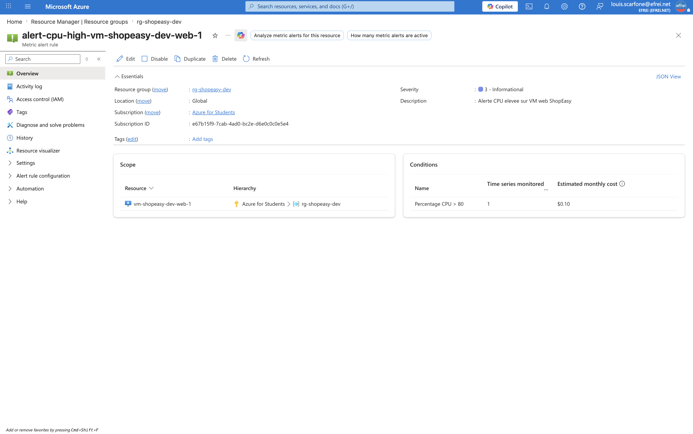
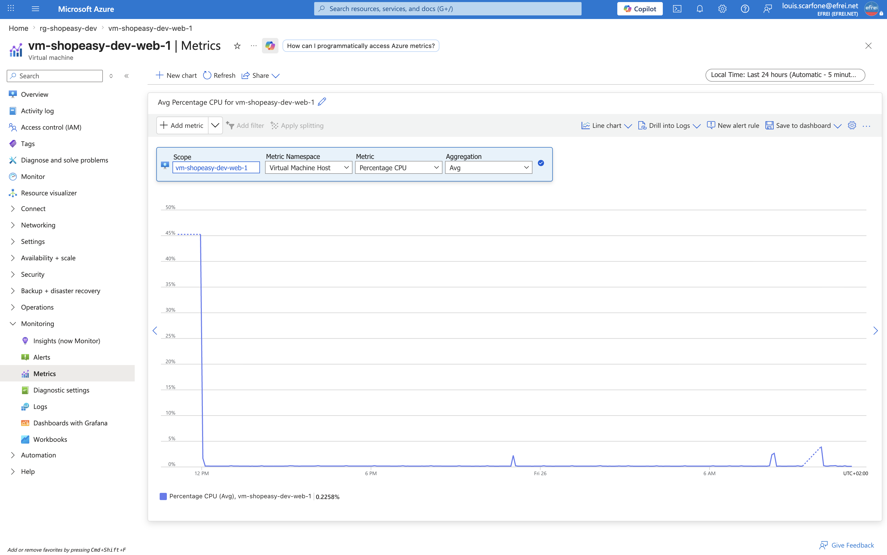

# Atelier 8 — Surveiller les métriques avec Azure Monitor (ShopEasy)

> **Objectif :** interroger les métriques Azure et créer une alerte simple sur une ressource critique. \
> **Livrable attendu :** sortie CLI montrant la métrique CPU et la règle d'alerte créée, avec justification du seuil.

---

## 1. Identifier l'ID de la VM

Les commandes de monitoring ciblent une ressource par son **ID complet** (pas seulement son nom).

```bash
VM_ID=$(az vm show --resource-group "$RG" --name "$VM1" --query id --output tsv)
echo "$VM_ID"
```

```text
/subscriptions/<sub-id>/resourceGroups/rg-shopeasy-dev/providers/Microsoft.Compute/virtualMachines/vm-shopeasy-dev-web-1
```

---

## 2. Lister les métriques disponibles

```bash
az monitor metrics list-definitions --resource "$VM_ID" \
  --query "[].{Metrique:name.value, Unite:unit}" -o table
```

```text
Metrique                     Unite
---------------------------  --------------
Percentage CPU               Percent
Network In                   Bytes
Network Out                  Bytes
Disk Read Bytes              Bytes
Disk Write Bytes             Bytes
Disk Read Operations/Sec     CountPerSecond
Disk Write Operations/Sec    CountPerSecond
CPU Credits Remaining        Count
CPU Credits Consumed         Count
OS Disk Read Bytes/sec       BytesPerSecond
OS Disk Write Bytes/sec      BytesPerSecond
...                          (≈ 30 métriques au total)
```

**Au moins trois métriques utiles pour une VM web** : `Percentage CPU` (saturation calcul), `Network In/Out` (trafic), `Disk Read/Write Bytes` (I/O).

> **Spécificité de `Standard_B2ats_v2`** : c'est une VM *burstable* (famille B). Les métriques **`CPU Credits Remaining`** et **`CPU Credits Consumed`** sont propres à cette famille : si le CPU reste élevé, la VM épuise ses crédits et se fait **brider** (throttling). C'est une métrique à surveiller en plus du CPU.

---

## 3. Lire la métrique CPU

```bash
az monitor metrics list --resource "$VM_ID" \
  --metric "Percentage CPU" \
  --start-time "$(date -u -v-20M +%Y-%m-%dT%H:%M:%SZ)" \
  --interval PT1M --aggregation Average \
  --query "value[0].timeseries[0].data[].{Heure:timeStamp, CPU_moyen_pct:average}" -o table
```

```text
Heure                 CPU_moyen_pct
--------------------  ---------------
2026-06-26T08:42:00Z  0.15
2026-06-26T08:43:00Z  0.12
2026-06-26T08:44:00Z  0.125
2026-06-26T08:45:00Z  0.12
2026-06-26T08:46:00Z  0.62
2026-06-26T08:47:00Z  0.14
2026-06-26T08:48:00Z  0.125
2026-06-26T08:55:00Z  0.12
2026-06-26T09:00:00Z  0.15
```

**Lecture :** le CPU moyen oscille entre **0,12 % et 0,62 %**. C'est cohérent : la VM web est **au repos** (pas de trafic réel sur le site). La métrique fonctionne et fournit une **base de référence** (*baseline*) pour calibrer le seuil d'alerte.

---

## 4. Créer une alerte CPU > 80 %

```bash
az monitor metrics alert create \
  --name "alert-cpu-high-$VM1" \
  --resource-group "$RG" \
  --scopes "$VM_ID" \
  --condition "avg Percentage CPU > 80" \
  --description "Alerte CPU elevee sur VM web ShopEasy" \
  --evaluation-frequency 1m \
  --window-size 5m \
  --severity 3
```

Règle créée et active :

```json
{ "name": "alert-cpu-high-vm-shopeasy-dev-web-1", "enabled": true,
  "evaluationFrequency": "PT1M", "windowSize": "PT5M", "severity": 3 }
```

Détail de la condition :

```json
{ "metrique": "Percentage CPU", "agregation": "Average",
  "operateur": "GreaterThan", "seuil": 80.0,
  "fenetre": "PT5M", "frequence": "PT1M", "severite": 3 }
```

```bash
az monitor metrics alert list --resource-group "$RG" -o table
```

```text
Nom                                   Active    Severite    Condition
------------------------------------  --------  ----------  -----------
alert-cpu-high-vm-shopeasy-dev-web-1  True      3           GreaterThan
```

---

## 5. Justification du seuil

| Paramètre | Valeur | Justification |
|---|---|---|
| **Seuil** | `> 80 %` | Compromis standard pour une VM web : assez haut pour ignorer les pics normaux (build, requêtes ponctuelles), assez bas pour détecter une **saturation réelle** avant dégradation des temps de réponse. À 50 % → trop de faux positifs ; à 95 % → détection trop tardive. |
| **Agrégation** | `Average` | On surveille une **charge soutenue**, pas un pic instantané (qui serait capté par `Maximum`). |
| **Fenêtre** | `5 min` | **Lisse** les pics transitoires : un pic de quelques secondes ne déclenche pas l'alerte ; il faut une charge élevée **prolongée**. |
| **Fréquence** | `1 min` | Réactivité : la condition est réévaluée chaque minute sur la moyenne des 5 dernières minutes. |
| **Sévérité** | `3` (Low) | Un CPU élevé est un **signal d'attention**, pas une panne. Les Sev 0/1 sont réservées aux indisponibilités. |

> Pour `B2ats_v2` (burstable), ce seuil gagnerait à être **couplé** à une alerte `CPU Credits Remaining` basse : un CPU à 80 % prolongé épuise les crédits et provoque un bridage avant même la saturation.

---

## 6. Deux autres alertes utiles pour ShopEasy

| Alerte proposée | Ressource / métrique | Pourquoi | Sévérité |
|---|---|---|---|
| **Disponibilité des backends** | Load Balancer — `Health Probe Status` / `Dip Availability` < 100 % | Détecte qu'une VM web ne répond plus à la sonde HTTP : c'est l'indicateur le plus proche de l'**expérience client** (site KO). | 1 (critique) |
| **Saturation disque / mémoire** | VM — `OS Disk free space` faible ou `Available Memory Bytes` bas | Un disque plein (logs Nginx) ou une mémoire saturée **bloque le service** ; panne fréquente et évitable. | 2 |

*(Autres pistes pertinentes : alerte budgétaire Cost Management, volume de requêtes anormal, erreurs HTTP applicatives.)*

---

## 7. Limites d'une alerte trop sensible ou trop large

- **Trop sensible** (seuil trop bas, fenêtre trop courte) : se déclenche sur des variations normales → **fatigue d'alerte** (*alert fatigue*). Les équipes finissent par **ignorer** les notifications et **ratent** les vrais incidents. Exemple : `CPU > 40 %` sur 1 min se déclenche à chaque déploiement.
- **Trop large** (seuil trop haut, fenêtre trop longue, scope trop vaste) : **détection tardive** — on n'est prévenu qu'une fois le service déjà dégradé. Une alerte unique couvrant tout le parc ne dit pas **quelle** ressource est en cause. Exemple : `CPU > 98 %` sur 30 min ignore une saturation à 85 % qui ralentit déjà les clients.
- **Règle d'or** : une alerte doit être **actionnable** et associée à une **procédure** (runbook : quoi vérifier, qui contacter, quelle action). Une alerte sans consigne n'est que du bruit supplémentaire.

---

## 8. Travail demandé — réponses

**1. Identifier ≥ 3 métriques.** `Percentage CPU`, `Network In/Out`, `Disk Read/Write Bytes` (+ `CPU Credits` propres au burstable).
**2. Lire la métrique CPU.** Lue sur 20 min : 0,12–0,62 % (VM au repos).
**3. Créer une alerte CPU.** `alert-cpu-high-vm-shopeasy-dev-web-1` créée, active, `avg Percentage CPU > 80` / 5 min / Sev 3.
**4. Proposer deux autres alertes.** Disponibilité backends (LB) et saturation disque/mémoire (§6).
**5. Limites d'une alerte trop sensible/large.** Détaillées en §7.

---

## 9. Captures portail



> Navigation (EN) : **Portal → Monitor → Alerts → Alert rules**. La règle `alert-cpu-high-vm-shopeasy-dev-web-1` est *Enabled*, sévérité 3, condition *Whenever the average Percentage CPU is greater than 80*.



> Navigation (EN) : **Portal → Virtual machines → vm-shopeasy-dev-web-1 → Monitoring → Metrics**, métrique *Percentage CPU* (agrégation *Average*). Le graphe reste très bas (VM au repos).

---

## ✅ État après l'Atelier 8

- Métriques de la VM identifiées (CPU, réseau, disque, crédits CPU burstable) ; CPU lu (baseline 0,12–0,62 %).
- Alerte `alert-cpu-high-vm-shopeasy-dev-web-1` créée et active : `avg Percentage CPU > 80`, fenêtre 5 min, fréquence 1 min, sévérité 3.
- Seuil justifié ; deux alertes complémentaires proposées (disponibilité LB, saturation disque/mémoire).
- Limites des alertes mal calibrées documentées (fatigue d'alerte vs détection tardive).

**Prêt pour l'Atelier 9 — Écrire un script de contrôle de santé (`healthcheck.sh`).**
