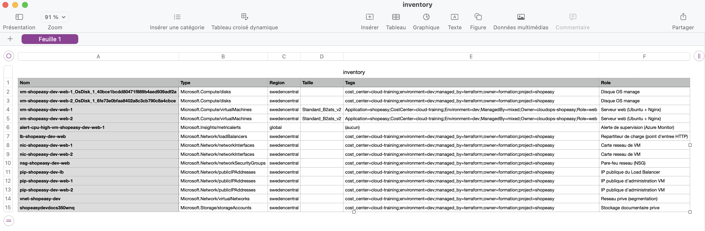

# Atelier 10 — Automatiser avec Python et Azure SDK (ShopEasy)

> **Objectif :** découvrir le SDK Azure pour Python afin de produire un inventaire programmable. \
> **Livrable attendu :** script `inventory.py` et fichier CSV généré, lisible dans Excel ou LibreOffice Calc.

---

## 1. Installation des dépendances

Les bibliothèques sont installées dans un **environnement virtuel** dédié (isolation des dépendances).

```bash
python3 -m venv .venv
source .venv/bin/activate
pip install azure-identity azure-mgmt-resource azure-mgmt-compute
```

```text
azure-core          1.41.0
azure-identity      1.25.3
azure-mgmt-compute  38.1.0
azure-mgmt-resource 26.0.0
```

| Bibliothèque | Rôle |
|---|---|
| `azure-identity` | Authentification (`DefaultAzureCredential`). |
| `azure-mgmt-resource` | Gestion des resource groups et ressources ARM. |
| `azure-mgmt-compute` | Gestion des machines virtuelles. |

---

## 2. Le script `python/inventory.py`

```python
#!/usr/bin/env python3
"""inventory.py - Inventaire programmable de ShopEasy via l'Azure SDK -> CSV."""

import os
import csv

from azure.identity import DefaultAzureCredential
from azure.mgmt.compute import ComputeManagementClient
try:
    # azure-mgmt-resource < 26 : client expose au niveau du package
    from azure.mgmt.resource import ResourceManagementClient
except ImportError:
    # azure-mgmt-resource >= 26 : client deplace dans le sous-module .resources
    from azure.mgmt.resource.resources import ResourceManagementClient

subscription_id = os.environ.get("AZURE_SUBSCRIPTION_ID")
resource_group = os.environ.get("AZURE_RESOURCE_GROUP", "rg-shopeasy-dev")

if not subscription_id:
    raise SystemExit("Variable AZURE_SUBSCRIPTION_ID manquante")

credential = DefaultAzureCredential()
resource_client = ResourceManagementClient(credential, subscription_id)
compute_client = ComputeManagementClient(credential, subscription_id)


def deduce_role(name: str, res_type: str) -> str:
    """Deduit le role d'une ressource a partir de son type/nom."""
    t = res_type.lower(); n = name.lower()
    if "virtualmachines" in t:        return "Serveur web (Ubuntu + Nginx)"
    if "disks" in t:                  return "Disque OS manage"
    if "virtualnetworks" in t:        return "Reseau prive (segmentation)"
    if "networksecuritygroups" in t:  return "Pare-feu reseau (NSG)"
    if "loadbalancers" in t:          return "Repartiteur de charge (point d'entree HTTP)"
    if "publicipaddresses" in t:      return "IP publique du Load Balancer" if "lb" in n else "IP publique d'administration VM"
    if "networkinterfaces" in t:      return "Carte reseau de VM"
    if "storageaccounts" in t:        return "Stockage documentaire prive"
    if "insights" in t or "metricalert" in t: return "Alerte de supervision (Azure Monitor)"
    return "Autre"


def fmt_tags(tags: dict) -> str:
    """Serialise les tags en 'cle1=val1;cle2=val2' (ou '(aucun)')."""
    if not tags:
        return "(aucun)"
    return ";".join(f"{k}={v}" for k, v in sorted(tags.items()))


# 1. Tailles des VM : croisement pour enrichir le CSV (colonne Taille)
vm_sizes = {vm.name.lower(): vm.hardware_profile.vm_size
            for vm in compute_client.virtual_machines.list(resource_group)}

# 2. Parcours des ressources
rows = []
for res in resource_client.resources.list_by_resource_group(resource_group):
    rows.append({
        "Nom": res.name, "Type": res.type, "Region": res.location,
        "Taille": vm_sizes.get(res.name.lower(), ""),
        "Tags": fmt_tags(res.tags), "Role": deduce_role(res.name, res.type),
    })
rows.sort(key=lambda r: (r["Type"], r["Nom"]))

# 3. Ecriture du CSV (utf-8-sig : accents corrects dans Excel)
out_dir = "exports"; os.makedirs(out_dir, exist_ok=True)
csv_path = os.path.join(out_dir, "inventory.csv")
with open(csv_path, "w", newline="", encoding="utf-8-sig") as f:
    writer = csv.DictWriter(f, fieldnames=["Nom", "Type", "Region", "Taille", "Tags", "Role"])
    writer.writeheader(); writer.writerows(rows)

# 4. Recapitulatif console
print(f"Inventaire du groupe   : {resource_group}")
print(f"Ressources inventoriees: {len(rows)}")
print(f"Machines virtuelles    : {len(vm_sizes)}")
print(f"CSV genere             : {csv_path}")
```

### Adaptation au SDK récent

Le code du sujet (`from azure.mgmt.resource import ResourceManagementClient`) **échoue** avec `azure-mgmt-resource 26.0.0` :

```text
ImportError: cannot import name 'ResourceManagementClient' from 'azure.mgmt.resource' (unknown location)
```

Dans cette version majeure, `azure.mgmt.resource` est devenu un **namespace pur** : le client a été déplacé dans le sous-module `azure.mgmt.resource.resources`. Le script gère les deux cas via un `try/except ImportError` (rétrocompatible).

---

## 3. Exécution

`DefaultAzureCredential` réutilise automatiquement la session **`az login`** (via `AzureCliCredential`), sans secret en dur.

```bash
export AZURE_SUBSCRIPTION_ID="$(az account show --query id -o tsv)"
export AZURE_RESOURCE_GROUP="rg-shopeasy-dev"
python python/inventory.py
```

```text
Inventaire du groupe   : rg-shopeasy-dev
Ressources inventoriees: 14
Machines virtuelles    : 2
CSV genere             : exports/inventory.csv
```

> **14 ressources via le SDK** — contre **13** via `az resource list`. Le SDK Python retourne l'**alerte métrique** `Microsoft.Insights/metricAlerts` (créée à l'Atelier 8), que `az resource list` **n'inclut pas** dans son décompte. Ce n'est pas une incohérence mais une **différence de comportement** documentée entre les deux outils ; l'alerte est correctement classée « Alerte de supervision ».

---

## 4. Le fichier CSV généré

`exports/inventory.csv` — encodage `utf-8-sig` (BOM) pour une ouverture **directe et sans souci d'accents** dans Excel / LibreOffice. Extrait représentatif :

```csv
Nom,Type,Region,Taille,Tags,Role
vm-shopeasy-dev-web-1,Microsoft.Compute/virtualMachines,swedencentral,Standard_B2ats_v2,Application=shopeasy;CostCenter=cloud-training;Environment=dev;ManagedBy=mixed;Owner=cloudops-shopeasy;Role=web,Serveur web (Ubuntu + Nginx)
alert-cpu-high-vm-shopeasy-dev-web-1,Microsoft.Insights/metricalerts,global,,(aucun),Alerte de supervision (Azure Monitor)
lb-shopeasy-dev-web,Microsoft.Network/loadBalancers,swedencentral,,cost_center=cloud-training;environment=dev;...,Repartiteur de charge (point d'entree HTTP)
nsg-shopeasy-dev-web,Microsoft.Network/networkSecurityGroups,swedencentral,,...;project=shopeasy,Pare-feu reseau (NSG)
shopeasydevdocs350wnq,Microsoft.Storage/storageAccounts,swedencentral,,...;project=shopeasy,Stockage documentaire prive
```

Le CSV (14 lignes) apporte une **valeur ajoutée** par rapport au TSV de l'Atelier 2 :
- colonne **`Taille`** renseignée pour les VM (croisement avec `ComputeManagementClient`) ;
- colonne **`Role`** déduite par le code (lecture métier de l'inventaire) ;
- **`Tags`** sérialisés et lisibles ; tri par type ; encodage tableur.

---

## 5. Bash ou Python ? (quand passer à l'un ou l'autre)

| Besoin | Outil adapté |
|---|---|
| Enchaîner des commandes, contrôles rapides, exports bruts | **Bash** (`inventory.sh`, `healthcheck.sh`) |
| Enrichir / croiser des données (taille VM, rôle), produire un format structuré (CSV/JSON), intégrer une API | **Python + SDK** (`inventory.py`) |

Ici, le **croisement** ressources ↔ tailles de VM et la **déduction de rôle** illustrent précisément le moment où Python devient préférable à un script shell : le besoin n'est plus seulement « lister », mais « **structurer et enrichir** ».

---

## 6. Travail demandé — réponses

Le script produit un **CSV** contenant **nom, type, région, tags et rôle** (colonnes demandées), enrichi d'une colonne **taille** pour les VM. Le fichier est encodé `utf-8-sig` et **lisible dans Excel / LibreOffice Calc**. L'authentification passe par `DefaultAzureCredential` (session `az login`), sans secret. Le script et le CSV sont fournis (`python/inventory.py`, `exports/inventory.csv`).

---

## 7. Captures



> Capture du fichier `exports/inventory.csv` ouvert dans un tableur (LibreOffice Calc / Excel / Numbers) : les colonnes *Nom, Type, Region, Taille, Tags, Role* s'affichent correctement, accents compris (encodage `utf-8-sig`).

---

## ✅ État après l'Atelier 10

- Environnement Python isolé (`.venv`) ; SDK Azure installé (identity, mgmt-resource, mgmt-compute).
- Script `python/inventory.py` fonctionnel : authentification `az login`, parcours ARM, **CSV enrichi** (rôle + taille).
- Adaptation au SDK récent gérée (`ResourceManagementClient` déplacé en v26, import rétrocompatible).
- `exports/inventory.csv` (14 ressources) généré, lisible dans un tableur ; classe correctement l'alerte de supervision.

**Prêt pour l'Atelier 11 — Analyse FinOps d'exploitation.**
