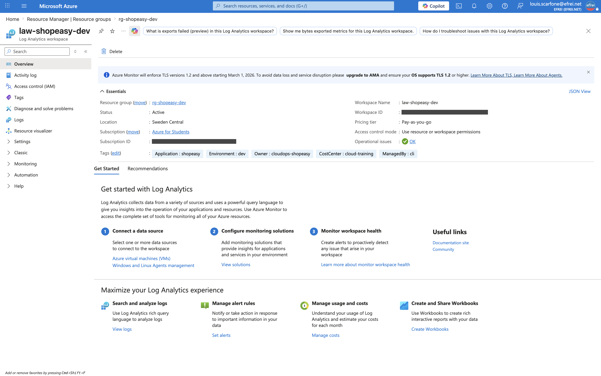

# Atelier 2 — Préparer l'environnement Azure Monitor (ShopEasy)

> **Objectif :** mettre en place la base de l'observabilité Azure — un espace **Log Analytics**, des **diagnostics** et une organisation claire des ressources. \
> **Livrable attendu :** description de l'espace Log Analytics, **liste des ressources connectées ou à connecter**, et justification des choix.

---

## 1. Ressources à identifier

L'environnement ShopEasy a été redéployé à l'identique depuis le Terraform du TP2 (`terraform apply` → 21 objets). Repérage des ressources de l'abonnement / du groupe de ressources :

```bash
az account show --query "{name:name, state:state}" -o table
az resource list --resource-group rg-shopeasy-dev --output table
```

```text
Name                State
------------------  -------
Azure for Students  Enabled
```

Correspondance avec les ressources attendues par l'énoncé :

| Ressource attendue | Présence dans `rg-shopeasy-dev` | Détail |
|---|---|---|
| Groupe de ressources | ✅ | `rg-shopeasy-dev` (`swedencentral`) |
| Machines virtuelles | ✅ | `vm-shopeasy-dev-web-1`, `vm-shopeasy-dev-web-2` (`Standard_B2ats_v2`) |
| Network Security Groups | ✅ | `nsg-shopeasy-dev-web` |
| Storage Account | ✅ | `shopeasydevdocsczvc1s` (privé, versionné) |
| Réseau virtuel | ✅ | `vnet-shopeasy-dev` (`10.20.0.0/16`, subnet `snet-web`) |
| **Base de données** | ❌ | **Non déployée** : la base Azure SQL fait partie de la cible TP1 mais **n'est pas dans le périmètre Terraform du TP2** (21 ressources, sans base). Traitée en proposition (Atelier 5). |
| **Ressources de monitoring existantes** | ❌ → créée | **Aucune** au départ (`az monitor log-analytics workspace list` vide) → le workspace est créé dans cet atelier. |

**13 ressources de premier niveau** au total ; aucune ressource d'observabilité préexistante, d'où la nécessité de centraliser.

---

## 2. Création du Log Analytics Workspace

Le workspace centralise logs et métriques et facilite les recherches opérationnelles (requêtes KQL).

```bash
az monitor log-analytics workspace create \
  --resource-group rg-shopeasy-dev \
  --workspace-name law-shopeasy-dev \
  --location swedencentral \
  --tags Application=shopeasy Environment=dev Owner=cloudops-shopeasy CostCenter=cloud-training ManagedBy=cli
```

> La région est **`swedencentral`** (et non `francecentral` comme dans l'exemple de l'énoncé) : `francecentral` est bloquée par la policy *Allowed regions* d'*Azure for Students* (contrainte héritée des TP1/2/3).

```text
Nom               Region         Sku        RetentionJours    Etat
----------------  -------------  ---------  ----------------  ---------
law-shopeasy-dev  swedencentral  PerGB2018  30                Succeeded
```

Le workspace `law-shopeasy-dev` est créé : SKU **PerGB2018** (facturation à l'ingestion, adaptée au pay-as-you-go), rétention **30 jours** (suffisante en dev), état `Succeeded`.

---

## 3. Diagnostic settings — raccordement au workspace

Pour chaque ressource critique, vérification de ce qui **peut** être envoyé vers Log Analytics, puis raccordement de ce qui est réalisable dans le périmètre déployé :

| Ressource | Diagnostics attendus | Intérêt opérationnel | Statut |
|---|---|---|---|
| **VM** (`web-1`, `web-2`) | Métriques plateforme (CPU, réseau, disque, **crédits CPU**) ; logs système (syslog) | Détecter surcharge et indisponibilité | Métriques **disponibles nativement** dans Azure Monitor ; logs invité **à connecter** (Azure Monitor Agent + DCR) |
| **Storage Account** | Transactions (métrique), logs data-plane (read/write/delete) | Surveiller activité et coûts | ✅ **Connecté** → `diag-storage-to-law` + `diag-blob-to-law` |
| **Azure SQL** | CPU, DTU/vCore, connexions | Détecter saturation base | **Non déployé** (hors périmètre TP2) → à connecter si la base est provisionnée |
| **Activity Log** | Opérations administratives, sécurité, policy | Auditer les changements | ✅ **Connecté** → `activitylog-to-law` |

### 3.1 Storage Account → workspace

```bash
STORAGE_ID=$(az storage account show -g rg-shopeasy-dev -n shopeasydevdocsczvc1s --query id -o tsv)
LAW_ID=$(az monitor log-analytics workspace show -g rg-shopeasy-dev -n law-shopeasy-dev --query id -o tsv)

# Metrique Transaction (activite et couts) au niveau du compte
az monitor diagnostic-settings create --name "diag-storage-to-law" \
  --resource "$STORAGE_ID" --workspace "$LAW_ID" \
  --metrics '[{"category":"Transaction","enabled":true}]'

# Logs data-plane (acces read/write/delete) au niveau du Blob service
az monitor diagnostic-settings create --name "diag-blob-to-law" \
  --resource "$STORAGE_ID/blobServices/default" --workspace "$LAW_ID" \
  --logs '[{"category":"StorageRead","enabled":true},{"category":"StorageWrite","enabled":true},{"category":"StorageDelete","enabled":true}]'
```

### 3.2 Activity Log (abonnement) → workspace

```bash
az monitor diagnostic-settings subscription create --name "activitylog-to-law" \
  --location swedencentral --workspace "$LAW_ID" \
  --logs '[{"category":"Administrative","enabled":true},{"category":"Security","enabled":true},{"category":"Policy","enabled":true},{"category":"Alert","enabled":true},{"category":"ResourceHealth","enabled":true}]'
```

Vérification des raccordements :

```text
# Storage Account
diag-storage-to-law   -> Transaction (metrique)            -> law-shopeasy-dev
diag-blob-to-law      -> StorageRead/Write/Delete (logs)   -> law-shopeasy-dev

# Abonnement
activitylog-to-law    -> Administrative/Security/Policy/Alert/ResourceHealth -> law-shopeasy-dev
```

### 3.3 VM — métriques disponibles sans agent

Les **métriques de plateforme** des VM remontent nativement dans Azure Monitor (sans agent ni workspace) :

```text
Metrique               Unite
---------------------  -------
Percentage CPU         Percent
CPU Credits Remaining  Count
Network In Total       Bytes
```

Les **logs invité** (syslog) et compteurs de performance mémoire/disque nécessitent l'**Azure Monitor Agent** + une **Data Collection Rule** (DCR) pointant vers `law-shopeasy-dev` — raccordement documenté comme « à connecter » (non requis pour les métriques de l'Atelier 3).

---

## 4. Justification des choix

- **Un workspace centralisé** (`law-shopeasy-dev`) plutôt que des journaux dispersés : il permet de **corréler** logs et métriques de plusieurs ressources et d'interroger en **KQL** depuis un point unique — base d'une vision d'exploitation.
- **Activity Log raccordé en priorité** : c'est la source d'**audit** (qui a fait quoi, quand) exploitée à l'Atelier 8 ; les catégories `Administrative` et `Security` couvrent les changements de configuration et de droits.
- **Storage raccordé** (métrique + logs data-plane) : surveille l'**activité** (transactions) et les **accès** aux documents (lecture/écriture/suppression), utile à la fois pour les coûts et la sécurité.
- **SKU PerGB2018 / rétention 30 j** : facturation à l'ingestion et rétention courte, **adaptées à un environnement de dev** (pas de sur-rétention payante).
- **Base SQL et logs invité VM laissés « à connecter »** : honnêteté du périmètre — la base n'est pas déployée, et les logs invité demandent l'agent ; les deux sont documentés avec la méthode exacte plutôt que simulés.

---

## 5. Capture portail



> Navigation (EN) : **Portal → Log Analytics workspaces → law-shopeasy-dev → Overview**.

---

## ✅ État après l'Atelier 2

- Ressources de l'environnement **identifiées** (13 ressources ; aucune ressource de monitoring préexistante).
- **Log Analytics Workspace `law-shopeasy-dev`** créé (`swedencentral`, PerGB2018, 30 j, `Succeeded`).
- **3 diagnostic settings** opérationnels vers le workspace : Storage (métrique Transaction + logs blob) et Activity Log (Administrative/Security/Policy/Alert/ResourceHealth).
- Métriques VM disponibles nativement ; logs invité VM et base SQL documentés « à connecter ».

**Prêt pour l'Atelier 3 — Superviser les machines virtuelles.**
