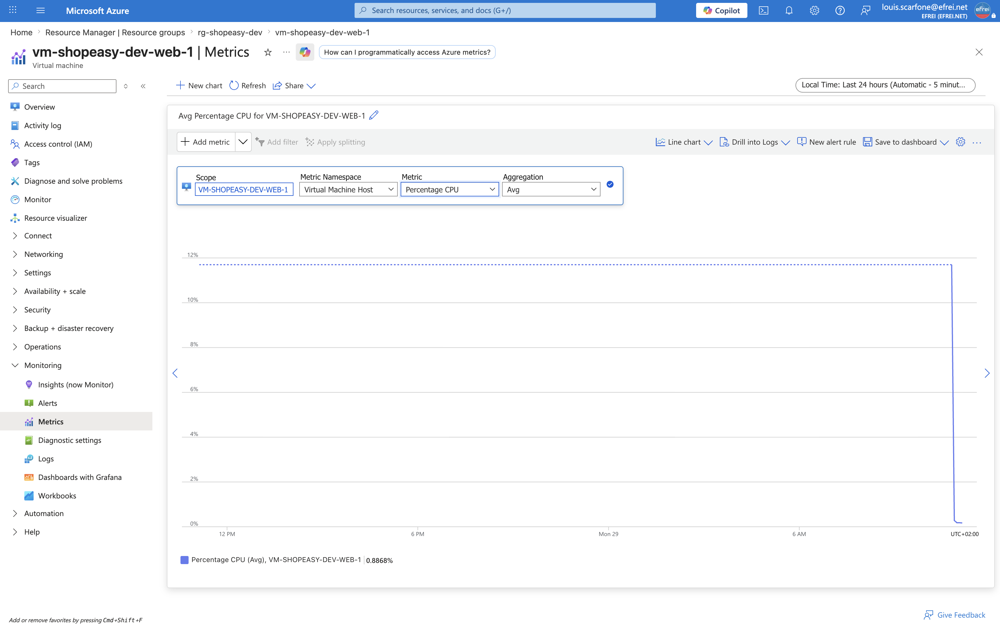

# Atelier 3 — Superviser les machines virtuelles (ShopEasy)

> **Objectif :** analyser l'état des machines virtuelles et construire une première vision de supervision. \
> **Livrable attendu :** un tableau d'analyse des VM avec **au moins deux recommandations** d'exploitation.

---

## 1. État des VM (inventaire)

```bash
az vm list -g rg-shopeasy-dev --show-details \
  --query "[].{Nom:name,Etat:powerState,IP_publique:publicIps,IP_privee:privateIps,Taille:hardwareProfile.vmSize}" -o table
```

```text
Nom                    Etat        IP_publique    IP_privee    Taille
---------------------  ----------  -------------  -----------  -----------------
vm-shopeasy-dev-web-1  VM running  20.240.255.96  10.20.1.4    Standard_B2ats_v2
vm-shopeasy-dev-web-2  VM running  20.240.47.225  10.20.1.5    Standard_B2ats_v2
```

Statut de démarrage et provisionnement (`az vm get-instance-view`) :

```bash
az vm get-instance-view -g rg-shopeasy-dev -n vm-shopeasy-dev-web-1 \
  --query "instanceView.statuses[?starts_with(code,'PowerState/') || starts_with(code,'ProvisioningState/')].{Code:code, Etat:displayStatus}" -o table
```

```text
Code                         Etat
---------------------------  ----------------------
ProvisioningState/succeeded  Provisioning succeeded
PowerState/running           VM running
```

Les deux VM sont **`running`**, provisionnées avec succès, en `Standard_B2ats_v2` (Ubuntu + Nginx). Aucune erreur dans l'*instance view*.

---

## 2. Métriques observées (Azure Monitor)

Lecture des métriques demandées via `az monitor metrics list` (fenêtre des 30–60 dernières min) :

```bash
VM1_ID=$(az vm show -g rg-shopeasy-dev -n vm-shopeasy-dev-web-1 --query id -o tsv)
az monitor metrics list --resource "$VM1_ID" --metric "Percentage CPU" \
  --interval PT5M --aggregation Average Maximum -o table
```

| Métrique demandée | Métrique Azure | VM web-1 | VM web-2 | Lecture |
|---|---|---|---|---|
| **Pourcentage CPU** | `Percentage CPU` | pic **19 %** au boot → **~0,3 %** moy. (1,1 % max) au repos | idem | VM au repos (page statique, pas de trafic réel). |
| **Réseau entrant/sortant** | `Network In/Out Total` | **242 Ko** / **404 Ko** | 229 Ko / 327 Ko | Trafic faible (sondes + administration). |
| **Disque lu/écrit** | `Disk Read/Write Bytes` | **2,40 Mo** / **2,16 Mo** | 2,55 Mo / 2,78 Mo | Activité de boot (cloud-init), puis quasi nulle. |
| **Disponibilité de la VM** | `VmAvailabilityMetric` | **1.0** (saine) | **1.0** (saine) | La VM est disponible **au niveau plateforme**. |
| **Erreurs éventuelles** | *instance view* / statuts | aucune (`succeeded`) | aucune | Pas d'erreur d'infrastructure ; erreurs **applicatives** non visibles ici (cf. §3). |
| **Statut de démarrage** | `PowerState` / `ProvisioningState` | `running` / `succeeded` | `running` / `succeeded` | Démarrage nominal. |

Métriques complémentaires utiles, propres au contexte :

```text
CPU Credits Remaining   : 63,14        (burstable B2ats_v2 : reserve de credits saine)
Available Memory Bytes  : ~528 Mo      (sur 1 Gio : ~la moitie libre au repos)
```

> La VM `Standard_B2ats_v2` est **burstable** (1 Gio de RAM, 2 vCPU) : les **crédits CPU** et la **mémoire disponible** sont des indicateurs déterminants (un CPU élevé prolongé épuise les crédits → bridage ; 1 Gio de RAM est la ressource la plus contrainte).

---

## 3. Questions d'analyse

**1. La VM est-elle correctement dimensionnée ?**
Pour l'usage actuel (page Nginx statique, sans trafic réel), elle est **largement dimensionnée côté CPU** (~0,3 % au repos, 63 crédits en réserve) — une taille burstable de série B est donc adaptée à un environnement de dev. Le point de vigilance est la **mémoire** : `B2ats_v2` n'offre que **1 Gio**, dont ~la moitié est déjà consommée au repos. Sous charge réelle (trafic + application + logs), la **RAM serait le facteur limitant** avant le CPU. Verdict : bien dimensionnée pour le dev/test, mais à re-dimensionner (RAM) avant toute mise en charge de production. *(Rappel : `B1s` est indisponible sur Azure for Students, `B2ats_v2` est l'alternative recommandée.)*

**2. Les métriques disponibles suffisent-elles à diagnostiquer un incident applicatif ?**
**Non.** Les métriques de plateforme (CPU, réseau, disque, disponibilité, mémoire) décrivent l'état de l'**infrastructure**, pas celui de l'**application**. Un incident applicatif — Nginx qui renvoie des `500`, une requête lente, une erreur de configuration — peut survenir alors que la VM est **parfaitement saine au niveau infra** (`VmAvailabilityMetric = 1`, CPU bas). Ces métriques disent *si la machine tourne*, pas *si le service rend correctement le service*.

**3. Quelles métriques manquent pour une supervision applicative complète ?**
- **Codes de statut HTTP** et **taux d'erreurs** (`5xx`/`4xx`) issus des logs Nginx ;
- **Temps de réponse / latence** (P95) ;
- **Débit applicatif** (requêtes/s) et **connexions actives** Nginx ;
- **Logs applicatifs** (erreurs, exceptions) centralisés dans Log Analytics ;
- **Disponibilité synthétique** vue utilisateur (cf. question 4).
Ces signaux nécessitent l'**Azure Monitor Agent** (syslog + logs Nginx → `law-shopeasy-dev`, raccordement préparé à l'Atelier 2) et/ou **Application Insights**.

**4. Que faudrait-il ajouter pour connaître la disponibilité réelle vue par un utilisateur ?**
`VmAvailabilityMetric = 1` indique seulement que la VM tourne **au niveau plateforme**, pas que le site répond. Pour mesurer la disponibilité **réellement perçue**, il faut une **sonde synthétique** : un test externe qui interroge périodiquement le site via l'**IP publique du Load Balancer** (`http://4.223.84.214`) et vérifie le **code 200 + le contenu + le temps de réponse**. Dans Azure, c'est un **URL ping test** (Application Insights / Log Analytics) ou le suivi du **Health Probe Status** du Load Balancer. Cette sonde mesure la chaîne complète (DNS → LB → VM → Nginx → réponse), c'est-à-dire l'expérience réelle de l'utilisateur.

---

## 4. Tableau d'analyse des VM

| VM | État | Risque observé | Action proposée |
|---|---|---|---|
| `vm-shopeasy-dev-web-1` | `running`, disponibilité **1.0**, CPU ~0,3 %, crédits CPU 63, mémoire ~528 Mo libre / 1 Gio | **RAM contrainte** (1 Gio) → saturation possible sous charge ; **aucune supervision applicative** (logs/HTTP non centralisés) ; **pas de sonde de disponibilité utilisateur** | Surveiller mémoire + crédits CPU (alerte, Atelier 4) ; raccorder syslog + logs Nginx au workspace (AMA + DCR) ; ajouter une sonde de disponibilité synthétique |
| `vm-shopeasy-dev-web-2` | `running`, disponibilité **1.0**, profil identique | Idem web-1 ; de plus **désallouée par défaut** en dev (HA), elle ne sert que les tests de répartition | Mêmes actions ; vérifier son redémarrage avant les tests de charge |

### Recommandations d'exploitation

1. **Mettre en place une supervision applicative** : les métriques d'infrastructure ne suffisent pas (Q2). Raccorder les **logs Nginx + codes HTTP** à `law-shopeasy-dev` (Azure Monitor Agent + DCR) pour diagnostiquer les incidents applicatifs.
2. **Ajouter une sonde de disponibilité synthétique** (URL ping test sur l'IP du Load Balancer) pour mesurer la disponibilité **réelle vue par l'utilisateur**, au-delà de l'état plateforme.
3. **Surveiller mémoire et crédits CPU** (spécifiques au burstable 1 Gio) et matérialiser ces seuils en **alertes** (objet de l'Atelier 4).

---

## 5. Capture portail



> Navigation (EN) : **Portal → Virtual machines → vm-shopeasy-dev-web-1 → Monitoring → Metrics** (*Percentage CPU*).

---

## ✅ État après l'Atelier 3

- État des 2 VM relevé (`running`, provisioning `succeeded`, disponibilité `1.0`).
- Métriques demandées observées dans Azure Monitor : CPU (~0,3 % au repos), réseau, disque, disponibilité, mémoire, crédits CPU.
- 4 questions d'analyse traitées (dimensionnement, limites des métriques d'infra, métriques applicatives manquantes, disponibilité utilisateur).
- Tableau d'analyse des VM + **3 recommandations** d'exploitation.

> Le livrable est ce **tableau d'analyse** (preuve = sorties CLI ci-dessus), complété par la capture du graphe de métriques.

**Prêt pour l'Atelier 4 — Créer des alertes opérationnelles.**
