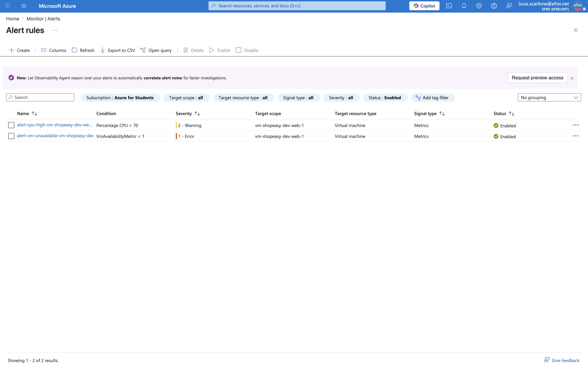
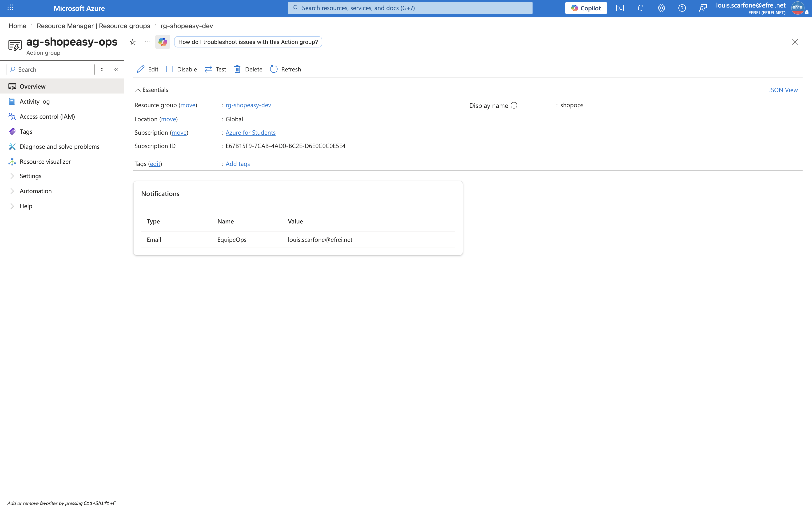

# Atelier 4 — Créer des alertes opérationnelles (ShopEasy)

> **Objectif :** configurer des alertes permettant de détecter rapidement un incident. \
> **Livrable attendu :** une **fiche d'alerte** avec nom, ressource cible, seuil, criticité, destinataire et procédure de réaction.

---

## 1. Alertes retenues

Parmi les alertes proposées par l'énoncé, **deux sont configurées réellement** dans cet atelier ; les autres sont rattachées aux ateliers dédiés.

| Alerte | Seuil | Criticité | Action attendue | Statut |
|---|---|---|---|---|
| **CPU élevé VM web** | `> 70 %` (moy. 5 min) | Moyenne | Vérifier la charge, les logs et le dimensionnement | ✅ Configurée |
| **VM indisponible** | `VmAvailabilityMetric < 1` | Haute | Redémarrage, escalade, analyse d'incident | ✅ Configurée |
| **Budget dépassé** | `> 80 %` du budget | Moyenne | Analyse des coûts, suppression des ressources inutiles | ➡️ Atelier 6 (FinOps) |
| Activité critique (Activity Log) | modification de droits / NSG | Moyenne | Vérifier l'auteur et la légitimité du changement | ➡️ Atelier 8 (Audit) |

---

## 2. Action Group — qui est notifié et comment

Un **Action Group** définit les destinataires d'une alerte. Ici, un récepteur **e-mail** vers l'équipe d'exploitation (en contexte réel : webhook, ITSM ou canal d'exploitation en complément).

```bash
az monitor action-group create \
  --resource-group rg-shopeasy-dev --name ag-shopeasy-ops --short-name shopops \
  --action email EquipeOps louis.scarfone@efrei.net
```

```json
{
  "Nom": "ag-shopeasy-ops",
  "ShortName": "shopops",
  "Destinataire": "EquipeOps",
  "Email": "louis.scarfone@efrei.net",
  "Etat": "Enabled"
}
```

---

## 3. Création des alertes (Azure CLI)

```bash
AG_ID=$(az monitor action-group show -g rg-shopeasy-dev -n ag-shopeasy-ops --query id -o tsv)
VM1_ID=$(az vm show -g rg-shopeasy-dev -n vm-shopeasy-dev-web-1 --query id -o tsv)

# Alerte 1 - CPU moyen > 70% (Moyenne / Sev2)
az monitor metrics alert create \
  --name "alert-cpu-high-vm-shopeasy-dev-web-1" --resource-group rg-shopeasy-dev --scopes "$VM1_ID" \
  --condition "avg Percentage CPU > 70" \
  --window-size 5m --evaluation-frequency 1m \
  --severity 2 --action "$AG_ID" \
  --description "CPU moyen de la VM web superieur a 70% pendant 5 min"

# Alerte 2 - VM indisponible (Haute / Sev1)
az monitor metrics alert create \
  --name "alert-vm-unavailable-vm-shopeasy-dev-web-1" --resource-group rg-shopeasy-dev --scopes "$VM1_ID" \
  --condition "avg VmAvailabilityMetric < 1" \
  --window-size 5m --evaluation-frequency 1m \
  --severity 1 --action "$AG_ID" \
  --description "Disponibilite de la VM web inferieure a 1 (VM indisponible)"
```

Vérification (`az monitor metrics alert list`) :

```text
Nom                                         Active    Sev    Condition
------------------------------------------  --------  -----  --------------------
alert-cpu-high-vm-shopeasy-dev-web-1        True      2      Percentage CPU
alert-vm-unavailable-vm-shopeasy-dev-web-1  True      1      VmAvailabilityMetric
```

> **Seuil CPU à 70 %** (et non 80 %) : aligné sur l'exemple de l'énoncé. Le seuil se cale entre 70 et 80 % selon la baseline (mesurée à ~0,3 % au repos, Atelier 3) — assez haut pour ignorer les pics normaux, assez bas pour détecter une saturation soutenue avant dégradation. **Sévérités** : Sev 2 = *Warning* (Moyenne), Sev 1 = *Error* (Haute).

---

## 4. Fiches d'alerte (livrable)

### Fiche 1 — CPU élevé VM web

| Champ | Valeur |
|---|---|
| **Nom** | `alert-cpu-high-vm-shopeasy-dev-web-1` |
| **Ressource cible** | VM `vm-shopeasy-dev-web-1` (`Standard_B2ats_v2`) |
| **Seuil** | CPU moyen `> 70 %`, fenêtre 5 min, évaluation 1 min |
| **Criticité** | Moyenne (Sev 2) |
| **Destinataire** | Action Group `ag-shopeasy-ops` → e-mail `EquipeOps` |
| **Procédure de réaction** | 1) Vérifier le trafic et les **crédits CPU** (burstable). 2) Consulter les logs Nginx (pic de requêtes ? boucle ?). 3) Si charge légitime et soutenue → **redimensionner** ou ajouter une instance. 4) Si anormale → identifier le processus, corriger. 5) Journaliser l'incident. |

### Fiche 2 — VM indisponible

| Champ | Valeur |
|---|---|
| **Nom** | `alert-vm-unavailable-vm-shopeasy-dev-web-1` |
| **Ressource cible** | VM `vm-shopeasy-dev-web-1` |
| **Seuil** | `VmAvailabilityMetric < 1`, fenêtre 5 min, évaluation 1 min |
| **Criticité** | Haute (Sev 1) |
| **Destinataire** | Action Group `ag-shopeasy-ops` → e-mail `EquipeOps` |
| **Procédure de réaction** | 1) Vérifier l'état dans le portail (`PowerState`, *boot diagnostics*). 2) Tenter un **redémarrage** (`az vm restart`). 3) Vérifier que le Load Balancer a retiré la VM du pool (continuité de service sur l'autre VM). 4) Si échec → **escalader** et analyser (incident matériel / OS). 5) Post-mortem. |

---

## 5. Questions d'analyse

**1. Quel risque y a-t-il à définir des seuils trop bas ?**
La **fatigue d'alerte** (*alert fatigue*) : l'alerte se déclenche sur des variations normales (faux positifs) et **noie** les équipes sous des notifications non prioritaires. À force, elles **ignorent** les alertes et **ratent les vrais incidents**. Exemple : `CPU > 40 %` sur 1 min se déclencherait à chaque déploiement, sans qu'aucune action ne soit requise.

**2. Quel risque y a-t-il à définir des seuils trop hauts ?**
La **détection tardive** : on n'est prévenu qu'une fois le service **déjà dégradé ou en panne**, donc trop tard pour agir préventivement. Exemple : `CPU > 98 %` sur 30 min ignore une saturation à 85 % qui **ralentit déjà** les utilisateurs. Le seuil trop haut transforme une alerte préventive en simple constat d'incident.

**3. Pourquoi faut-il documenter une action attendue pour chaque alerte ?**
Parce qu'une alerte doit être **actionnable**. Sans **procédure** (runbook : quoi vérifier, qui contacter, quelle action), le destinataire reçoit un signal **sans savoir quoi en faire** → perte de temps, mauvaise réaction, ou alerte ignorée. La procédure rend l'alerte exploitable, **réduit le MTTR** et garantit une réponse cohérente quelle que soit la personne d'astreinte. C'est ce qui distingue une **alerte** d'un simple **bruit**.

**4. Comment éviter la fatigue d'alerte ?**
- **Distinguer les criticités** : critique (action immédiate) / avertissement (analyse) / information (reporting en dashboard, pas en alerte).
- **Calibrer les seuils** sur la **baseline** réelle + une **fenêtre de lissage** (5 min) pour ignorer les pics transitoires.
- **N'alerter que sur l'actionnable** (règle-filtre : « une personne doit-elle vraiment agir ? ») ; le reste va au tableau de bord.
- **Regrouper** les notifications via les **Action Groups** et **supprimer les alertes redondantes**.
- **Réviser régulièrement** les règles (supprimer celles qui ne déclenchent jamais ou trop souvent).

---

## 6. Captures portail



> Navigation (EN) : **Portal → Monitor → Alerts → Alert rules**.



> Navigation (EN) : **Portal → Monitor → Alerts → Action groups → ag-shopeasy-ops**.

---

## ✅ État après l'Atelier 4

- **Action Group `ag-shopeasy-ops`** créé (récepteur e-mail `EquipeOps`, `Enabled`).
- **2 alertes opérationnelles actives** rattachées à l'Action Group : CPU > 70 % (Moyenne) et VM indisponible (Haute).
- **2 fiches d'alerte** complètes (nom, ressource, seuil, criticité, destinataire, procédure).
- 4 questions d'analyse traitées (seuils trop bas/hauts, action documentée, fatigue d'alerte).

**Prêt pour l'Atelier 5 — Construire un tableau de bord d'exploitation.**
