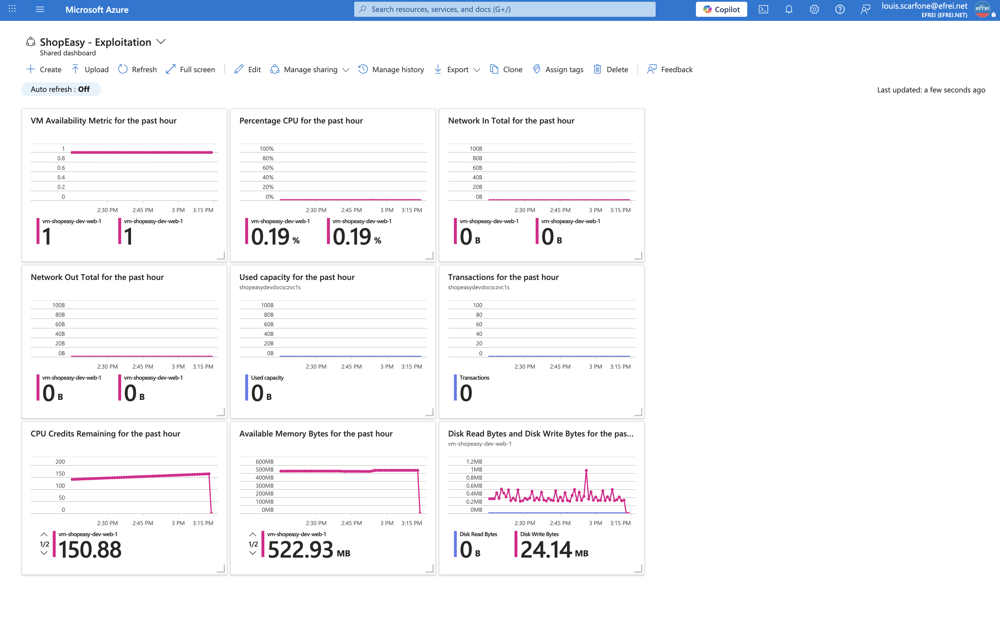

# Atelier 5 — Construire un tableau de bord d'exploitation (ShopEasy)

> **Objectif :** créer une vue synthétique permettant à une équipe SI de suivre l'état de l'application ShopEasy. \
> **Livrable attendu :** capture du dashboard **ou** maquette détaillée, avec justification de chaque tuile.

---

## 1. Approche retenue — un dashboard Azure réel

Le tableau de bord a été **réellement créé dans Azure** via `az portal dashboard create` (ressource `Microsoft.Portal/dashboards` nommée `ShopEasy-Exploitation`) — capture au §4. Il regroupe **9 tuiles de métriques réelles** (graphes Azure Monitor sur les VM et le Storage), **sans tuile factice ni texte de remplissage**.

Le dashboard couvre les **quatre axes de métriques** du contenu minimal de l'énoncé (état des VM, CPU, trafic réseau, stockage). Les autres items demandés — **coûts, alertes, journaux** — ne sont **pas des graphes de métriques** mais des **lames Azure dédiées** (Cost Management, Monitor Alerts, Activity Log) : ils sont traités dans leurs ateliers respectifs et restent épinglables au dashboard (cf. §3). La **base de données** n'est pas déployée (cible TP1, hors périmètre Terraform du TP2).

---

## 2. Les 9 tuiles du dashboard

| # | Tuile (métrique Azure) | Ressource | Donnée réelle observée | Décision facilitée |
|---|---|---|---|---|
| 1 | **Disponibilité des VM** (`VmAvailabilityMetric`) | web-1 + web-2 | `1.0` (saines) | Détecter une **indisponibilité** plateforme |
| 2 | **CPU des VM** (`Percentage CPU`) | web-1 + web-2 | ~0,3 % au repos | Identifier une **surcharge** |
| 3 | **Réseau entrant** (`Network In Total`) | web-1 + web-2 | 242 / 229 Ko | Détecter un **pic** de trafic / une attaque |
| 4 | **Réseau sortant** (`Network Out Total`) | web-1 + web-2 | 404 / 327 Ko | Détecter une **exfiltration** / une chute |
| 5 | **Stockage — capacité** (`Used capacity`) | `shopeasydevdocsczvc1s` | volume faible | Surveiller la **croissance** du stockage |
| 6 | **Stockage — transactions** (`Transactions`) | `shopeasydevdocsczvc1s` | activité blob | Surveiller l'**activité** et les coûts |
| 7 | **Crédits CPU** (`CPU Credits Remaining`) | web-1 + web-2 | 63 (réserve saine) | Anticiper le **bridage** (burstable) |
| 8 | **Mémoire disponible** (`Available Memory Bytes`) | web-1 + web-2 | ~528 Mo / 1 Gio | Anticiper une **saturation mémoire** |
| 9 | **Disque lu/écrit** (`Disk Read/Write Bytes`) | web-1 | 2,40 / 2,16 Mo | Détecter une **saturation I/O** |

Les tuiles 1 à 6 couvrent les axes métriques de l'énoncé ; les tuiles 7 à 9 ajoutent les indicateurs **propres au burstable `B2ats_v2`** (crédits CPU, mémoire) et les I/O disque — les plus contraints sur cette taille.

---

## 3. Couverture du contenu minimal de l'énoncé

| Item attendu (énoncé) | Sur le dashboard ? | Source / traitement |
|---|---|---|
| État des VM | ✅ Tuile 1 | `VmAvailabilityMetric` (graphe) |
| CPU des VM | ✅ Tuile 2 | `Percentage CPU` (graphe) |
| Trafic réseau | ✅ Tuiles 3-4 | `Network In/Out Total` (graphes) |
| Stockage consommé | ✅ Tuiles 5-6 | `Used capacity` + `Transactions` (graphes) |
| État de la base de données | ➖ Hors dashboard | Base SQL **non déployée** (cible TP1, hors Terraform TP2) |
| Coûts / Budget | ➖ Lame dédiée | **Cost Management** → Atelier 6 (épinglable) |
| Alertes récentes | ➖ Lame dédiée | **Azure Monitor → Alerts** → Atelier 4 (épinglable) |
| Lien journaux / Activity Log | ➖ Lame dédiée | **Activity Log** + `law-shopeasy-dev` (KQL) → Atelier 8 |

> Le dashboard est la **vue de supervision temps réel** (métriques). Le cockpit d'exploitation complet s'appuie en plus sur les **lames natives** Cost Management, Monitor Alerts et Activity Log — chacune approfondie dans son atelier et **épinglable** au même dashboard si besoin.

---

## 4. Capture portail — dashboard Azure réel

> Navigation (EN) : **Portal → Dashboard → Browse all dashboards → Shared dashboards → ShopEasy - Exploitation**. Dashboard créé par `az portal dashboard create` à partir d'un JSON `Microsoft.Portal/dashboards` — **9 tuiles `MetricsChartPart`**.

---

## 5. Pourquoi ce tableau de bord

Un tableau de bord utile ne se limite pas à empiler des courbes : il répond aux **questions de pilotage**. Ici, les 9 tuiles permettent de voir d'un coup d'œil **si le service tourne** (disponibilité), **s'il est saturé** (CPU, crédits CPU, mémoire, disque), et **comment il consomme** (réseau, stockage) — les signaux les plus utiles pour une VM web burstable. La dépense (Cost Management), les incidents (Alerts) et la traçabilité (Activity Log) complètent le pilotage via leurs lames dédiées, gardant le dashboard **lisible et 100 % métriques**.

---

## ✅ État après l'Atelier 5

- **Dashboard Azure réel** `ShopEasy-Exploitation` créé (`az portal dashboard create`) : **9 tuiles de métriques** (VM + Storage), **aucune tuile markdown**.
- Les 4 axes métriques de l'énoncé (état VM, CPU, réseau, stockage) sont des **tuiles réelles** ; coûts / alertes / journaux sont **mappés à leurs lames** (Ateliers 6 / 4 / 8) ; base SQL non déployée.
- Tableau des 9 tuiles (métrique / ressource / donnée réelle / décision) + couverture du contenu minimal de l'énoncé.

> Le livrable est ce **dashboard Azure réel** (capture §4). La base SQL est le seul item non couvert par une tuile, car la ressource n'est pas déployée — cas explicitement prévu par l'énoncé.

**Prêt pour l'Atelier 6 — Analyse FinOps.**
