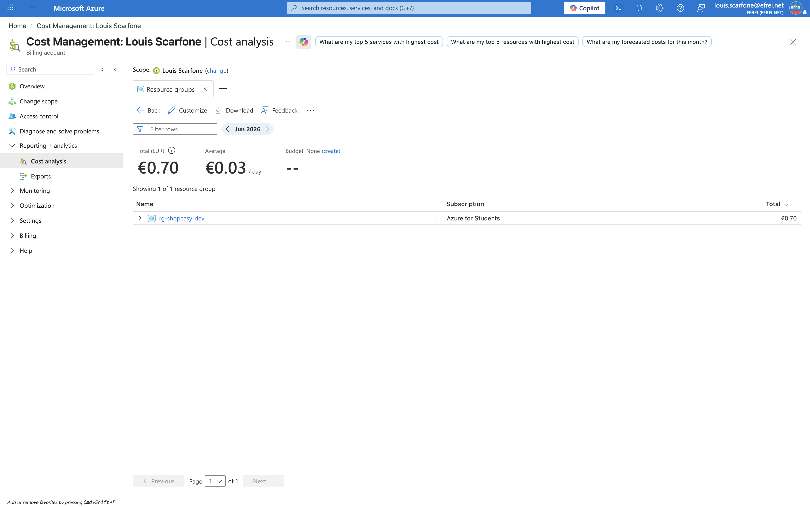

# Atelier 6 — Analyse FinOps (ShopEasy)

> **Objectif :** comprendre les coûts de l'environnement et proposer des optimisations réalistes. \
> **Livrable attendu :** une analyse FinOps structurée avec **au moins cinq constats et cinq actions correctives**.

---

## 1. Analyse des coûts

**Méthode.** Les données de **coût réel** (Cost Management) n'apparaissent qu'après 24–48 h sur un abonnement récent : `az consumption usage list` remonte déjà les **compteurs** facturés (IP `Standard IPv4`, disques `Standard HDD S4 LRS`) mais leur `PretaxCost` est encore `None`. Les montants ci-dessous sont donc calculés à partir des **prix réels** de l'**API Azure Retail Prices** (région `swedencentral`, USD, base 730 h/mois) — prix VM confirmé en direct : **`Standard_B2ats_v2` = 0,00972 $/h**.

### Coût par type de service

| Poste | Calcul | Coût $/mois | Part |
|---|---|---|---|
| **Load Balancer Standard** | forfait règles + data | **≈ 18,25** | ~39 % |
| **Compute — 2 VM `B2ats_v2`** | 2 × 0,00972 × 730 | **≈ 14,19** | ~30 % |
| **3 IP publiques Standard** | 3 × 0,005 × 730 | **≈ 10,95** | ~23 % |
| 2 disques OS `Standard HDD S4 LRS` | ~1,30 chacun | ≈ 2,60 | ~6 % |
| Storage Account LRS | usage faible | < 1 | ~2 % |
| **Total** | | **≈ 47 $/mois** | 100 % |

### Coût par groupe de ressources / par ressource

Tout l'environnement tient dans **un seul groupe** `rg-shopeasy-dev` (≈ 47 $/mois). Les **3 postes les plus coûteux** (Load Balancer + compute + IP) représentent **~92 %** du coût ; le **Load Balancer** et les **IP publiques** facturent **24/7, indépendamment du trafic** — seul le **compute** est élastique (réductible par désallocation).

### Ressources sans tag / orphelines / prévisionnel

```bash
az resource list -g rg-shopeasy-dev --query "length([?tags.Application==null])" -o tsv      # -> 14
az disk list -g rg-shopeasy-dev --query "length([?managedBy==null])" -o tsv                  # -> 0
az network public-ip list -g rg-shopeasy-dev --query "length([?ipConfiguration==null])" -o tsv  # -> 0
```

- **14 ressources sans tag `Application`** après normalisation du RG + 2 VM (cf. §2) → coût **non imputable**.
- **0 disque orphelin, 0 IP non associée** : environnement **propre**, aucun coût « invisible ».
- **Coût prévisionnel** : ≈ **47 $/mois** en 24/7 (≈ 30 $ avec désallocation des VM, ≈ 0 si destruction de l'environnement).
- **Recommandations Advisor (coût)** : aucune sur cet environnement récent (Advisor a besoin d'un historique d'usage).

---

## 2. Politique de tags de gouvernance

Politique de tags **minimale** proposée pour ShopEasy :

| Tag | Exemple | Utilité |
|---|---|---|
| `Application` | `shopeasy` | Regrouper les coûts par application |
| `Environment` | `dev` / `test` / `prod` | Distinguer les environnements |
| `Owner` | `cloudops-shopeasy` | Identifier le responsable |
| `CostCenter` | `cloud-training` | Affecter les coûts à un centre de coût |
| `Criticality` | `low` / `medium` / `high` | Prioriser supervision et sécurité |

Application au groupe de ressources et aux VM (commande utile de l'énoncé) :

```bash
# Groupe de ressources
az group update -n rg-shopeasy-dev --tags Application=shopeasy Environment=dev \
  Owner=cloudops-shopeasy CostCenter=cloud-training Criticality=high

# Chaque VM (az resource tag --ids)
az resource tag --ids "$VM_ID" --tags Application=shopeasy Environment=dev \
  Owner=cloudops-shopeasy CostCenter=cloud-training Criticality=high Role=web
```

```json
// Tags du RG apres application
{ "Application": "shopeasy", "CostCenter": "cloud-training", "Criticality": "high",
  "Environment": "dev", "Owner": "cloudops-shopeasy" }
```

Le nombre de ressources sans tag `Application` est passé de **16 à 14** (RG + 2 VM normalisés). La généralisation aux 14 restantes doit passer par **Azure Policy** (audit ou refus à la création d'une ressource sans `Application`/`Owner`).

---

## 3. Tableau d'optimisation FinOps

| # | Constat | Risque financier | Priorité | Action proposée |
|---|---|---|---|---|
| 1 | **VM allumées 24/7** alors qu'inutilisées en dev | Dépense compute inutile (~14 $/mois) | **Haute** | Désallouer hors usage (`az vm deallocate`) ; détruire l'environnement entre les séances (`terraform destroy`) |
| 2 | **3 IP publiques + Load Balancer** facturés à vide | ~29 $/mois indépendants du trafic | **Haute** | Supprimer les IP directes des VM (→ Azure Bastion) ; ne garder le LB que si nécessaire |
| 3 | **14 ressources sans tag `Application`** | Coût **non imputable / non pilotable** | Moyenne | Généraliser la politique de tags via **Azure Policy** |
| 4 | **Aucun budget actif** | Dérive **non détectée** | Moyenne | Créer un budget **50 $/mois** (Cost Management) + alertes 80 % / 100 % (cf. §4) |
| 5 | **Disque non attaché** (orphelin) | Coût oublié | Basse | **Aucun actuellement** (0 orphelin) ; automatiser le contrôle régulier (`az disk list` / `az network public-ip list`) |
| 6 | **VM potentiellement surdimensionnée** | Sur-paiement | Basse | `B2ats_v2` déjà minimale (burstable) ; surveiller `CPU Credits` avant tout downsize |

> **5 constats + 5 actions** au minimum sont couverts (les lignes 1–4 reprennent les constats de l'énoncé, complétés par les IP/LB facturés à vide et le contrôle des orphelins).

---

## 4. Budget mensuel (50 $) — design et mise en œuvre

Budget visé : **50 $/mois** sur le périmètre, avec **deux seuils d'alerte** :
- **80 % (40 $)** → vigilance, notification à l'équipe CloudOps ;
- **100 % (50 $)** → dépassement, action requise.

```bash
az consumption budget create --budget-name budget-shopeasy-dev \
  --amount 50 --category Cost --time-grain Monthly \
  --start-date 2026-06-01 --end-date 2027-06-01 --resource-group rg-shopeasy-dev
```

> **Limite rencontrée** : `az consumption budget create` (commande **en préview**) renvoie `400 — Invalid budget configuration, please use filter interface` sur cet abonnement *Azure for Students*. En pratique, le budget se crée de façon fiable via **Cost Management → Budgets → Add** (portail) ou l'API REST `2019-05-01-preview` avec interface de filtre. Le design (montant, grain, seuils 80/100 %) reste celui ci-dessus.

---

## 5. Questions d'analyse

**1. Pourquoi le cloud peut-il coûter plus cher que prévu ?**
Parce que la dépense apparaît **au fil de la consommation** (OPEX) et non à l'achat (CAPEX) : elle varie avec l'activité, les **erreurs de configuration** et les **ressources oubliées**. Plusieurs pièges : ressources **facturées à vide** (Load Balancer, IP publiques même sans trafic), **surdimensionnement**, environnements de test **laissés allumés**, stockage et versions qui **s'accumulent**, et surtout **absence de tags/budget** qui prive de visibilité. On découvre alors la dérive **sur la facture**, trop tard.

**2. Quelles ressources doivent être arrêtées hors période d'utilisation ?**
Les **VM de développement** : `az vm deallocate` ramène leur coût compute à **0** (≈ 14 $/mois économisés). Le **Load Balancer** et les **IP publiques**, facturés à vide, peuvent être supprimés hors usage (recréables par Terraform). Le levier maximal reste de **détruire l'environnement entier** (`terraform destroy`) entre les séances → coût ≈ 0, recréable à l'identique par `terraform apply`.

**3. Pourquoi les tags sont-ils indispensables pour une DSI ?**
Ils permettent d'**imputer** les coûts (par application, environnement, **centre de coût**), d'**identifier le responsable** (`Owner`), de **prioriser** (`Criticality`) et d'**automatiser** la gouvernance (Azure Policy, arrêt automatique des ressources `dev`). Sans tags, la DSI ne peut ni répondre à « combien coûte ShopEasy en dev ? », ni imputer une dépense, ni piloter — la facture devient un bloc opaque.

**4. Quelle différence faites-vous entre réduction de coût et optimisation de valeur ?**
- **Réduire** = baisser la dépense, parfois **au détriment du service** (supprimer, sous-dimensionner aveuglément).
- **Optimiser** = obtenir le **meilleur rapport valeur/coût** : bon dimensionnement, suppression du **gaspillage** (ressources oubliées, surdimensionnées, facturées à vide), choix du bon niveau de service — **sans dégrader la valeur métier**.
La cible FinOps est l'**optimisation**, pas la réduction aveugle : on cherche à maximiser la valeur produite par chaque dollar dépensé.

---

## 6. Capture portail



> Navigation (EN) : **Portal → Cost Management → Cost analysis** (les montants réels n'apparaissent qu'après 24–48 h sur un abonnement récent).

---

## ✅ État après l'Atelier 6

- Coûts analysés (prix réels Azure Retail Prices) : **≈ 47 $/mois en 24/7**, dont **~92 %** sur Load Balancer + compute + IP ; environnement **propre** (0 orphelin).
- Politique de tags minimale **proposée et appliquée** (RG + 2 VM, avec `Criticality`) ; 14 ressources restantes à généraliser via Azure Policy.
- **Tableau d'optimisation FinOps** : 6 constats / risque / priorité / action (≥ 5 demandés).
- Budget 50 $/mois conçu (seuils 80/100 %) ; création CLI bloquée (API préview) → à créer via Cost Management.
- 4 questions d'analyse traitées.

> Le livrable est cette **analyse FinOps structurée** (tableaux), complétée par la capture Cost Management.

**Prêt pour l'Atelier 7 — Revue de sécurité Azure.**
