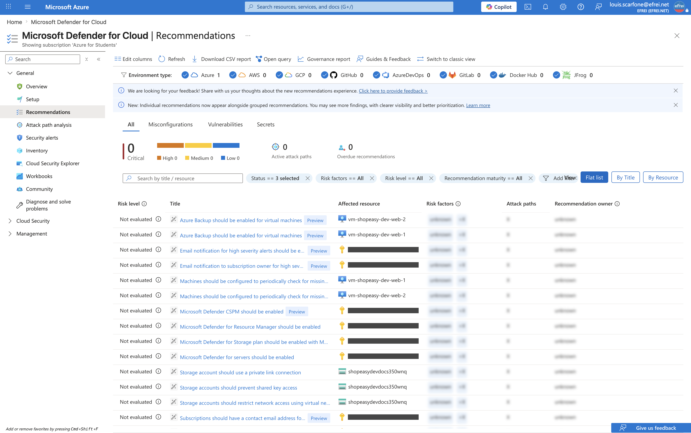
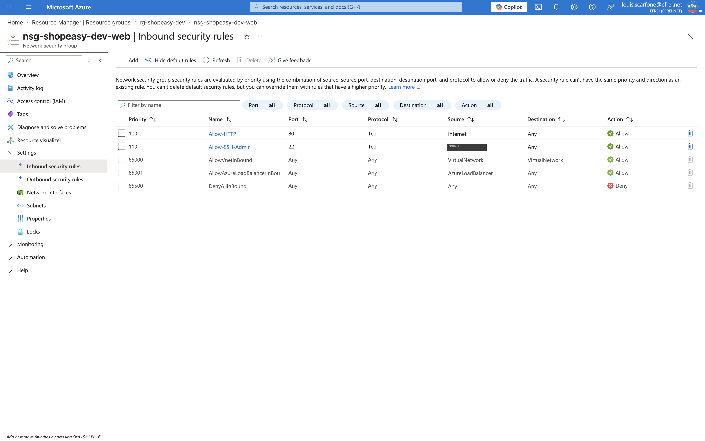

# Atelier 7 — Revue de sécurité Azure (ShopEasy)

> **Objectif :** identifier les principaux risques de sécurité de l'environnement et proposer un plan d'amélioration. \
> **Livrable attendu :** une matrice de risques sécurité avec **au moins cinq risques**, leur criticité et les mesures correctives proposées.

---

## 1. Points de contrôle

| Point de contrôle | Constat réel | Verdict |
|---|---|---|
| Rôles attribués (RBAC) | 1 compte **Owner** (hérité de l'abonnement) | ⚠️ droits larges |
| Utilisateurs à droits élevés | `louis.scarfone@efrei.net` = **Owner** | ⚠️ |
| Ressources exposées publiquement | 3 IP publiques (1 Load Balancer + **2 VM**) | ⚠️ 2 IP de VM inutiles |
| Règles NSG trop ouvertes | HTTP 80 (Internet), SSH 22 (`<IP_ADMIN>/32`) | ✅ aucun `0.0.0.0/0` sur port sensible |
| Accès SSH / RDP depuis Internet | SSH **restreint à l'IP admin** ; pas de RDP | ✅ |
| Chiffrement du stockage | SSE activé, **TLS 1.2**, HTTPS-only | ✅ |
| Accès public du Storage | **`allowBlobPublicAccess = True`** | ⚠️ à désactiver |
| Logs d'activité disponibles | `activitylog-to-law` → `law-shopeasy-dev` | ✅ disponibles |
| Recommandations Defender / Advisor | Defender non activé, MAJ non vérifiées… | ⚠️ (cf. §4) |

---

## 2. Contrôle RBAC

```bash
az role assignment list --resource-group rg-shopeasy-dev --include-inherited \
  --query "[].{Principal:principalName, Role:roleDefinitionName, Type:principalType}" -o table
```

```text
Principal                 Role    Type
------------------------  ------  ------
louis.scarfone@efrei.net  Owner   User
louis.scarfone@efrei.net  Owner   User
```

Le compte d'administration détient le rôle **Owner** (hérité de l'abonnement). Aucune attribution directe au niveau du RG. Pour une **équipe**, c'est un privilège trop large : il faut appliquer le **moindre privilège** (`Reader`/`Contributor` selon le besoin) et **MFA**. *(Advisor signale aussi, pour la résilience, qu'un **second owner** « break-glass » serait souhaitable — complémentaire au moindre privilège.)*

---

## 3. Contrôle NSG

```bash
az network nsg rule list -g rg-shopeasy-dev --nsg-name nsg-shopeasy-dev-web \
  --query "sort_by([].{Nom:name,Prio:priority,Sens:direction,Acces:access,Port:destinationPortRange,Source:sourceAddressPrefix}, &Prio)" -o table
```

```text
Nom              Prio    Sens     Acces    Port    Source
---------------  ------  -------  -------  ------  ---------------
Allow-HTTP       100     Inbound  Allow    80      Internet
Allow-SSH-Admin  110     Inbound  Allow    22      <IP_ADMIN>/32
```

- **HTTP (80)** ouvert depuis Internet : nécessaire pour exposer le site (trafic en clair → HTTPS en production).
- **SSH (22)** restreint à l'**IP de l'administrateur** (`/32`), **jamais `0.0.0.0/0`** ; la règle par défaut `DenyAllInBound` bloque le reste. **Aucune règle dangereuse** (pas de RDP, pas de port d'administration ouvert à Internet).

---

## 4. Exposition, chiffrement et recommandations

**Ressources exposées** : 3 IP publiques — `pip-shopeasy-dev-lb` (`4.223.84.214`, point d'entrée légitime) et **2 IP directes sur les VM** (`20.240.255.96`, `20.240.47.225`) qui élargissent inutilement la surface d'attaque (administration possible via Bastion à la place).

**Chiffrement du Storage** :

```text
Nom                    ChiffrementRepos    TLS     HttpsOnly    AccesPublicBlob
---------------------  ------------------  ------  -----------  -----------------
shopeasydevdocsczvc1s  True                TLS1_2  True         True
```

Le chiffrement au repos (SSE), TLS 1.2 et HTTPS-only sont **corrects**, mais **`AllowBlobPublicAccess = True`** (défaut Terraform) : le compte **autoriserait** un conteneur public. À **désactiver** au niveau du compte (défense en profondeur) — le conteneur `documents` est privé, mais le garde-fou doit être posé.

**Recommandations de sécurité (Microsoft Defender / Advisor)** — extrait réel :

```text
Impact    Recommandation
--------  ----------------------------------------------------------------------
High      Machines should be configured to periodically check for missing updates
High      Microsoft Defender for Resource Manager should be enabled
High      Microsoft Defender CSPM should be enabled
High      Microsoft Defender for Storage should be enabled
High      Microsoft Defender for servers should be enabled
High      There should be more than one owner assigned to subscriptions
Medium    Email notification to subscription owner for high severity alerts
```

Les plans **Microsoft Defender for Cloud** (CSPM, servers, storage) ne sont **pas activés** et les VM ne vérifient pas leurs **mises à jour système** : ce sont les axes de durcissement prioritaires côté plateforme.

---

## 5. Matrice de risques sécurité

| Risque | Impact | Probabilité | Mesure corrective |
|---|---|---|---|
| **Storage : accès public blob autorisé** (`allowBlobPublicAccess=true`) | **Élevé** | Moyenne | Désactiver l'accès public (`az storage account update --allow-blob-public-access false`), auditer les conteneurs |
| **IP publiques directes sur les 2 VM** | **Élevé** | Moyenne | Supprimer les IP des VM, administrer via **Azure Bastion** ; ne garder que l'IP du Load Balancer |
| **Droits `Owner` larges** (compte unique tout-puissant) | **Élevé** | Faible | **Moindre privilège** (`Reader`/`Contributor`), revue régulière des rôles, **MFA** |
| **Microsoft Defender non activé** (CSPM / servers / storage) | Moyen | Élevée | Activer les plans **Defender for Cloud** pour la détection et la posture |
| **Mises à jour système non vérifiées** | Moyen | Moyenne | Activer **Azure Update Manager** (vérification périodique des correctifs) |
| **Tags incomplets** (14 ressources sans `Application`) | Moyen | Élevée | Imposer la politique de tags via **Azure Policy** |
| **SSH (22) exposé sur Internet** | Moyen | Faible | **Déjà restreint** à `<IP_ADMIN>/32` ; cible : **Bastion** / accès *just-in-time* |

> **7 risques** identifiés (≥ 5 demandés), chacun avec impact, probabilité et mesure corrective. Les risques **élevés** (Storage public, IP de VM, droits Owner) sont à traiter en priorité.

---

## 6. Points forts déjà en place

La revue n'identifie pas que des faiblesses : plusieurs **contrôles essentiels sont déjà appliqués** — SSH restreint à l'IP admin (jamais `0.0.0.0/0`), conteneur de stockage **privé**, **TLS 1.2 + HTTPS-only + chiffrement au repos**, **logs d'activité disponibles** (raccordés au workspace), aucun secret versionné (`terraform.tfvars`/`tfstate` exclus). Le socle est sain ; les renforcements portent surtout sur l'**exposition réseau**, la **posture Defender** et le **moindre privilège**.

---

## 7. Captures portail



> Navigation (EN) : **Portal → Microsoft Defender for Cloud → Recommendations**.



> Navigation (EN) : **Portal → nsg-shopeasy-dev-web → Settings → Inbound security rules**. *(La source de la règle SSH — l'IP admin — est redactée sur la capture.)*

---

## ✅ État après l'Atelier 7

- **8 points de contrôle** vérifiés (RBAC, exposition, NSG, SSH/RDP, chiffrement, accès public Storage, logs, recommandations).
- Constats réels : 1 compte Owner, 2 IP de VM exposées, `allowBlobPublicAccess=true`, Defender non activé, MAJ non vérifiées — face à des contrôles déjà sains (SSH restreint, stockage privé/chiffré, logs disponibles).
- **Matrice de 7 risques** (impact / probabilité / mesure corrective) — le livrable demandé.

> Le livrable est cette **matrice de risques** (tableau), complétée par les captures Defender et NSG.

**Prêt pour l'Atelier 8 — Audit des changements et Activity Log.**
