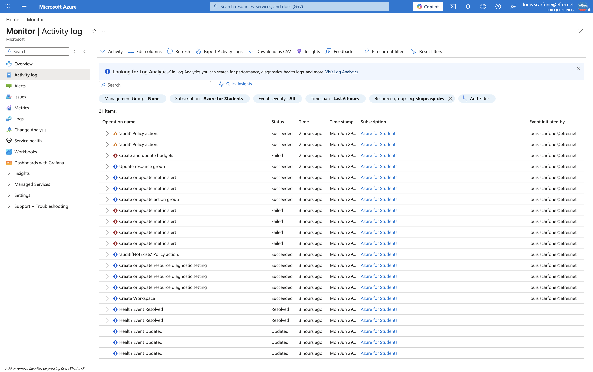

# Atelier 8 — Audit des changements et Activity Log (ShopEasy)

> **Objectif :** exploiter les journaux d'activité Azure pour comprendre ce qui a changé dans l'environnement. \
> **Livrable attendu :** une **fiche d'audit** listant **trois événements significatifs** observés et leur interprétation.

---

## 1. Exploration de l'Activity Log

```bash
# Operations de modification reelles (le bruit des evaluations Azure Policy est ecarte)
az monitor activity-log list -g rg-shopeasy-dev --offset 8h --max-events 1000 \
  --query "[?contains(operationName.value,'/write') || contains(operationName.value,'/delete') || contains(operationName.value,'roleAssignments')].{op:operationName.value, st:status.value}" \
  -o tsv | sort | uniq -c | sort -rn
```

Extrait du résumé (opérations `Succeeded`, **264 événements** tracés sur la fenêtre, auteur unique `louis.scarfone@efrei.net`) :

```text
  Microsoft.Compute/virtualMachines/write              (x2)   creation des 2 VM web
  Microsoft.Network/loadBalancers/write                       creation du Load Balancer
  Microsoft.Network/publicIPAddresses/write            (x3)   creation des 3 IP publiques
  Microsoft.Network/networkInterfaces/write            (x2)   creation des NIC
  Microsoft.Network/virtualNetworks/write + subnets           creation du reseau
  Microsoft.Compute/disks/write                        (x2)   creation des disques OS
  Microsoft.Storage/storageAccounts/write + containers        creation du stockage
  Microsoft.Resources/.../resourceGroups/write                creation/maj du groupe (+ tags)
  Microsoft.OperationalInsights/workspaces/write              creation du Log Analytics (Atelier 2)
  Microsoft.Insights/diagnosticSettings/write          (x3)   raccordement diagnostics (Atelier 2)
  Microsoft.Insights/actionGroups/write                       creation de l'action group (Atelier 4)
  Microsoft.Insights/metricAlerts/write                       creation des alertes (Atelier 4)
  Microsoft.Insights/metricAlerts/write   Failed       (x4)   tentatives d'alerte multi-VM rejetees
```

---

## 2. Synthèse par catégorie (travail demandé)

| Catégorie | Observé dans l'Activity Log ? | Détail |
|---|---|---|
| **Créations de ressources** | ✅ Oui | `terraform apply` (VM, LB, IP, NIC, VNet, disques, Storage, RG) + workspace, action group, alertes |
| **Suppressions de ressources** | ➖ Aucune sur la fenêtre | La dernière suppression date du nettoyage de fin de TP3 (`terraform destroy`), hors période |
| **Modifications de configuration** | ✅ Oui | `diagnosticSettings/write` (×3), mise à jour des **tags** du RG (Atelier 6), config du Storage |
| **Changements de droits** | ➖ Aucun sur la fenêtre | Le rôle `Owner` est **hérité de l'abonnement**, non modifié aujourd'hui (aucun `roleAssignments/write`) |
| **Erreurs / opérations échouées** | ✅ Oui | `metricAlerts/write` **Failed** (×4) : tentatives d'alerte sur **scope multi-VM** rejetées (cf. Atelier 4) |

> L'Activity Log trace **qui** (`louis.scarfone@efrei.net`), **quoi** (opération ARM), **quand** (horodatage) et **avec quel résultat** (`Started`/`Accepted`/`Succeeded`/`Failed`). Le bruit des **évaluations Azure Policy** (`policies/audit`) a été écarté pour ne garder que les changements réels.

---

## 3. Fiche d'audit — trois événements significatifs

| # | Événement (opération) | Ressource concernée | Auteur | Horodatage (UTC) | Statut | Interprétation |
|---|---|---|---|---|---|---|
| **1** | Création de VM (`Microsoft.Compute/virtualMachines/write`) | `vm-shopeasy-dev-web-1/2` | `louis.scarfone@efrei.net` | 2026-06-29 08:47 | **Succeeded** | **Redéploiement de l'infrastructure** via `terraform apply` (21 ressources). Action **légitime et attendue** (préalable au TP) ; l'auteur et l'horodatage sont tracés. |
| **2** | Création du workspace (`Microsoft.OperationalInsights/workspaces/write`) | `law-shopeasy-dev` | `louis.scarfone@efrei.net` | 2026-06-29 08:49 | **Succeeded** | **Mise en place de la supervision centralisée** (Atelier 2). Changement de configuration **structurant** pour l'observabilité — à conserver dans l'historique de gouvernance. |
| **3** | Échec de création d'alerte (`Microsoft.Insights/metricAlerts/write`) | alerte multi-VM (web-1 + web-2) | `louis.scarfone@efrei.net` | 2026-06-29 09:09 | **Failed** | **Tentative rejetée** (scope multi-ressource invalide). Montre que l'Activity Log **trace aussi les échecs** : précieux pour **diagnostiquer** une opération qui n'a pas abouti et comprendre pourquoi. |

Ces trois événements couvrent une **création**, une **modification de configuration** et une **erreur** — les trois axes typiques d'un audit de changements.

---

## 4. Questions d'analyse

**1. Pourquoi l'Activity Log est-il important pour l'audit ?**
Parce qu'il constitue la **source de vérité** des opérations de gestion : il enregistre **qui a fait quoi, quand et avec quel résultat** sur les ressources Azure. Il permet de **reconstituer l'historique** des changements, de **détecter une action non autorisée** (création, suppression, modification de droits), de **prouver** qu'une mesure existe, et de répondre aux exigences de **conformité et de contrôle interne**. Sans lui, les changements d'infrastructure seraient **invisibles et non imputables**.

**2. Quelle différence y a-t-il entre un log technique et un log d'activité ?**
- Un **log technique** (système ou applicatif : syslog, logs Nginx, logs d'application) décrit le **fonctionnement interne** d'une ressource ou d'une application — erreurs, requêtes, événements métier (*data-plane*).
- Un **log d'activité** (Activity Log) trace les **opérations de gestion** réalisées sur les ressources Azure via ARM — création, modification, suppression, changements de droits (*control-plane*).
En résumé : le log technique raconte **ce que fait l'application** ; le log d'activité, **ce que l'on fait à l'infrastructure**.

**3. Quelle information manque parfois pour reconstituer un incident ?**
- Le **contexte applicatif** : l'Activity Log indique « VM modifiée » mais pas pourquoi l'application a planté.
- Les **logs invité / applicatifs** s'ils ne sont **pas centralisés** (syslog, Nginx — non raccordés ici sans Azure Monitor Agent).
- L'**intention** derrière une action : le log dit **qui/quoi/quand**, rarement le **pourquoi**.
- Les **accès data-plane** (lecture/écriture de blobs, données) qui ne figurent pas dans l'Activity Log de gestion.
- La **corrélation temporelle** entre un changement et un symptôme.
D'où l'intérêt de **centraliser** logs d'activité **et** logs techniques dans un même workspace (`law-shopeasy-dev`).

**4. Comment une DSI peut-elle exploiter ces logs dans une démarche de contrôle interne ?**
En **centralisant l'Activity Log** dans Log Analytics (déjà fait : `activitylog-to-law`) pour : exécuter des **requêtes KQL** régulières, **alerter** sur les opérations sensibles (changements RBAC, règles NSG, suppressions), mener des **revues périodiques** (qui a modifié quoi), **conserver des preuves d'audit** (rétention), **détecter les écarts** (modification manuelle vs IaC) et produire un **reporting de conformité**. Le journal devient un outil de **gouvernance** : traçabilité, imputabilité, détection et preuve.

---

## 5. Capture portail



> Navigation (EN) : **Portal → Monitor → Activity log** (filtré sur `rg-shopeasy-dev`).

---

## ✅ État après l'Atelier 8

- Activity Log exploité (**264 événements** sur 8 h) : créations, modifications de configuration et **échecs** identifiés ; suppressions et changements de droits **absents** sur la fenêtre (cohérent).
- **Fiche d'audit de 3 événements** significatifs (création VM, création workspace, échec d'alerte) avec auteur, horodatage, statut et **interprétation** — le livrable demandé.
- 4 questions d'analyse traitées (importance de l'audit, log technique vs log d'activité, information manquante, exploitation par une DSI).

**Prêt pour l'Atelier 9 — Plan d'amélioration avant production.**
